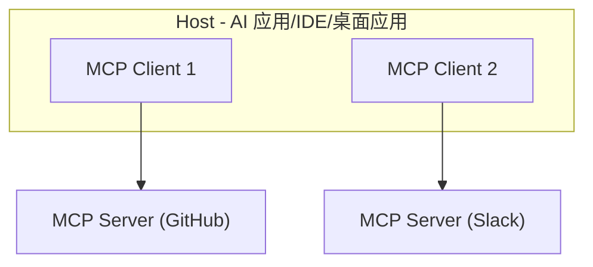
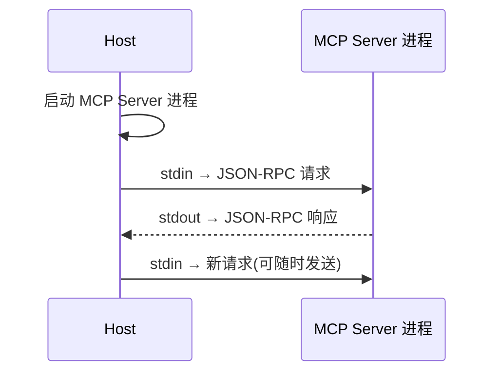
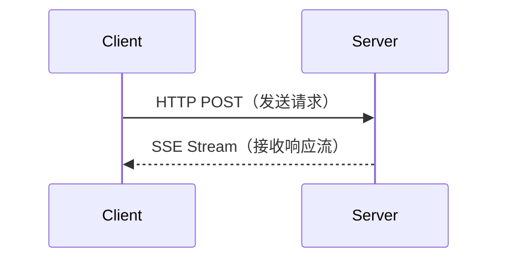

---
title: "MCP协议"
created: "2026-07-13"
tags: [八股文, AI]
source: "每日笔记AI补充"
---

# MCP协议 (Model Context Protocol)


MCP（Model Context Protocol）是由 Anthropic 于 2024 年底提出的开放协议标准，旨在统一 LLM 与外部数据源和工具的连接方式。可以把它理解为 **AI 应用的 USB-C 接口**。

## 为什么需要 MCP？

### 现状：碎片化集成

每个 AI 应用需要为每个工具/数据源编写专门的集成代码：

```
AI 应用 A → 专用集成 → GitHub
AI 应用 A → 专用集成 → Slack
AI 应用 A → 专用集成 → 数据库
AI 应用 B → 专用集成 → GitHub    (重复开发)
AI 应用 B → 专用集成 → Slack     (重复开发)
```

### MCP 的解决方案

```
AI 应用 → MCP Client → MCP Server（GitHub）→ GitHub API
AI 应用 → MCP Client → MCP Server（Slack）→ Slack API
AI 应用 → MCP Client → MCP Server（数据库）→ DB
```

**一次开发，处处可用。** MCP Server 开发者只需实现标准协议，所有支持 MCP 的 AI 应用都能直接使用。

## MCP 架构



| 角色 | 说明 | 示例 |
| ------ | ------ | ------ |
| Host | 宿主应用，管理 MCP Client | Claude Desktop, Cursor IDE |
| Client | 与 MCP Server 保持 1:1 连接 | Host 内部组件 |
| Server | 提供工具、资源和提示 | GitHub MCP Server, 文件系统 MCP Server |

## MCP 三大核心能力

### 1. Tools 工具

类似 Function Calling，允许 LLM 调用外部函数。

```json
{
  "name": "create_issue",
  "description": "在 GitHub 仓库中创建 Issue",
  "inputSchema": {
    "type": "object",
    "properties": {
      "owner": {"type": "string", "description": "仓库所有者"},
      "repo": {"type": "string", "description": "仓库名称"},
      "title": {"type": "string", "description": "Issue 标题"},
      "body": {"type": "string", "description": "Issue 内容"}
    },
    "required": ["owner", "repo", "title"]
  }
}
```

### 2. Resources 资源

提供对数据源的**只读访问**，类似 GET 请求。

```json
{
  "uri": "file:///project/README.md",
  "name": "README 文件",
  "mimeType": "text/markdown"
}
```

**Resources vs Tools 的区别：**

| 维度 | Resources | Tools |
| ------ | ----------- | ------- |
| 操作 | 只读 | 读写都可 |
| 类比 | REST GET | REST POST/PUT/DELETE |
| 触发方式 | 应用/用户选择 | LLM 决定调用 |
| 安全级别 | 低风险 | 需要更多控制 |

### 3. Prompts 提示模板

MCP Server 可以提供预定义的提示模板，帮助 LLM 更好地使用其工具。

```json
{
  "name": "review_code",
  "description": "代码审查提示",
  "arguments": [
    {"name": "file_path", "description": "要审查的文件路径", "required": true}
  ]
}
```

## MCP vs Function Calling

| 维度 | Function Calling | MCP |
| ------ | ----------------- | ----- |
| 标准化 | 各厂商 API 不同 | 统一开放协议 |
| 发现机制 | 静态定义 | 动态发现（运行时获取工具列表） |
| 传输方式 | HTTP API | stdio / HTTP + SSE |
| 资源管理 | 无 | 内置 Resources |
| 提示管理 | 无 | 内置 Prompts |
| 生态 | 各自为政 | 统一生态 |
| 安全模型 | 各自实现 | 协议级规范 |

## 传输方式

| 方式 | 说明 | 适用场景 |
| ------ | ------ | --------- |
| stdio | 标准输入输出 | 本地进程通信 |
| HTTP + SSE | HTTP POST + Server-Sent Events | 远程/网络通信 |

### stdio 模式



适用于本地部署，安全性好（无需网络暴露）。

### HTTP + SSE 模式



适用于远程部署和多客户端场景。

## MCP 安全模型

| 安全层面 | 机制 |
| --------- | ------ |
| 传输安全 | TLS 加密、本地 stdio 隔离 |
| 授权认证 | OAuth 2.0 支持 |
| 权限控制 | 工具级别的访问控制 |
| 人类确认 | 敏感操作需要用户确认 |
| 数据隔离 | Server 之间数据不共享 |

## 实际 MCP 示例

### 文件系统 MCP Server

```
工具列表：
- read_file: 读取文件内容
- write_file: 写入文件
- list_directory: 列出目录内容
- search_files: 搜索文件
- get_file_info: 获取文件元信息
```

### GitHub MCP Server

```
工具列表：
- create_issue: 创建 Issue
- list_issues: 列出 Issues
- create_pull_request: 创建 PR
- search_code: 搜索代码
- get_file_contents: 获取文件内容
```

### 数据库 MCP Server

```
工具列表：
- query: 执行 SQL 查询
- list_tables: 列出所有表
- describe_table: 查看表结构
- explain_query: 查看执行计划
```

## MCP 开发入门

### Server 端开发

```python
# Python MCP Server 示例
from mcp.server import Server
from mcp.types import Tool

server = Server("my-server")

@server.list_tools()
async def list_tools():
    return [
        Tool(
            name="hello",
            description="打个招呼",
            inputSchema={
                "type": "object",
                "properties": {
                    "name": {"type": "string"}
                }
            }
        )
    ]

@server.call_tool()
async def call_tool(name, arguments):
    if name == "hello":
        return f"Hello, {arguments['name']}!"
```

### Client 端使用（Claude Desktop 配置）

```json
{
  "mcpServers": {
    "github": {
      "command": "npx",
      "args": ["-y", "@modelcontextprotocol/server-github"],
      "env": {"GITHUB_TOKEN": "your-token"}
    }
  }
}
```

---

## 相关链接
- [[八股文学习清单]]
- [[00-全局导航|全局导航]]

---

## 面试 Q&A 速查表

| 问题 | 参考答案 |
| ------ | --------- |
| MCP 是什么？解决什么问题？ | MCP 是 Anthropic 提出的开放协议，统一 LLM 与外部工具/数据源的连接方式。解决了每个 AI 应用需要单独集成工具的碎片化问题 |
| MCP 的三大核心能力？ | Tools（工具调用）、Resources（资源访问，只读）、Prompts（提示模板） |
| MCP 和 Function Calling 的关系？ | Function Calling 是 LLM 的能力，MCP 是工具集成的协议标准。MCP Server 提供的 Tools 可以通过 Function Calling 机制被 LLM 调用 |
| MCP 的两种传输方式？ | stdio（本地进程通信，安全但仅限本地）和 HTTP+SSE（远程通信，支持多客户端） |
| MCP 的安全模型有哪些？ | 传输加密（TLS）、授权认证（OAuth 2.0）、权限控制、人类确认、数据隔离 |
| 为什么 MCP 选择 JSON-RPC？ | JSON-RPC 是轻量级的远程过程调用协议，简单、跨语言、易于实现，且支持双向通信 |
| MCP Server 如何被发现？ | Client 在连接时通过 initialize 请求获取 Server 的能力列表（工具、资源、提示模板），运行时动态发现 |
| MCP 目前的局限性？ | ① 协议还在演进中 ② 生态尚不成熟 ③ 远程部署的安全性需加强 ④ 缺乏成熟的监控和治理工具 |
