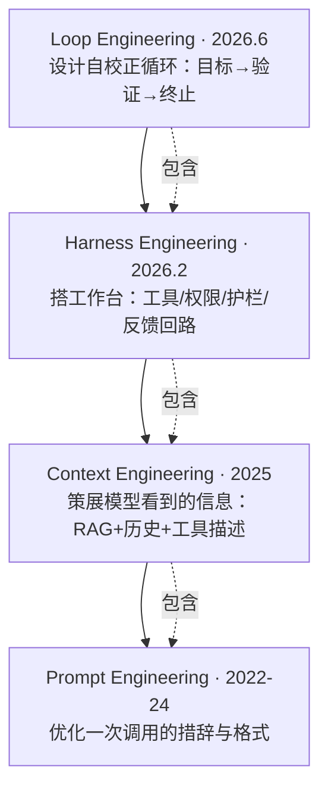

# 四层是嵌套关系（外层包含内层），不是替代关系

> 本条目是「认知升级：四层模型」的第 7 部分，对应学习清单条目 1.2.3。
>
> **前置依赖**：四层模型整体认知
> **为以下铺垫**：后续所有方法论学习

---

## 一、核心观点

> **四层是嵌套关系（外层包含内层），不是替代关系**：新层出来，旧层变成它的子集，不是作废。即「外层包含内层」——Loop 包含 Harness 包含 Context 包含 Prompt，详见下方嵌套关系图。

---

## 二、嵌套关系图（Mermaid）

---

## 三、「包含」与「不是替代」的含义

- **Prompt 在 Context 中**：Prompt 是模型看到的上下文的一部分
- **Context 在 Harness 中**：Context 运行在 Harness 提供的环境里
- **Harness 在 Loop 中**：Harness 是 Loop 的一个执行单元
- **都不会过时**：每次调用仍要 Prompt；信息管理、生产环境、自动化永远需要

> ❌ 错误理解：「有了 Context，Prompt 不重要了」「有了 Loop，Harness 不需要了」
> ✅ 正确理解：四层是**补充**不是**替代**，按依赖顺序逐层学

---

## 四、每层的定位

| 层 | 定位 | 出现时间 | 代表人物 |
|----|------|----------|----------|
| **Prompt** | 单次调用的措辞 | 2022–2024 | — |
| **Context** | 模型看到的信息 | 2025-06 | Tobi Lütke、Karpathy、Anthropic |
| **Harness** | Agent 运行的环境 | 2026-02 | HumanLayer、Mitchell Hashimoto |
| **Loop** | 自主循环的设计 | 2026-06 | Boris Cherny、Steinberger、Osmani |

---

## 五、实践中的应用

设计 Agent 系统时**逐层思考**：

1. **Prompt 层**：指令怎么写？
2. **Context 层**：模型需要看到什么信息？
3. **Harness 层**：Agent 需要什么工具和权限？
4. **Loop 层**：如何设计自动化循环？

> 项目答辩/技术评审时，可逐层展开「我的项目在四层都做了设计」，展示系统思维（见 [[10-画出四层模型演进图|四层模型演进图]]）。

---

## 六、学习资源

- Anthropic《Building Effective Agents》(2024-12)
- 进阶：[[05-Prompt权重变化|Prompt 权重变化]] · [[10-画出四层模型演进图|画出四层模型演进图]]

---

## 参考来源（一手链接 · 可溯源深挖）

- **Anthropic (2024-12)**《Building Effective Agents》：[anthropic.com/engineering/building-effective-agents](https://www.anthropic.com/engineering/building-effective-agents)
- 代表人物原始信号（Boris / Steinberger / Osmani）见本系列 04、08、09 与 [tosea.ai Loop Engineering 综述](https://tosea.ai/blog/loop-engineering-ai-agents-complete-guide-2026)

**相关链接**：
- 系列清单：[[学习计划/Agent 方法论与产品思维学习清单|Agent 方法论与产品思维学习清单]]
- 上一层级：[[00-Agent 方法论与产品思维|认知升级：四层模型 · 索引]]
- 同主题：[[06-设计Agent思考框架|设计 Agent 思考框架]] · [[09-一句话说清区别|一句话说清区别]]
