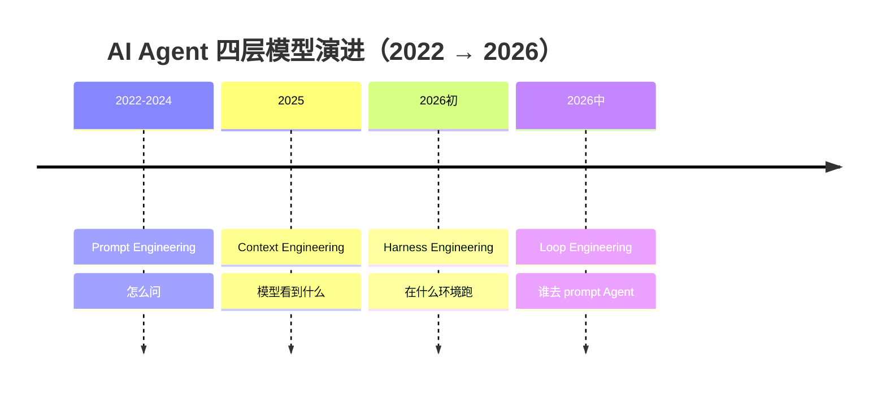
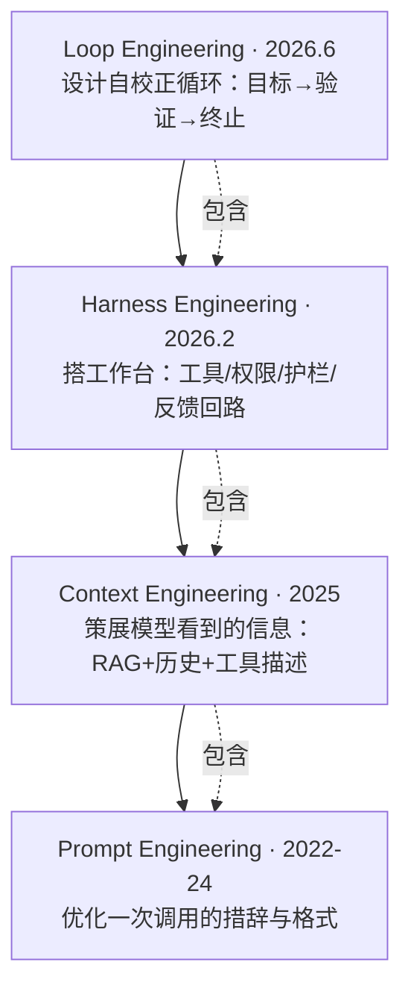

# 画出四层模型演进图

> 本条目是「认知升级：四层模型」的第 10 部分，对应学习清单条目 1.4.2。
>
> **前置依赖**：四层模型整体认知
> **为以下铺垫**：（表达与沟通）

---

## 一、核心观点

> **能画出四层模型演进图，是展示全局认知最有力的动作**——无论是技术评审、方案汇报还是团队科普，一张图胜过千言。

---

## 二、演进时间线（Mermaid）

---

## 三、嵌套关系图（Mermaid）

> 每层都把人往上「退」了一格：从手写 Prompt → 策展 Context → 搭 Harness → 设计 Loop。

---

## 四、每层关键数据

| 层级 | 管什么 | 代表实践 | 出现时间 | 代表人物 |
|------|--------|----------|----------|----------|
| **Prompt Engineering** | 你怎么问 | 清晰指令、Few-shot、输出格式 | 2022–2024 | — |
| **Context Engineering** | 模型看到什么 | 检索、记忆、上下文窗口管理 | 2025-06 | Tobi Lütke、Karpathy、Anthropic |
| **Harness Engineering** | 在什么环境工作 | 工具、权限、测试回路、自动检查 | 2026-02 | HumanLayer、Mitchell Hashimoto |
| **Loop Engineering** | 由谁来 prompt Agent | 调度循环、工作队列、自动验收 | 2026-06 | Boris Cherny、Steinberger、Osmani |

---

## 五、为什么这张图在 2026 年尤其重要

行业数据证明「四层都做」已成交付门槛：

- **Gartner（2026-05）**：40% 企业应用将在 2026 年底内置任务型 Agent（年初 <5%）；AI Agent 软件支出 2026 年 **$206.5B** → 2027 年 **$376.3B**（+82%）。
- **生产落差**：turion.ai（2026）称 **88%** 的 Agent 未能进入生产；进入生产的 12% 平均 ROI **171%**——差距主要来自 Harness/Loop 缺失，而非 Prompt 不行。
- **能力跃迁**：Stanford HAI（2026-04）OSWorld 基准 Agent 成功率 **12%**（2024）→ **66.3%**（2026，接近人类 ~72%）。

> 结论：能画出四层、讲清「嵌套非替代」、并结合项目说明每层落地，是展示系统思维的最佳载体。

---

## 六、学习资源

- Gartner AI Agent 市场预测 (2026-05)
- Stanford HAI AI Index (2026-04)
- Anthropic《Building Effective Agents》(2024-12)
- 进阶：[[07-四层嵌套关系|四层嵌套关系]] · [[05-Prompt权重变化|Prompt 权重变化]]

---

**下一篇**：[[../02-Prompt 2.0/01-给目标不给步骤|Prompt 2.0 方法论]]——四层「地图」讲完，进入 Prompt 层「放大图」。

---

## 参考来源（一手链接 · 可溯源深挖）

- **Gartner (2026-05)** AI Agent 支出与渗透率：[AI Agents Statistics 2026](https://enterprisedna.co/resources/stats/ai-agents)（汇总 Gartner）
- **turion.ai (2026)** 88% 未进生产——原始发布待核实
- **Stanford HAI (2026-04)** AI Index：OSWorld 12%→66.3%：[Stanford HAI AI Index 2026](https://hai.stanford.edu/ai-index)
- **Anthropic (2024-12)**《Building Effective Agents》：[anthropic.com/engineering/building-effective-agents](https://www.anthropic.com/engineering/building-effective-agents)

**相关链接**：
- 系列清单：[[学习计划/Agent 方法论与产品思维学习清单|Agent 方法论与产品思维学习清单]]
- 上一层级：[[00-Agent 方法论与产品思维|认知升级：四层模型 · 索引]]
- 同主题：[[08-Boris Cherny语录|Boris Cherny 语录]] · [[09-一句话说清区别|一句话说清区别]]
