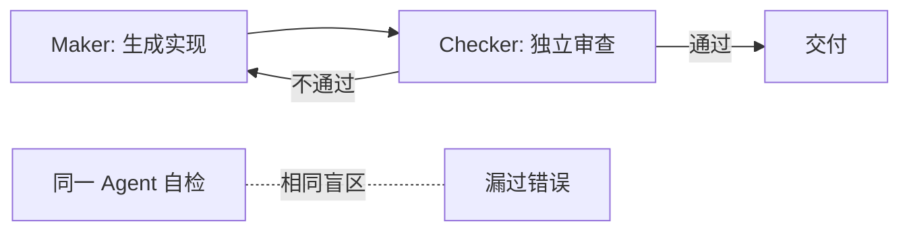

# 分离规划与执行（Maker & Checker）

> 本条目是「Prompt 2.0 方法论」的第 3 部分，对应学习清单条目 2.1.3。
>
> **前置依赖**：给目标不给步骤、评估标准写进指令
> **为以下铺垫**：Maker-Checker模式详解、Skill Engineering

---

## 一、核心观点

> **分离规划与执行**：Maker（创造者）负责生成，Checker（检查者）负责审查。
> 就像银行不给同一个人「既开票又盖章」——一笔交易要两人之手，这叫「四眼原则」，防的就是「自己给自己打分」。

---

## 二、定义与原理（类比先行）

### 2.1 定义

- **Maker（创造者）**：生成初稿、写代码、出方案
- **Checker（检查者）**：审查、验证、找漏洞

### 2.2 来源：银行业的「四眼原则」

这个模式源自银行业的 **Four-Eyes Principle（四眼原则）**：一笔交易必须经两人之手——一人发起，一人审批。搬到 AI 上，就是 **Creator Agent 写实现，Checker Agent 独立审查**。

> 关键点：**不能是同一个 Agent 自检**。否则就是「自己给自己打分」，容易漏过盲区——你自己写的 bug，你最容易「视而不见」，因为它符合你当下的思路。

---

## 三、为什么需要分离？

### 3.1 同一个 Agent 自检的问题

- ❌ 相同盲区：它犯的错误，它自己大概率也发现不了
- ❌ 缺乏独立视角：没有外部眼睛，容易陷入「确认偏误」
- ❌ 容易放水：模型普遍有谄媚倾向（sycophancy），审自己时倾向「这还行」

### 3.2 分离之后

- ✅ Checker 有独立视角，能发现 Maker 的盲区
- ✅ 质量更高、更稳



### 3.3 数据支持

- **Anthropic《Harness design for long-running application development》(2025)**：明确指出「把干活的 Agent 和挑刺的 Agent 拆成独立上下文窗口，是提升长任务质量的关键杠杆（a strong lever）」；并发现开箱即用的 Claude 其实是「相当糟糕的 QA Agent」，需把评估者单独调严格才有效。
- **Google《Towards a Science of Scaling Agent Systems》(2025/2026)**：独立并行 Agent 若没有验证瓶颈，会把单个错误**放大 17.2 倍**；中心化架构靠协调者验证也只能压到 4.4 倍——这从反面说明「独立审查」为什么必要（见 [[12-Maker vs Checker自检|Maker vs Checker 自检]]）。
- **（来源待核实：业内流传「质量提升 2–3 倍」的说法，原始一手数据未检索到，疑似 Anthropic 内部实验或第三方复盘，建议引用时标注为经验值而非论文结论。）**

---

## 四、示例对比

### 4.1 ❌ 同一个 Agent 自检

```text
请审查这段代码，找出问题并修复。然后自己检查修复是否正确。
```

**问题**：同一模型、同一盲区、容易放水。

### 4.2 ✅ 分离 Maker 和 Checker

```text
Maker：请审查这段代码，找出问题并生成修复方案。
Checker：请审查 Maker 的修复方案，验证：
1. 修复是否正确  2. 是否引入新问题  3. 是否符合评估标准
```

---

## 五、实践提示

- Maker / Checker 可以是同一底座模型的不同 Prompt，也可以是不同模型（跨模型互审，盲区互补）。
- 硬门禁（pytest / ruff / mypy）交给确定性测试，不交给模型判断——机器判对错比模型判更可靠。

---

## 六、最新研究与企业数据（2024–2026）

- **Anthropic (2025)** 多小时编码实验：generator–evaluator 分离 + 上下文重置（context reset）让 Claude 能产出完整可运行的全栈应用；自评估模式下模型会「自信地夸自己」，即便质量明显平庸。
- **Google Research (2025/2026)** 180 组受控实验：多 Agent 在顺序推理任务上反而下降 39–70%，但在可并行任务（如金融分析）上集中式协调可 +80.9%——印证「分离 + 协调」比「堆数量」重要（详见 [[16-选型判断标准|选型判断标准]]）。

---

## 七、学习资源

- **权威指南**：Anthropic《Harness design for long-running application development》
- **研究**：Google《Towards a Science of Scaling Agent Systems》
- **进阶**：[[09-Maker-Checker概念|Maker-Checker 概念]] · [[04-设计反馈闭环|设计反馈闭环]]

---

## 核心要点

| 要点 | 速记 |
|------|------|
| 核心 | 生成（Maker）与审查（Checker）分离 |
| 类比 | 银行四眼原则：开票和盖章不能同一人 |
| 铁律 | 绝不让同一 Agent 自检（确认偏误 + 谄媚放水） |
| 一手证据 | Anthropic：分离上下文是质量「关键杠杆」；Google：无验证的并行错误放大 17.2× |
| 兜底 | 硬门禁用确定性测试，不靠模型判断 |

**下一篇**：[[04-设计反馈闭环|设计反馈闭环]]——分离之后，还要让系统「执行→评估→调整」转起来。

---

## 参考来源（一手链接 · 可溯源深挖）

- **Anthropic (2025)**《Harness design for long-running application development》：[anthropic.com/engineering/harness-design-long-running-apps](https://www.anthropic.com/engineering/harness-design-long-running-apps)
- **Google Research (2025/2026)**《Towards a Science of Scaling Agent Systems》：[research.google/blog/towards-a-science-of-scaling-agent-systems](https://research.google/blog/towards-a-science-of-scaling-agent-systems-when-and-why-agent-systems-work/)
- **Anthropic (2024-12)**《Building Effective Agents》：[anthropic.com/engineering/building-effective-agents](https://www.anthropic.com/engineering/building-effective-agents)

**相关链接**：
- 系列清单：[[学习计划/Agent 方法论与产品思维学习清单|Agent 方法论与产品思维学习清单]]
- 上一层级：[[00-Agent 方法论与产品思维|Prompt 2.0 方法论 · 索引]]
- 同主题：[[09-Maker-Checker概念|Maker-Checker 概念]] · [[12-Maker vs Checker自检|Maker vs Checker 自检]]
