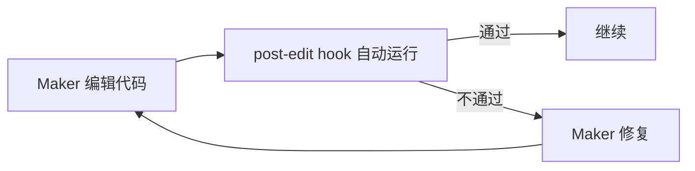

# Maker-Checker 实战落地

> 本条目是「Prompt 2.0 方法论」的第 10 部分，对应学习清单条目 2.4.2。
>
> **前置依赖**：Maker-Checker概念
> **为以下铺垫**：成本考量、Skill Engineering

---

## 一、核心观点

> **实战落地**：用 Claude Code 的 post-edit hook 自动跑 lint + typecheck，把「Checker」变成确定性的、每次都执行的护栏。
> 需要「每次都做对」的事，别靠 Prompt 提醒——靠 Hook。Hook 像收银台的扫码枪：不管店员记不记得，钱都得扫。

---

## 二、定义与原理（类比先行）

### 2.1 类比：收银台的扫码枪

你当然可以贴张「请记得扫码」的纸条（Prompt 提醒），但店员忙起来就会忘。真正的办法是**把扫码做成流程里绕不开的一步**（Hook）——不扫就过不了账。Checker 落地也一样：把验证嵌进工具链，而非指望模型自觉。

### 2.2 Hook 是什么

Hook 是在特定事件点自动执行的脚本：

- `PreToolUse`：工具调用前（如拦一道防火墙）
- `PostToolUse`：工具调用后（如编辑后自动检查）
- `Notification`：通知事件

---

## 三、实战示例

### 3.1 配置 post-edit hook

```json
// .claude/settings.json
{
  "hooks": {
    "PostToolUse": [
      { "matcher": "Edit|Write",
        "hooks": [{ "type": "command", "command": "ruff check $FILE && mypy $FILE" }] }
    ]
  }
}
```

### 3.2 工作流程



> 注：`matcher` 用 `Edit|Write` 而非精确文件名；退出码 `0`=放行，`2`=阻断（详见 Anthropic hook 文档）。

---

## 四、其他落地方式

- **Git Pre-commit Hook**：`ruff check . && mypy . && pytest`
- **CI/CD Pipeline**：GitHub Actions 里跑 lint/typecheck/test
- **IDE 插件**：VS Code 的 Ruff / Mypy / Pylance

---

## 五、优劣势

- ✅ 自动化、即时反馈、不通过就卡住——比「靠模型自觉」稳
- ✅ Checker 变确定性，不消耗额外 LLM 调用
- ❌ 初始有一次配置成本；规则多了要维护

---

## 六、最新研究与企业数据（2024–2026）

- **Anthropic《Harness design for long-running application development》(2025)**：明确把 **hooks（生命周期事件点的确定性自动化）** 列为 harness 的核心组件；并强调「需要每次都执行的事用 Hook，不要用 Prompt 提醒」。该文还用 context reset（上下文重置）配合 hook，解决长任务中上下文焦虑与失焦。
- 同一文指出：Hook 是**确定性**的，Skills 是**概率性**的——凡能确定化的验证，优先 Hook。

---

## 七、学习资源

- **权威指南**：Anthropic《Harness design for long-running application development》
- **工具文档**：Anthropic Claude Code Hooks（PreToolUse / PostToolUse 配置）
- **进阶**：[[11-Checker成本考量|Checker 成本考量]] · [[../01-认知升级/07-四层嵌套关系|四层嵌套关系]]

---

## 核心要点

| 要点 | 速记 |
|------|------|
| 核心 | 用 hook 把 Checker 变确定性护栏 |
| 类比 | 收银台扫码枪：不扫过不了账 |
| 口诀 | 每次都要做对的事→Hook，别靠 Prompt |
| 退出码 | 0=放行，2=阻断 |
| 一手依据 | Anthropic：Hook 确定性，Skills 概率性 |

**下一篇**：[[11-Checker成本考量|Checker 成本考量]]——Checker 一定要用贵模型吗？不。

---

## 参考来源（一手链接 · 可溯源深挖）

- **Anthropic (2025)**《Harness design for long-running application development》：[anthropic.com/engineering/harness-design-long-running-apps](https://www.anthropic.com/engineering/harness-design-long-running-apps)
- **Anthropic** Claude Code Hooks 配置文档（PreToolUse / PostToolUse）——原始链接待核实：docs.anthropic.com 下 Claude Code / hooks 章节

**相关链接**：
- 系列清单：[[学习计划/Agent 方法论与产品思维学习清单|Agent 方法论与产品思维学习清单]]
- 上一层级：[[00-Agent 方法论与产品思维|Prompt 2.0 方法论 · 索引]]
- 同主题：[[09-Maker-Checker概念|Maker-Checker 概念]] · [[11-Checker成本考量|Checker 成本考量]]
