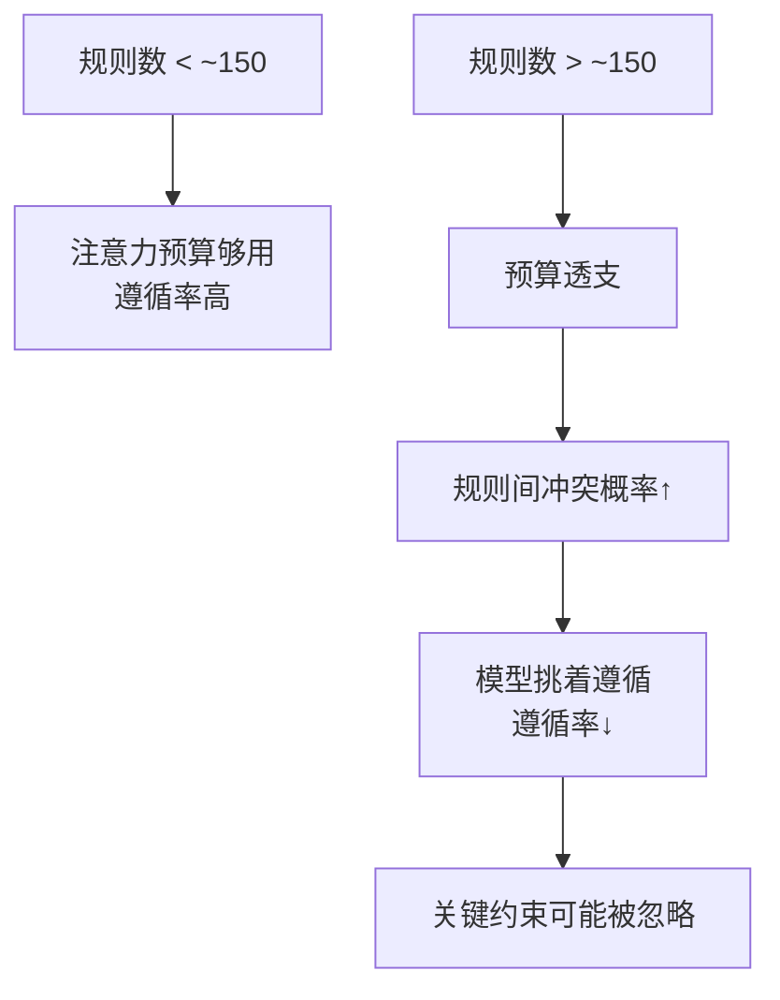

# 150 条指令天花板：规则堆太多，模型开始「挑着听」

> 本条目是「Context Engineering」的第 3 部分，对应学习清单条目 3.1.3。
>
> **前置依赖**：Attention Budget
> **为以下铺垫**：文件大小与注意力衰减、Context Rot

---

## 核心观点

> **150 条指令天花板**：当 System Prompt 里的独立规则超过约 150 条，模型的遵循率会肉眼可见地往下掉——不是它变笨，是注意力预算被规则「挤爆」了。

这就像给新员工发了一本 300 页的员工手册，还要求在每次干活前默背。他不会真背完，而是凭直觉挑几条「看起来重要」的照做，剩下的当背景噪音。规则越多，冲突越密，模型越容易「选择性失聪」——而且它失聪时依然写得很自信。

## 定义 / 原理 / 实践 / 示例 / 优劣势

### 定义与原理

「150 条指令天花板」是社区里流传的经验法则：当 Prompt 中**相互独立**的约束/规则累计超过约 150 条，模型开始系统性地忽略其中一部分。它本质上是 [[02-Attention Budget|Attention Budget]] 的具象化——每条规则都占一份注意力额度，额度见底就触发「选择性忽略」。

### 为什么是「约 150」而不是精确值

注意：150 是量级估计，不是铁律。规则越独立、越互斥、越長，天花板来得越早；用结构化分节 + 渐进式加载可以把它推后（见 [[04-文件大小与注意力衰减|文件大小与注意力衰减]] 与 [[06-渐进式加载|渐进式加载]]）。

### 工程实践

- **每节 1–6 条**：把规则按主题拆成小节，每节只放 1–6 条「必须记得」的。
- **总量控在 150 条内**：超出就拆分到 Skills / 子目录 CLAUDE.md（见 [[14-路径作用域|路径作用域]]）。
- **优先级标记**：关键约束用 ⚠️「必须」显式标出（见 [[13-重注入格式设计|重注入格式设计]]）。
- **用结构别用文字墙**：XML / Markdown 分节比一坨纯文本更容易被模型定位。

### 优劣势

- ✅ 给「规则越多越糟」一个可操作的量级锚点，逼你把规范做减法。
- ❌ 数字本身没有公开一手实验背书，且和「文件行数」「指令密度」高度耦合，不能单独当 KPI。

## 核心要点

| 概念 | 一句话 |
|------|--------|
| 150 条天花板 | 独立规则累计超 ~150 条，遵循率明显下滑 |
| 本质 | Attention Budget 被规则挤爆 |
| 解法 | 每节 1–6 条 + 渐进式加载 + 优先级标记 |
| 注意 | 150 是量级估计，非受控实验结论 |

## 最新研究与企业数据

- **原则层面（一手）**：Anthropic（2025-09）指出上下文是有限且边际收益递减的资源，系统提示应「极清晰、用简单直接的语言」，在「太啰嗦」和「太模糊」之间找 Goldilocks（金发姑娘）平衡区——过度堆规则会稀释信号（来源：Anthropic Effective Context Engineering）。
- **~150 条经验值（待核实）**：该数字来自 Claude Code 用户群体与社区的反复观察，未见 Anthropic 公开的一手实验报告。如需引用，建议自行做 A/B 对照实测。

## 学习资源

- **必读**：Anthropic《Effective context engineering for AI agents》(2025-09)
- **进阶**：[[02-Attention Budget|Attention Budget]] · [[04-文件大小与注意力衰减|文件大小与注意力衰减]] · [[06-渐进式加载|渐进式加载]]

## 相关链接

- 系列清单：[[学习计划/Agent 方法论与产品思维学习清单|Agent 方法论与产品思维学习清单]]
- 上一层级：[[00-Agent 方法论与产品思维|Context Engineering · 索引]]
- 关联理论：[[../01-认知升级/07-四层嵌套关系|四层嵌套关系]]

**下一篇**：[[04-文件大小与注意力衰减|文件大小与注意力衰减]]——指令天花板讲完，下篇讲「文件本身越长，遵循率越低」。

---

## 参考来源（一手链接 · 可溯源深挖）

- **Anthropic (2025-09)**《Effective context engineering for AI agents》：[anthropic.com/engineering/effective-context-engineering-for-ai-agents](https://www.anthropic.com/engineering/effective-context-engineering-for-ai-agents)
- **「~150 条指令天花板」经验值**：(来源待核实：Claude Code 用户群体经验法则，未检索到 Anthropic 公开实验报告；建议自测校准)
