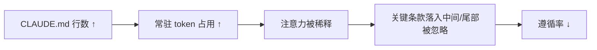

# 文件大小与注意力衰减：CLAUDE.md 越长，模型越「懒得看」

> 本条目是「Context Engineering」的第 4 部分，对应学习清单条目 3.1.4。
>
> **前置依赖**：Lost in the Middle、Attention Budget、150条指令天花板
> **为以下铺垫**：首末重注入、渐进式加载、Context Rot

---

## 核心观点

> **文件大小与注意力衰减**：CLAUDE.md / AGENTS.md 这类「每次会话都自动加载」的规则文件越大，模型对它的遵循率越低——不是它看不懂，是它看不过来。

把规则文件想成便利店的《员工守则》：两页纸大家能背，600 页没人翻。模型也一样，根文件越长，关键条款越容易埋进「注意力洼地」，然后被默默无视。CLAUDE.md 不是写得越全越好，而是「够用 + 好找」才好用。

## 定义 / 原理 / 实践 / 示例 / 优劣势

### 定义与原理

文件大小与注意力衰减描述的是：**常驻规则文件的体积，和模型对其中规则的遵循率呈负相关**。它同时踩中两个坑——[[02-Attention Budget|Attention Budget]]（总 token 多→预算被摊薄）和 [[01-Lost in the Middle|Lost in the Middle]]（长文件里中间条款最易被忽略）。

### 为什么越长越差

### 工程实践

- **根文件控在 ~200 行内**：Anthropic 与多位实践者都建议 CLAUDE.md 保持精简，超了就拆。
- **根文件当目录**：只放核心约束 + 指向 `docs/` 的 `@path` 导入（见 [[06-渐进式加载|渐进式加载]]）。
- **子目录各自管**：用 [[14-路径作用域|路径作用域]] 把规范下沉到子目录 CLAUDE.md。
- **关键规则靠锚点**：把永真约束写进 CLAUDE.md 开头（每次会话都在窗口顶部，衰减最慢）。

### 优劣势

- ✅ 常驻文件是「几乎零成本的持久记忆」，写好一本万利；且放开头的内容在会话中**不会衰减**。
- ❌ 一旦过长，反而变成噪声源；维护成本随行数线性上升。

## 核心要点

| 概念 | 一句话 |
|------|--------|
| 文件大小衰减 | 常驻规则文件越长，遵循率越低 |
| 根文件建议 | 控在 ~200 行内，超了就拆 |
| 根文件用法 | 当目录 + `@path` 导入详情 |
| 双坑 | 同时踩中 Attention Budget + Lost in the Middle |

## 最新研究与企业数据

- **官方原则（一手）**：Anthropic《Claude Code Best Practices》明确「上下文窗口填得越快，性能越差」，并强调上下文是「最需要管理的资源」；同时建议 CLAUDE.md 保持精简、把长文档外置（来源：Anthropic Claude Code Best Practices）。
- **具体行数—遵循率曲线（待核实）**：原始文件引用的「1–100 行 ~95%、600+ 行 ~45%」来自 Claude Code 用户观察与社区复盘，未见 Anthropic 公开一手实验报告，建议以自测为准。
- **实践共识（次级）**：多位 2026 从业者复盘建议 CLAUDE.md 控制在 100–200 行；Windsurf 等对超长文件设硬警告（来源：crystl.dev / claudify.tech 2026 博客，次级来源）。

## 学习资源

- **必读**：Anthropic《Claude Code Best Practices》
- **延伸**：Anthropic《Effective context engineering for AI agents》(2025-09)
- **进阶**：[[06-渐进式加载|渐进式加载]] · [[14-路径作用域|路径作用域]] · [[13-重注入格式设计|重注入格式设计]]

## 相关链接

- 系列清单：[[学习计划/Agent 方法论与产品思维学习清单|Agent 方法论与产品思维学习清单]]
- 上一层级：[[00-Agent 方法论与产品思维|Context Engineering · 索引]]
- 关联理论：[[../01-认知升级/07-四层嵌套关系|四层嵌套关系]]

**下一篇**：[[05-首末重注入|首末重注入]]——理论根基讲完，下篇进入实战技术：把关键规则甩到首尾。

---

## 参考来源（一手链接 · 可溯源深挖）

- **Anthropic**《Claude Code Best Practices》：[anthropic.com/engineering/claude-code-best-practices](https://www.anthropic.com/engineering/claude-code-best-practices)
- **Anthropic (2025-09)**《Effective context engineering for AI agents》：[anthropic.com/engineering/effective-context-engineering-for-ai-agents](https://www.anthropic.com/engineering/effective-context-engineering-for-ai-agents)
- **「1–100 行 ~95% / 600+ 行 ~45%」具体曲线**：(来源待核实：Claude Code 用户观察与社区复盘，未检索到 Anthropic 公开一手实验；建议自测校准)
- **crystl.dev (2026) / claudify.tech (2026)**：CLAUDE.md 100–200 行实践建议 —— 次级从业者博客。
