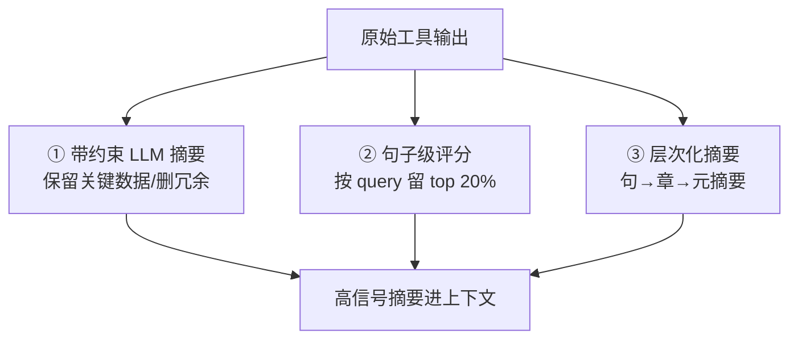

# 摘要压缩：工具吐 500 行日志，先榨成 5 行再给模型

> 本条目是「Context Engineering」的第 8 部分，对应学习清单条目 3.2.4。
>
> **前置依赖**：渐进式加载、Recency Effect
> **为以下铺垫**：长任务重注入、Context Rot

---

## 核心观点

> **摘要压缩（Summarization / Compaction）**：工具返回的原始结果先压缩成「只留关键信息」的摘要再进上下文，绝不把 500 行原始输出直接拍给模型。

就像同事甩给你一份 80 页调研报告，你不会从头精读，而是先看「结论 + 三条关键数据」，原始细节等要用了再翻。模型更挑——原始噪声越多，真正有用的信号越被淹没，它还会为噪声多付 token。先榨汁，再上桌。

## 定义 / 原理 / 实践 / 示例 / 优劣势

### 定义与原理

摘要压缩 = 把工具/检索返回的长内容，用 LLM 或规则提炼成高信号摘要，只保留决策需要的字段。Anthropic（2025-09）把 compaction（压缩）列为长程 Agent 的三大上下文杠杆之一（另两个是 tool-result clearing 与 memory）。

### 三种压缩策略

### 工程实践

- **带约束 LLM 摘要**：「请压缩，保留错误类型/位置/建议修复，控制在 200 字内」。
- **句子级评分**：小模型给每句打分，按与当前 query 的相关度留前 20%。
- **层次化摘要**：句摘要→章摘要→元摘要，逐级蒸馏。
- **可恢复压缩**：完整原始结果 dump 到本地 JSONL「黑匣子」，要精确细节时模型主动读回（见 [[12-compact总结|compact 总结]]）。

### 优劣势

- ✅ 砍掉噪声、省 token、提准确率；长会话可持续跑。
- ❌ 有损——摘要可能丢关键细节；压缩提示词要针对你的负载调，否则「压错了比不压更糟」。

## 核心要点

| 概念 | 一句话 |
|------|--------|
| 摘要压缩 | 工具结果先榨成摘要再进上下文 |
| 三种策略 | LLM 摘要 / 句子评分 / 层次化 |
| 关键 | 只留决策需要的信号 |
| 兜底 | 原始结果落黑匣子，可恢复 |

## 最新研究与企业数据

- **官方概念（一手）**：Anthropic Cookbook《memory, compaction, and tool clearing》把 compaction 定义为「把上下文窗口蒸馏成高保真摘要，让长对话以最小性能损失继续」，并确认 Claude Code 在生产中用 compaction 处理长会话（来源：Anthropic Cookbook）。
- **Anthropic 原则（一手）**：context 是有限资源，compaction 是核心杠杆之一（来源：Anthropic Effective Context Engineering）。
- **「砍掉 50–75% token / 准确率提升 15–30%」具体数字（待核实）**：原始文件引用的该区间来自阿里云 2026 等次级来源，未见一手受控实验，建议以自家负载实测为准。

## 学习资源

- **必读**：Anthropic Cookbook《Context engineering: memory, compaction, and tool clearing》
- **延伸**：Anthropic《Effective context engineering for AI agents》(2025-09)
- **进阶**：[[09-长任务重注入|长任务重注入]] · [[12-compact总结|compact 总结]] · [[10-污染征兆识别|污染征兆识别]]

## 相关链接

- 系列清单：[[学习计划/Agent 方法论与产品思维学习清单|Agent 方法论与产品思维学习清单]]
- 上一层级：[[00-Agent 方法论与产品思维|Context Engineering · 索引]]
- 关联理论：[[../01-认知升级/07-四层嵌套关系|四层嵌套关系]]

**下一篇**：[[09-长任务重注入|长任务重注入]]——摘要压缩讲完，下篇讲「长任务跑到一半，把关键约束再念一遍」。

---

## 参考来源（一手链接 · 可溯源深挖）

- **Anthropic Cookbook**《Context engineering: memory, compaction, and tool clearing》：[platform.claude.com/cookbook/tool-use-context-engineering-context-engineering-tools](https://platform.claude.com/cookbook/tool-use-context-engineering-context-engineering-tools)
- **Anthropic (2025-09)**《Effective context engineering for AI agents》：[anthropic.com/engineering/effective-context-engineering-for-ai-agents](https://www.anthropic.com/engineering/effective-context-engineering-for-ai-agents)
- **「砍掉 50–75% token / 准确率提升 15–30%」**：(来源待核实：阿里云 2026 等次级来源引用，未检索到一手受控实验；建议自测校准)
