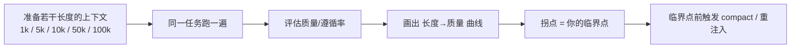

# 找到临界点：你的 Agent，对话多长开始「魂飘了」

> 本条目是「Context Engineering」的第 11 部分，对应学习清单条目 3.3.2。
>
> **前置依赖**：污染征兆识别
> **为以下铺垫**：compact总结、重注入格式设计

---

## 核心观点

> **找到临界点（Find your critical point）**：上下文长到某个阈值后，模型开始显著跑偏——这个阈值每个项目/模型/任务都不同，得自己测，不能抄别人的数。

就像每个人的「专注续航」不一样：有人能连续深度工作 4 小时，有人 40 分钟就走神。模型的「注意力续航」也因窗口大小、任务类型、规则密度而异。不测就盲跑，等于不知道自己酒量还硬灌，迟早出事。

## 定义 / 原理 / 实践 / 示例 / 优劣势

### 定义与原理

临界点 = 上下文长度到达某阈值后，回答质量/遵循率明显拐头向下的那个点。Anthropic（2025-09）强调性能是**梯度式下降**而非硬悬崖：模型在长上下文仍很强，但对信息检索和长程推理的精度会随长度下降。

### 怎么测

### 工程实践

- **记录每场景临界点**：代码审查、文档生成、QA 各自的临界点不同，存成配置。
- **临界点前干预**：接近阈值就触发 [[12-compact总结|compact]] 或 [[09-长任务重注入|长任务重注入]]，别等崩了再救。
- **留 headroom（余量）**：别把窗口用到 100%，留 buffer 让模型保持清醒。

### 优劣势

- ✅ 把「凭感觉管理上下文」变成「按数据管理」，可复现、可监控。
- ❌ 需要一次性基准测试；模型/版本升级后临界点会漂移，得重测。

## 核心要点

| 概念 | 一句话 |
|------|--------|
| 临界点 | 上下文超阈值后质量明显拐头 |
| 特性 | 梯度下降，非硬悬崖；因场景而异 |
| 怎么做 | 扫不同长度测质量，画拐点 |
| 用法 | 临界点前 compact / 重注入 |

## 最新研究与企业数据

- **性能梯度（一手）**：Anthropic（2025-09）指出 context rot 是跨模型存在的性能梯度，越长精度越低（来源：Anthropic Effective Context Engineering）。
- **实践拐点观测（次级）**：2026 从业者复盘称质量约在窗口 **40–50%** 处开始明显下滑，未到硬限制（来源：crystl.dev 2026 博客，次级来源，建议自测校准）。原始笔记的「40–60%」为同区间的经验估计。
- **行业背景（一手）**：Stanford HAI AI Index 持续追踪企业 AI 部署规模，说明长程 Agent 已进入生产，临界点管理是规模化落地的现实需求（来源：Stanford HAI AI Index）。Gartner 聚合数据显示Agent 类项目在企业中的投资与试点快速增长，进一步推高对可靠长上下文管理的需求（来源：Gartner agents stats 聚合）。

## 学习资源

- **必读**：Anthropic《Effective context engineering for AI agents》(2025-09)
- **行业**：Stanford HAI AI Index；Gartner Agent 统计（聚合）
- **进阶**：[[12-compact总结|compact 总结]] · [[09-长任务重注入|长任务重注入]] · [[02-Attention Budget|Attention Budget]]

## 相关链接

- 系列清单：[[学习计划/Agent 方法论与产品思维学习清单|Agent 方法论与产品思维学习清单]]
- 上一层级：[[00-Agent 方法论与产品思维|Context Engineering · 索引]]
- 关联理论：[[../01-认知升级/07-四层嵌套关系|四层嵌套关系]]

**下一篇**：[[12-compact总结|compact 总结]]——临界点讲完，下篇讲「用 /compact 或手动总结中间结果」。

---

## 参考来源（一手链接 · 可溯源深挖）

- **Anthropic (2025-09)**《Effective context engineering for AI agents》：[anthropic.com/engineering/effective-context-engineering-for-ai-agents](https://www.anthropic.com/engineering/effective-context-engineering-for-ai-agents)
- **crystl.dev (2026)**《Optimize Claude Code's Context Window》：[crystl.dev/blog/optimize-claude-code-context](https://crystl.dev/blog/optimize-claude-code-context) —— 次级从业者博客，40–50% 拐点为经验观测。
- **Stanford HAI** AI Index：[hai.stanford.edu/ai-index](https://hai.stanford.edu/ai-index)
- **Gartner** Agent 统计（聚合）：[enterprisedna.co/resources/stats/ai-agents](https://enterprisedna.co/resources/stats/ai-agents)
- **「40–60% 窗口开始下滑」具体区间**：(来源待核实：社区经验估计 + crystl.dev 次级观测，非受控实验；建议自测校准)
