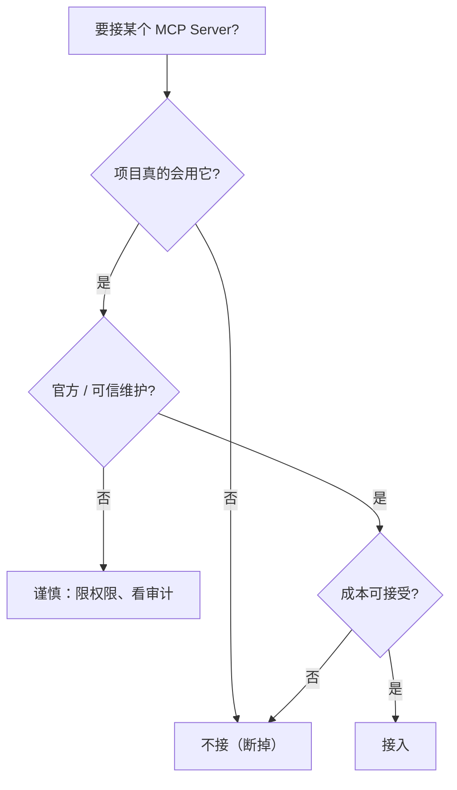

# MCP 工具选型：你的项目真需要哪几个"USB 外设"

> 本条目是「多工具协同方法论」的第 5 部分，对应学习清单条目 5.2.1。
>
> **前置依赖**：工具选型原则
> **为以下铺垫**：工具箱管理、MCP协议

---

## 一、核心观点

> **MCP（Model Context Protocol，模型上下文协议）是 Agent 的「USB 接口」；选型原则只有一句——只装项目真正需要的，宁缺毋滥。**
> 就像你桌上插一堆用不上的 USB 外设只会让线更乱、供电更紧：MCP Server 接太多，token 浪费、判断出错概率都往上走。

---

## 二、什么是 MCP（一句话）

- **MCP（Model Context Protocol，模型上下文协议）**：Anthropic 于 **2024-11** 开源的开放标准，让 Agent 用统一方式连外部工具/数据源
- **现归属**：2025-12 捐赠给 Linux Foundation 的 **Agentic AI Foundation（AAIF）**，由 Anthropic / OpenAI / Google / Microsoft / AWS 等共治——**没人独占，人人依赖**
- **规模（2026-03）**：月 SDK 下载达 **9700 万次**，生态有 **1 万+** 生产级 Server（详见 [[07-MCP协议|MCP 协议]]）

---

## 三、MCP 选型三原则

### 3.1 只选需要的

- 不要"收藏式"地装 MCP Server
- 每个 Server 都要进上下文、都要被模型判断，**接得越多越乱**
- 用不上的就断掉

### 3.2 优先官方 / 可信源

- 优先官方维护的 Server（如官方 GitHub、Postgres、Slack 连接器）
- 社区 Server 谨慎，看清权限范围与维护活跃度
- 安全优先：MCP 默认给 Agent 广泛工具权限，不可轻信

### 3.3 算清成本

- 部分 Server 需要 API Key、按量付费
- 算清"调用频率 × 单价"，权衡是否值得接

---

## 四、常见 MCP Server（按需取用）

| MCP Server | 作用 | 典型场景 |
|------------|------|----------|
| **filesystem** | 文件读写 | 本地文件操作 |
| **git** | Git 操作 | 版本控制 |
| **github** | GitHub API | PR / Issue 管理 |
| **postgres** | 数据库操作 | 数据查询 |
| **slack** | Slack API | 消息通知 |

> 反例：一个纯前端项目硬接 postgres + slack，纯属给模型喂噪声。

---

## 五、优劣势

- ✅ 统一标准、N+M 而非 N×M 的集成成本（见 [[07-MCP协议|MCP 协议]]）
- ✅ 接得少 → 上下文干净、判断更准、token 更省
- ❌ 接得多 → Context Rot、工具混淆、成本失控
- ❌ 社区 Server 质量参差，需自担安全审查

---

## 六、最新研究与企业数据（2024–2026）

- **9700 万次月下载（2026-03）**：MCP 月 SDK 下载从 2024-11 的约 200 万飙到 2026-03 的 **9700 万**，16 个月涨约 **4750%**，是 AI 基础设施协议里最快的采用曲线之一。
- **Linux Foundation 托管（2025-12）**：捐赠给 AAIF，OpenAI / Block 为联合创始，Google / Microsoft / AWS / Cloudflare 等为成员——消除"厂商锁定"顾虑，加速 Fortune 500 生产部署。
- **安全现实**：2026 年初研究者针对 MCP 实现提交了 30+ 个 CVE（含一个 CVSS 9.6 的远程代码执行）；Equixly 研究发现约 **43%** 被测 MCP 实现存在命令注入漏洞——所以"优先官方 + 限权限"不是矫情，是保命。

---

## 七、学习资源

- **官方**：[modelcontextprotocol.io](https://modelcontextprotocol.io)
- **采用数据分析（2026-03，97M 下载）**：[ai2.work · MCP crosses 97M](https://ai2.work/blog/mcp-crosses-97-million-installs-as-protocol-war-ends)
- **进阶**：[[07-MCP协议|MCP 协议]]——原理与架构；[[06-工具箱管理|工具箱管理]]——把选型固化进个人配置

---

## 核心要点

- **一句话**：MCP = Agent 的 USB 接口；选型=只装真正需要的，宁缺毋滥。
- **三原则**：只选需要的 / 优先官方可信 / 算清成本。
- **规模锚点**：9700 万次月下载（2026-03），1 万+ 生产 Server，已归 Linux Foundation。
- **安全**：43% 被测实现有命令注入漏洞 → 社区 Server 必须限权限 + 审计。
- **口诀**：接得少 = 上下文干净 = 判断更准。

---

## 参考来源（一手链接 · 可溯源深挖）

- **官方**：[modelcontextprotocol.io](https://modelcontextprotocol.io)
- **Digital Applied Analysis / ai2.work (2026-03)**《MCP Crosses 97 Million Installs》（9700 万月下载、4750% 增长、Linux Foundation AAIF）：[ai2.work/blog/mcp-crosses-97-million-installs-as-protocol-war-ends](https://ai2.work/blog/mcp-crosses-97-million-installs-as-protocol-war-ends)
- **ai2.work (2026)**《MCP Surpasses 97M Installs》：[ai2.work/blog/model-context-protocol-crosses-97m-installs-cementing-agentic-ai](https://ai2.work/blog/model-context-protocol-crosses-97m-installs-cementing-agentic-ai)
- **MCP 安全（CVE / 命令注入，2026）**：来源待核实——具体为 2026 年初安全研究汇总与 Equixly 对 MCP 实现的研究，未检索到一手永久链接，建议以官方 modelcontextprotocol.io 安全指南为准。

**相关链接**：
- 系列清单：[[学习计划/Agent 方法论与产品思维学习清单|Agent 方法论与产品思维学习清单]]
- 上一层级：[[00-Agent 方法论与产品思维|多工具协同方法论 · 索引]]
- 下一篇：[[06-工具箱管理|工具箱管理]]——把选型固化进你的个人配置
- 同主题：[[07-MCP协议|MCP 协议]] · [[08-A2A协议|A2A 协议]] · [[09-ACP协议|ACP 协议]]
