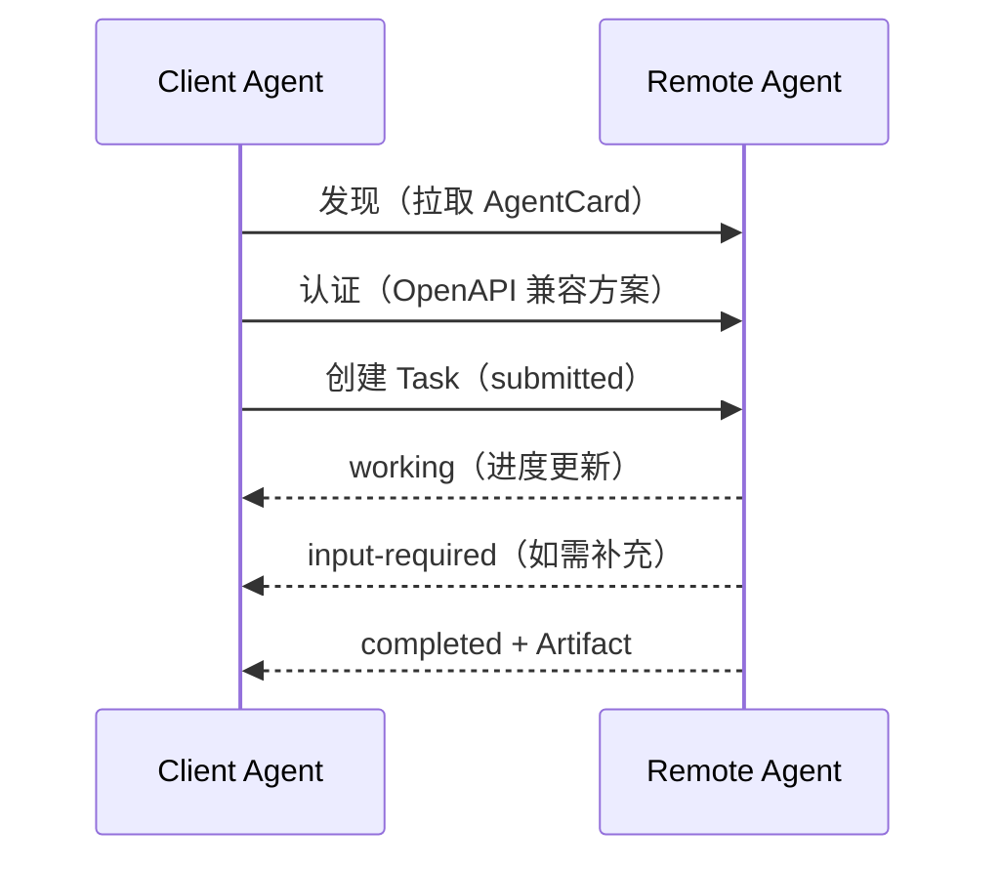

# A2A 协议：Agent 的"互联网协议"

> 本条目是「多工具协同方法论」的第 8 部分，对应学习清单条目 5.3.2。
>
> **前置依赖**：MCP协议
> **为以下铺垫**：ACP协议、混用Agent策略

---

## 一、核心观点

> **A2A（Agent-to-Agent Protocol，智能体间协议）是 Agent 的「互联网协议」——它解决"不同厂商、不同框架的 Agent 怎么互相发现、分工、协作"。**
> 如果说 MCP 管"员工用扳手"，A2A 管"员工之间怎么沟通、谁擅长啥、活怎么分"。它和 MCP **互补，不是替代**。

---

## 二、定义与原理

### 2.1 是什么

- **A2A（Agent-to-Agent Protocol，智能体间协议）**：Google 于 **2025-04-09** 在 Cloud Next 大会发布，现由 **Linux Foundation** 托管
- **作用**：跨平台 Agent 的**能力发现、任务协作、状态跟踪**
- **支持**：50+ 企业与组织贡献（PayPal、SAP、ServiceNow、Accenture、Deloitte 等）

### 2.2 类比：互联网协议（HTTP）

就像 HTTP 让不同网站互相访问，A2A 让不同厂商的 Agent 互操作——不必为每对 Agent 写定制 API。

### 2.3 核心概念

| 概念 | 作用 |
|------|------|
| **AgentCard** | Agent 的"名片/简历"（JSON），声明能力、URL、认证方式 |
| **Task** | 任务对象，带完整生命周期（submitted→working→input-required→completed/failed） |
| **Message** | 一次交互单元，承载上下文/回复/指令 |
| **Artifact** | 任务产出的交付物（文档/图片/表格） |
| **Part** | Message/Artifact 的内容单元（Text/File/Data） |

---

## 三、工作原理（Mermaid）

- 基于 **HTTP / SSE / JSON-RPC 2.0**，企业级认证与 OpenAPI 对齐
- 支持同步、流式、长周期异步（任务可拖好几天、含人工介入）

---

## 四、优势

- ✅ **跨平台**：不同厂商/框架的 Agent 可互操作，开放标准
- ✅ **自动发现**：AgentCard 让 Agent 自己找"谁最适合干这活"
- ✅ **状态可跟踪**：Task 生命周期可监控、可审计
- ✅ **长任务 + 多模态**：支持音频/视频流、数天级深度研究
- ❌ 2025 发布时 Google 自陈"未达采用临界点"，仍靠企业落地率决定成败
- ❌ 与 MCP 分工需理清：MCP 管工具，A2A 管 Agent 间通信

---

## 五、优劣势小结

> 维修厂比喻再升级：MCP 是"员工用工具"，A2A 是"员工问客户要左胎照片、和零件供应商砍价"。两者拼起来，才是一个能自治的维修厂（Agent 系统）。

---

## 六、最新研究与企业数据（2024–2026）

- **发布与托管**：Google 2025-04-09 发布 A2A，已有 50+ 合作方；随后并入 **Linux Foundation** 成为开源 Agent2Agent 项目，与 MCP 同属"厂商共治"路线。
- **与 MCP 互补成共识**：IBM、Google 等一致表述——MCP 负责 agent-to-tool，A2A 负责 agent-to-agent，二者互补（如库存 Agent 用 MCP 查数据库，用 A2A 通知采购 Agent 向供应商下单）。
- **企业采用仍在爬坡**：Google 云高管在发布时坦言 A2A 尚未达到采用"临界点"，2026 重点在拓展用例与场景。

---

## 七、学习资源

- **Google 官方发布**：[developers.googleblog.com/en/a2a-a-new-era-of-agent-interoperability](https://developers.googleblog.com/en/a2a-a-new-era-of-agent-interoperability/)
- **A2A 官方文档**：[a2a-protocol.com](https://a2a-protocol.com/)
- **IBM** What is A2A：[ibm.com/think/topics/agent2agent-protocol](https://www.ibm.com/think/topics/agent2agent-protocol)
- **进阶**：[[07-MCP协议|MCP 协议]]（互补层）· [[09-ACP协议|ACP 协议]] · [[10-混用Agent策略|混用 Agent 策略]]

---

## 核心要点

- **一句话**：A2A = Agent 的互联网协议，解决跨厂商 Agent 的发现与协作。
- **类比**：HTTP 让网站互访，A2A 让 Agent 互操作。
- **五件套**：AgentCard（名片）/ Task（生命周期）/ Message / Artifact（交付物）/ Part（内容单元）。
- **基础**：HTTP + SSE + JSON-RPC 2.0，认证对齐 OpenAPI。
- **与 MCP 关系**：MCP 管工具，A2A 管 Agent 间通信——互补。

---

## 参考来源（一手链接 · 可溯源深挖）

- **Google (2025-04)**《A New Era of Agent Interoperability》（A2A 发布、AgentCard/Task、50+ 合作方）：[developers.googleblog.com/en/a2a-a-new-era-of-agent-interoperability](https://developers.googleblog.com/en/a2a-a-new-era-of-agent-interoperability/)
- **A2A 官方文档**：[a2a-protocol.com](https://a2a-protocol.com/)
- **IBM** What is A2A Protocol（与 MCP 互补、Linux Foundation 托管）：[ibm.com/think/topics/agent2agent-protocol](https://www.ibm.com/think/topics/agent2agent-protocol)
- **Google 发布报道（中文转述，含维修厂比喻）**：[finance.sina.com.cn · 智东西](https://finance.sina.com.cn/stock/relnews/us/2025-04-10/doc-inesteuk5531264.shtml)

**相关链接**：
- 系列清单：[[学习计划/Agent 方法论与产品思维学习清单|Agent 方法论与产品思维学习清单]]
- 上一层级：[[00-Agent 方法论与产品思维|多工具协同方法论 · 索引]]
- 下一篇：[[09-ACP协议|ACP 协议]]——Agent 的"进程管理器"
- 同主题：[[07-MCP协议|MCP 协议]] · [[10-混用Agent策略|混用 Agent 策略]]
