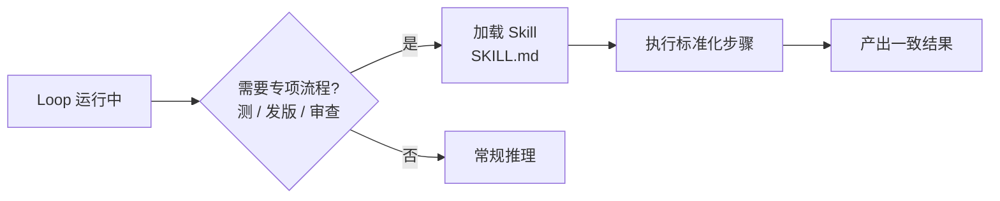

# Skills（技能编码）

> 本条目是「Loop Engineering」的第 3 部分，对应学习清单条目 6.1.3。
>
> **前置依赖**：Automations、Worktrees
> **为以下铺垫**：Connectors、Sub-agents、State

---

## 一、核心观点

> **Skills（技能编码） = 把「老员工的经验」写成 Agent 能一键调用的说明书**：这个项目怎么测、怎么发版、撞过哪些坑，全沉淀成可复用流程。
>
> 没有它，每次 Loop 跑起来都像「新来的实习生」，连 `pytest` 在哪都要重新摸索一遍。

---

## 二、定义与原理

**Skill** 是一份被结构化描述的专项流程（典型如 `SKILL.md`），Agent 在合适的时机**按需加载**。它解决 Loop 的两大痛点：

- **知识复用（Progressive Disclosure）**：别把所有指令塞进 System Prompt，用 Skill 按场景加载，省上下文。
- **行为一致**：所有 Agent 走同一套流程，不会因为「心情不同」给出不同结果。



> **和 Context / Harness 的关系**：Skill 是 Context 工程的「按需注入」手段，也是 Harness 里「确定性流程」的载体——Mitchell Hashimoto 的金句是「每次 Agent 犯错，就把它变成一条永远不再犯的 Skill / Hook」（[humanlayer.dev](https://www.humanlayer.dev/blog/skill-issue-harness-engineering-for-coding-agents)）。

---

## 三、实践与示例

一个项目测试 Skill 的骨架（概念极简）：

```markdown
# SKILL.md
---
name: project-testing
description: 本项目如何运行测试与生成覆盖率报告
---
## 步骤
1. 激活虚拟环境 `source .venv/bin/activate`
2. 跑 `pytest -q`，失败立即停
3. 覆盖率低于 80% 视为未通过
## 坑
- 别用 `npm test`（本项目用 pytest）
- 数据库测试需先 `make db-up`
```

Loop 在「该测试了」这一步加载它，而不是每次把整套测试约定写进 prompt。CLAUDE.md 过长（>200 行）时，经验法则就是把细节拆进 Skill（见 [[../01-认知升级/03-2026初 Harness Engineering|Harness Engineering]]）。

---

## 四、优势与局限

- ✅ **复利效应**：写一次，所有 Agent、所有 session 都能用，团队知识越滚越大。
- ✅ **省上下文**：按需加载，避免 System Prompt 被说明书撑爆。
- ✅ **易维护**：改一处，处处生效。
- ❌ **会过时**：项目流程一变，Skill 不更新就变「错误经验」——需要当代码一样版本管理。
- ❌ **粒度难拿捏**：太粗等于没封装，太细则 Agent 被流程捆死、失去灵活性。

---

## 五、最新研究与企业数据（2024–2026）

- **Harness 铁律**：HumanLayer (2026) 强调「需要每次都执行的事用 Hooks/ Skills，不要用 Prompt 提醒」；Skill 是概率性流程、Hook 是确定性执行，两者分工（[humanlayer.dev](https://www.humanlayer.dev/blog/skill-issue-harness-engineering-for-coding-agents)）。
- **CLAUDE.md < 200 行**：超过此长度人与 Agent 都会「扫读」跳过，其余应移入 Skill（Harness 实践共识，见 [[../01-认知升级/03-2026初 Harness Engineering|Harness Engineering]]）。
- Skill 对「吞吐量 / 质量」提升的具体量化数据，缺少一手测量——**(来源待核实：若有 Anthropic / 各大厂 Skill 采纳后的缺陷率对比数据，此处应引用)**。

---

## 六、学习资源

- **HumanLayer (2026)**《Harness Engineering for Coding Agents》—— Skills 与 Hooks 的分工
- **Anthropic** Prompt / Context 工程文档：[docs.anthropic.com](https://docs.anthropic.com/en/docs/build-with-claude/prompt-engineering)
- **进阶**：[[../01-认知升级/03-2026初 Harness Engineering|Harness Engineering]] · [[04-Connectors|Connectors]]（Skill 内部如何调工具）

---

## 核心要点

- **一句话**：Skills = 把老员工经验写成 Agent 可一键调用的说明书，沉淀为复利。
- **本质**：结构化专项流程（SKILL.md），按需加载、省上下文。
- **铁律**：每次犯的错 → 变成一条永远不犯的 Skill / Hook。
- **坑**：过期 Skill 会变「错误经验」；CLAUDE.md 超 200 行就该拆分。

---

## 参考来源（一手链接 · 可溯源深挖）

- **HumanLayer (2026)**《Harness Engineering for Coding Agents》：[humanlayer.dev/blog/skill-issue-harness-engineering-for-coding-agents](https://www.humanlayer.dev/blog/skill-issue-harness-engineering-for-coding-agents)
- **Anthropic** 文档与指南：[docs.anthropic.com](https://docs.anthropic.com/en/docs/build-with-claude/prompt-engineering)

**相关链接**：
- 系列清单：[[学习计划/Agent 方法论与产品思维学习清单|Agent 方法论与产品思维学习清单]]
- 上一层级：[[00-Agent 方法论与产品思维|Loop Engineering · 索引]]
- 同系列：[[02-Worktrees|Worktrees]] · [[04-Connectors|Connectors]] · [[../01-认知升级/03-2026初 Harness Engineering|Harness Engineering]]
