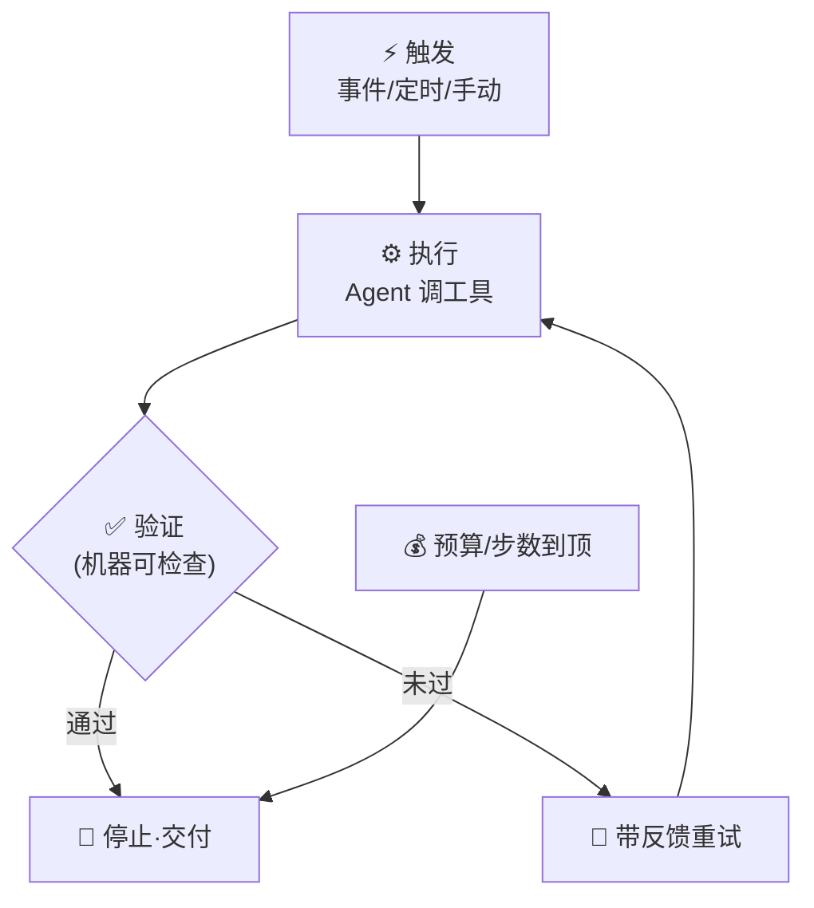

# Closed Loop 脚本

> 本条目是「Loop Engineering」的第 14 部分，对应学习清单条目 6.3.4。
>
> **前置依赖**：终止条件必须机器可检查、预算护栏必设、爆炸半径、断路器、存活检查
> **为以下铺垫**：看门狗熔断

---

## 一、核心观点

> **写一个最简单的 Closed Loop 脚本 = 触发 → 执行 → 验证 → 停止**：四步成环，有头有尾，才是「闭环」而非「开口乱跑」。
>
> 就像做菜：开火（触发）→ 炒（执行）→ 尝咸淡（验证）→ 关火装盘（停止）。缺一不可，否则要么夹生，要么烧糊。

---

## 二、定义与原理

**Closed Loop（闭环）** 是 Loop 的最简可运行形态，四个阶段环环相扣：

- **触发（Trigger）**：事件 / 定时 / 手动启动。
- **执行（Execute）**：Agent 调工具、产出结果。
- **验证（Verify）**：用**确定性** verifier（测试/lint/typecheck）判断通过与否。
- **停止（Stop）**：通过则交付；未过则带反馈重试；预算耗尽则停。



> **为什么必须「Closed」**：开口 Loop（只触发不验证、不停止）就是 [[10-Loop高风险警告|Loop 高风险]] 的温床。四阶段齐全，才把前面所有护栏（验证、预算、爆炸半径）真正串起来。

---

## 三、实践与示例

带预算护栏的最小闭环（概念极简）：

```python
def closed_loop(goal, budget):
    ctx = initial_context(goal)
    for step in range(budget.max_steps):
        budget.check()                       # 护栏先行
        action = llm.generate(goal, ctx)     # 执行
        result = execute(action)
        budget.consume(result.tokens, result.cost)
        if verify(result, goal):             # 机器可检查验证
            return result                    # 收敛，停止
        ctx = update_context(ctx, result)    # 反馈进下一轮
    return None                              # 步数到顶，停止
```

> 注意 `budget.check()` 在循环**最前**——先刹车后油门，呼应 [[08-预算护栏必设|预算护栏必设]]。验证用 `verify`（代码），不用「Agent 说好了」，呼应 [[07-终止条件必须机器可检查|终止条件必须机器可检查]]。

---

## 四、优势与局限

- ✅ **最小可控**：四阶段齐全即具备「自主但不失控」的基本盘。
- ✅ **可组合**：每个阶段都能替换升级（验证器换更强的、触发换 Automations）。
- ❌ **只是起点**：真实生产还要加 worktree 隔离、子 Agent、断路器、看门狗——本脚本是骨架不是全身。
- ❌ **验证器是瓶颈**：验证设计得差，闭环再漂亮也只会「高效地做错事」。

---

## 五、最新研究与企业数据（2024–2026）

- **Anthropic 的「workflow vs agent」**：先确认任务值得上 agent，再谈闭环；多数「触发→执行→验证」可被确定性 workflow 搞定，不必请 LLM（[anthropic.com/engineering/building-effective-agents](https://www.anthropic.com/engineering/building-effective-agents)）。
- **Loop Engineering 总览**：tosea.ai (2026) 把「触发→执行→验证→停止」作为自主 Loop 的最小闭环范式（[tosea.ai](https://tosea.ai/blog/loop-engineering-ai-agents-complete-guide-2026)）。
- 关于「最小闭环相对开口脚本的失败率对比」缺少一手基准——**(来源待核实：若有 closed-loop vs open-loop 的失败率数据，此处应引用)**。

---

## 六、学习资源

- **Anthropic (2024-12)**《Building Effective Agents》
- **tosea.ai (2026)**《Loop Engineering: The Complete Guide》
- **进阶**：[[15-看门狗熔断|看门狗熔断]]（给闭环加看门狗）· [[07-终止条件必须机器可检查|终止条件必须机器可检查]]

---

## 核心要点

- **一句话**：Closed Loop = 触发 → 执行 → 验证 → 停止，四步成环才叫「闭环」。
- **关键**：验证必须机器可检查；预算检查放循环最前。
- **定位**：最小可控骨架，真实生产还要叠 worktree / 子 Agent / 断路器 / 看门狗。
- **瓶颈**：验证器设计差，闭环只会高效地做错事。

---

## 参考来源（一手链接 · 可溯源深挖）

- **Anthropic (2024-12)**《Building Effective Agents》：[anthropic.com/engineering/building-effective-agents](https://www.anthropic.com/engineering/building-effective-agents)
- **tosea.ai (2026)**《Loop Engineering: The Complete Guide》：[tosea.ai/blog/loop-engineering-ai-agents-complete-guide-2026](https://tosea.ai/blog/loop-engineering-ai-agents-complete-guide-2026)

**相关链接**：
- 系列清单：[[学习计划/Agent 方法论与产品思维学习清单|Agent 方法论与产品思维学习清单]]
- 上一层级：[[00-Agent 方法论与产品思维|Loop Engineering · 索引]]
- 同系列：[[13-存活检查|存活检查]] · [[15-看门狗熔断|看门狗熔断]] · [[07-终止条件必须机器可检查|终止条件必须机器可检查]]
