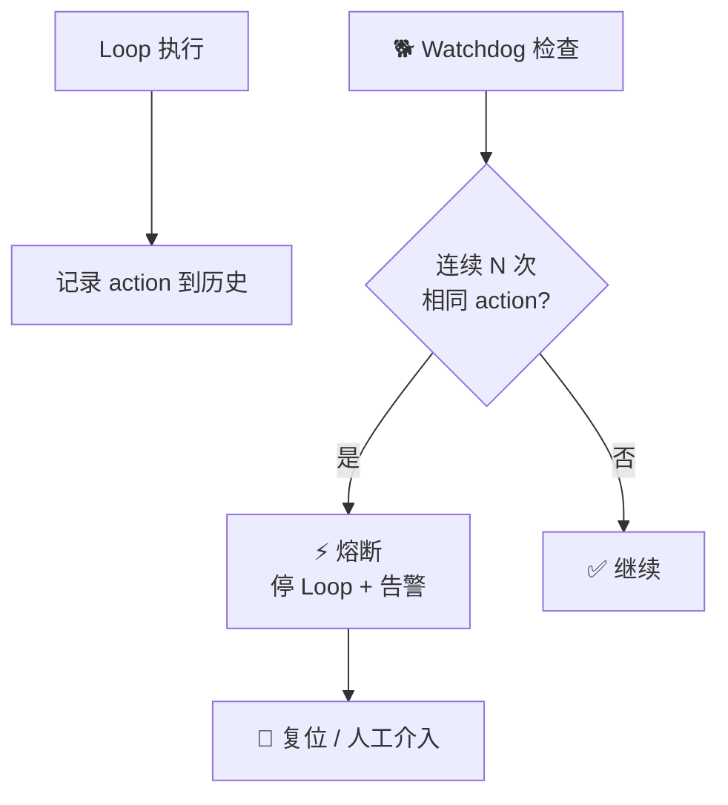

# 看门狗熔断

> 本条目是「Loop Engineering」的第 15 部分，对应学习清单条目 6.3.5。
>
> **前置依赖**：Closed Loop脚本
> **为以下铺垫**：Agent产品化

---

## 一、核心观点

> **给 Loop 加一只「看门狗」 = 发现它在原地兜圈子就熔断**：记录每次 action，连续重复即跳闸停 Loop。
>
> 真·看门狗不跟你讲道理——它不管你是不是「在思考」，只知道「你刚才一模一样叫了三声，不对劲，咬停」。

---

## 二、定义与原理

**看门狗（watchdog）** 是常驻在 Loop 外的监控者，融合前面两道保险：**存活检查**（还动不动，见 [[13-存活检查|13]]）+ **断路器**（是不是在重复，见 [[12-断路器|12]]），并在判定异常时**直接熔断**。

- **记录 action**：每次执行后把 action 存入历史。
- **检测重复**：近期 action 连续相同 → 可能卡住。
- **触发熔断**：抛异常、停 Loop、报警，必要时自动复位重试。



> **和断路器区别**：断路器常内嵌在 Loop 逻辑里；看门狗更强调「常驻、独立、外部」——它不被 Loop 的bug 一起带崩，对应 [[08-预算护栏必设|预算护栏]] 的「进程外强制」原则。两者可并存：看门狗是管家，断路器是家里某路电闸。

---

## 三、实践与示例

看门狗骨架（概念极简）：

```python
class Watchdog:
    def __init__(self, threshold=3):
        self.history = []; self.threshold = threshold
    def check(self, action):
        self.history.append(action)
        recent = self.history[-self.threshold:]
        if len(recent) == self.threshold and len(set(recent)) == 1:
            raise LoopStuck("检测到重复 action，熔断")
    def reset(self): self.history = []
```

---

## 四、优势与局限

- ✅ **最后一道闸**：即使验证器松、预算大，看门狗也能在「兜圈子」时断电。
- ✅ **外部独立**：不在 Loop 信任边界内，更难被同一 bug 绕过。
- ❌ **只看「完全相同」**：参数略变仍兜圈会漏，需配无进展检测 + 存活检查三件套。
- ❌ **误杀正常重试**：网络抖动导致的重发要排除，阈值与去重逻辑要调。

---

## 五、最新研究与企业数据（2024–2026）

- **$47K 事故的终极对照**：那套系统「No loop detection、No cost controls、No human checkpoint」——若有一只看门狗在「两 Agent 连续互发同类消息」时熔断，11 天的 `$47,000` 第一天就能止住（[supervaize.com](https://supervaize.com/fr/blog/20251016-47k-agent-loop)）。
- **外部强制是共识**：把熔断 / 预算放到 Agent 进程之外（网关、钱包级），才能挡住「本地计数器被同一 bug 绕过」的失效模式（[binary.ph](https://binary.ph/2026/03/21/ai-api-cost-control-how-ampersend-prevents-47k-agent-loop-overruns)）。
- 关于「看门狗熔断对长程 Loop 失败率的实际降幅」缺少一手量化——**(来源待核实：若有带 / 不带 watchdog 的失败率对照实验，此处应引用)**。

---

## 六、学习资源

- **Supervaize (2025-10)** $47K Agent Loop 复盘
- **binary.ph (2026-03)** 外部强制预算与熔断
- **进阶**：[[12-断路器|断路器]] · [[13-存活检查|存活检查]] · [[14-Closed Loop脚本|Closed Loop 脚本]]

---

## 核心要点

- **一句话**：看门狗熔断 = 常驻 Loop 外的管家，连重复即跳闸停 Loop。
- **定位**：= 断路器 + 存活检查的合体，且强调「外部独立」。
- **铁律**：放进程外，才不被 Loop 的 bug 一起带崩。
- **血训**：$47K 事故根因之一正是「没有 loop detection / 看门狗」。

---

## 参考来源（一手链接 · 可溯源深挖）

- **Supervaize (2025-10)** $47K Agent Loop 复盘（缺 loop detection）：[supervaize.com/fr/blog/20251016-47k-agent-loop](https://supervaize.com/fr/blog/20251016-47k-agent-loop)
- **binary.ph (2026-03)**《How ampersend Prevents $47K Agent Loop Overruns》（进程外强制）：[binary.ph/2026/03/21/ai-api-cost-control-how-ampersend-prevents-47k-agent-loop-overruns](https://binary.ph/2026/03/21/ai-api-cost-control-how-ampersend-prevents-47k-agent-loop-overruns)

**相关链接**：
- 系列清单：[[学习计划/Agent 方法论与产品思维学习清单|Agent 方法论与产品思维学习清单]]
- 上一层级：[[00-Agent 方法论与产品思维|Loop Engineering · 索引]]
- 同系列：[[12-断路器|断路器]] · [[13-存活检查|存活检查]] · [[14-Closed Loop脚本|Closed Loop 脚本]]
- 下一层：[[../07-Agent产品化/01-Workflow vs Agent选型|Agent 产品化]]
