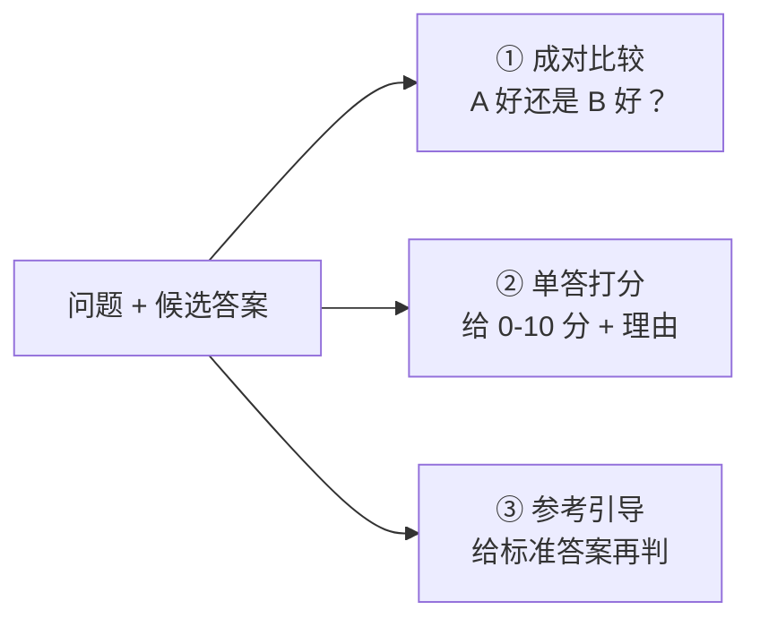

# LLM-as-Judge

> 本条目是「Agent 产品化思维」的第 8 部分，对应学习清单条目 7.3.2。
>
> **前置依赖**：三维评估框架
> **为以下铺垫**：A/B测试对照

---

## 一、核心观点

> **LLM-as-Judge（用大模型当裁判）**：拿一个强 LLM 去给另一个模型的输出打分、挑刺、给反馈，是规模化评估 Agent 的利器；但它有**位置偏见、冗长偏见、自我提升偏见**三大 known issues，必须配缓解手段，不能盲信。

---

## 二、定义与原理

### 2.1 是什么

- **LLM-as-Judge**：用一个 LLM 充当评估者（judge），对候选输出做**成对比较（pairwise）**或**单答打分（single-answer grading）**
- **核心动作**：给分数、找漏洞、给理由
- **作用**：把"人工评测"变成可批量、可复现的自动化流程

> **类比——请名师阅卷**：你出了一堆作业（Agent 输出），自己逐份看太慢，就请一位水平更高的老师（judge LLM）来批。名师批得快、标准稳，但名师也有偏好：喜欢字多的（冗长偏见）、习惯把写在前面的当更好（位置偏见）、偶尔偏袒自家学生（自我提升偏见）。所以名师的分，也得交叉验证。

### 2.2 三种评判范式



---

## 三、实践：优势与局限

### 3.1 优势

- **自动化 & 可扩展**：批量、并行，成本远低于人力
- **一致性**：同一 prompt 下标准稳定、可复现
- **可解释**：要求 judge 输出理由，便于追溯

### 3.2 局限（重点！）

| 偏见 | 表现 | 缓解 |
|------|------|------|
| **位置偏见 Position Bias** | 偏爱排在前面的答案，换顺序判断就翻转 | 交换顺序各判一次，两次一致才采信 |
| **冗长偏见 Verbosity Bias** | 偏爱更长更啰嗦的回答，哪怕注水 | 用参考引导 / 要求先独立解题再评 |
| **自我提升偏见 Self-enhancement** | 偏向自家模型生成的风格 | 多模型交叉验证 |

---

## 四、示例

```python
def llm_judge(output, criteria):
    prompt = f"请按标准评估输出并给 0-10 分与理由：\n输出：{output}\n标准：{criteria}"
    return parse_score(llm.generate(prompt))

# 缓解位置偏见：交换顺序各判一次
def judge_pairwise(a, b, criteria):
    s1 = llm_judge(f"A:{a}\nB:{b}", criteria)
    s2 = llm_judge(f"A:{b}\nB:{a}", criteria)  # 交换
    return s1 if s1 == s2 else "inconclusive"
```

---

## 五、优劣势

- ✅ 大规模评估的唯一可行解，强 judge（如 GPT-4 级）与人类偏好一致率 **>80%**
- ✅ 比人工便宜、比规则灵活
- ❌ 三大偏见会系统性污染分数
- ❌ judge 自己也幻觉；每次评估都烧 token（见 [[07-三维评估框架|三维评估]] 的成本维度）

---

## 六、核心要点

- ⚖️ **LLM-as-Judge = 用强模型当裁判**，成对比较 / 单答打分 / 参考引导三范式。
- 🎯 **一致率 >80%**：强 judge 与人类偏好吻合度可达人际一致水平（Zheng et al., 2023）。
- 🚩 **三大偏见**：位置偏见（换序翻转）、冗长偏见（偏爱长答案）、自我提升偏见（偏袒自家）。
- 🛡️ **必配缓解**：交换顺序双判、参考引导、多模型交叉验证——别盲信单 judge。

---

## 七、最新研究与企业数据

- **原始论文奠基**：Zheng et al. (2023, NeurIPS)《Judging LLM-as-a-Judge with MT-Bench and Chatbot Arena》系统验证：强 LLM judge（如 GPT-4）与人类偏好一致率 **超 80%**，达到人际一致水平；同时明确指出 **position bias、verbosity bias、self-enhancement bias** 三大局限，并提出"交换顺序双判 + few-shot + 参考引导"等缓解法。
- **多 Agent judge 会放大偏见**：2025 年 EMNLP 研究发现，Multi-Agent-Debate 框架在首轮辩论后**偏见急剧放大并持续**，而 Meta-Judge 方案抗性更强——提醒我们"用多个 judge"未必更稳，要看架构。

---

## 八、学习资源

- **一手论文**：Zheng et al. (2023)《Judging LLM-as-a-Judge》：[arXiv:2306.05685](https://arxiv.org/abs/2306.05685)
- **延伸**：[[09-A-B测试对照|A/B 测试对照]]——judge 之外如何对比两版；[[07-三维评估框架|三维评估框架]]——judge 分数喂进哪个维度

---

**下一篇**：[[09-A-B测试对照|A/B测试对照]]——评估方法讲完，下篇讲"A/B 测试：加载 Skill 与否、旧 Skill vs 新 Skill"。

---

## 参考来源（一手链接 · 可溯源深挖）

- **Zheng et al. (2023, NeurIPS)**《Judging LLM-as-a-Judge with MT-Bench and Chatbot Arena》：[arXiv:2306.05685](https://arxiv.org/abs/2306.05685)（一致率 >80%、位置/冗长/自我提升偏见、缓解法）
- **Ma et al. (2025, EMNLP Findings)**《Judging with Many Minds: Do More Perspectives Mean Less Prejudice?》：[ACL Anthology PDF](https://aclanthology.org/anthology-files/pdf/findings/2025.findings-emnlp.941.pdf)（多 Agent judge 偏见放大）
- **Ye et al. (2024)**《Justice or Prejudice? Quantifying Biases in LLM-as-a-Judge》（12 类偏见的量化框架 Calm）：[arXiv:2410.02736](https://arxiv.org/html/2410.02736v1)

**相关链接**：
- 系列清单：[[学习计划/Agent 方法论与产品思维学习清单|Agent 方法论与产品思维学习清单]]
- 上一层级：[[00-Agent 方法论与产品思维|Agent 产品化思维 · 索引]]
- 同主题：[[07-三维评估框架|三维评估框架]] · [[09-A-B测试对照|A/B 测试对照]]
