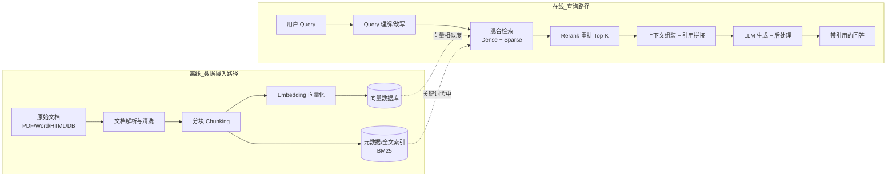

# RAG 系统设计

> 本篇定位为**系统设计层**：如何把"外部知识可靠接入 LLM 生成链路"落成一个可上线、可观测、可优化的系统。原理细节（分块/Embedding/混合检索/Re-ranker）见 [[AI与Agent/知识/八股/13-RAG检索增强生成|RAG检索增强生成]]、[[AI与Agent/知识/八股/14-文档解析与分块策略|文档解析与分块策略]]、[[AI与Agent/知识/八股/17-语义搜索与混合检索|语义搜索与混合检索]]。

## 为什么需要"设计"而非"拼链路"

朴素 RAG（检索→拼进 Prompt→生成）在 demo 里能跑，但上线后立刻暴露三类问题：**检索质量不稳定、长尾问题答不出、效果不可观测不可回归**。RAG 系统设计的核心目标是把这三件事工程化：

- **双路径解耦**：数据摄入（离线）与查询（在线）走不同节奏，各自可独立优化与扩缩容。
- **检索质量可量化**：用评估指标驱动分块/检索/重排的调参。
- **成本与延迟可控**：靠缓存、异步、分级检索降本提速。

## 双路径整体架构

两条路径只在"向量库 + 元数据索引"这个存储层交汇。摄入路径失败只影响新文档可见性，不影响存量问答；查询路径失败则影响实时性——这种隔离本身就是韧性设计。

## 模块一：数据摄入路径设计

### 文档解析
不同格式解析质量差异极大，决定检索上限：

| 格式 | 解析要点 | 常见坑 |
| ------ | ------ | ------ |
| PDF | 版式还原（标题/表格/多栏） | 表格被拆散、公式丢失 |
| Word/MD | 结构保留好 | 样式噪声 |
| HTML | 去噪（导航/广告） | 正文抽取需 readability |
| 数据库 | 行→文档映射 | 字段级 chunk |

详见 [[AI与Agent/知识/八股/14-文档解析与分块策略|文档解析与分块策略]]。

### 分块策略（直接决定召回质量）
工程上常用"固定窗口 + 滑动重叠"作为基线，再对结构化文档做语义/递归分块：

| 维度 | 推荐实践 | 理由 |
| ------ | ------ | ------ |
| chunk_size | 512–1024 tokens | 太小丢上下文，太大引入噪声 |
| overlap | 10%–20% | 避免切分点信息断裂 |
| 结构化文档 | 按标题/段落递归切 | 保留语义边界 |
| 元数据 | 每 chunk 带 source/时间/权限 | 支撑过滤与溯源 |

### 双写存储
摄入时**同时写入向量库与全文索引（BM25）**，为后续混合检索铺路；元数据（来源、时间、权限标签）单独存，用于检索时的预过滤（如"只看 2024 年后的文档"）。

## 模块二：查询路径设计

### Query 理解与改写
- 多轮对话做指代消解，把"它""这个方法"还原成具体实体。
- 复杂问题做查询扩展/分解（HyDE、Step-back、多子查询），提升召回。
- 路由：按问题类型选择检索通道（FAQ 直答 / 知识库检索 / 工具查询）。

### 混合检索 + Rerank
- 先用 Dense（向量）+ Sparse（BM25）各召回 Top-50，用 **RRF**（Reciprocal Rank Fusion）融合。
- 再送 Cross-Encoder Re-ranker 精排到 Top-5/Top-8，控制进 LLM 的上下文质量。
- 检索阶段用 bi-encoder（快），精排阶段用 cross-encoder（准），两阶段平衡速度与精度。

### 上下文组装与引用
- 拼接 Top-K + 用户问题 + 系统指令，要求模型"只基于上下文回答并标注引用"。
- 保留 chunk 的 source  metadata，前端可展示"回答依据哪几篇文档"。

## 缓存优化设计

| 缓存层 | 命中条件 | 收益 |
| ------ | ------ | ------ |
| Query 字符串缓存 | 相同问题 | 跳过整条检索+生成 |
| Embedding 缓存 | 相同文本 | 跳过向量化（最贵的一步之一） |
| 检索结果缓存 | 相同 query 向量 | 跳过向量检索 |
| 生成结果缓存 | 相同 (query+context) | 仅兜底，注意时效性 |

注意：带时效性的知识（如股价、库存）需给缓存加 TTL 或失效策略，否则会返回陈旧答案。

## 关键权衡

| 问题 | 设计回答要点 |
| ------ | ------ |
| 检索召回低怎么办？ | ① 调 chunk_size/overlap ② 加查询改写 ③ 混合检索补精确匹配 ④ 升级 Embedding ⑤ 加 Reranker |
| 上下文超长怎么处理？ | 重排收紧 Top-K、摘要压缩、按相关性截断、用" Lost in the Middle "策略把关键证据放首尾 |
| 如何评估 RAG 系统？ | 检索侧 Context Precision/Recall，生成侧 Faithfulness/Answer Relevance；建回归集持续监控 |
| 如何控制成本？ | Embedding 缓存、分层检索（先小库后大库）、结果缓存、异步预取 |

---

## 速记卡（面试闪卡）

**Q1：一句话讲清「RAG 系统设计」到底是什么？**
A：朴素 RAG（检索→拼进 Prompt→生成）在 demo 里能跑，但上线后立刻暴露三类问题：**检索质量不稳定、长尾问题答不出、效果不可观测不可回归**。RAG 系统设计的核心目标是把这三件事工程化：
**双路径解耦**：数据摄入（离线）与查询（在线）走不同节奏，各自可独立优化与扩缩容。
**检索质量可量化**：用评估指标驱动分块/检索/重排的调参。

**Q2：为什么需要"设计"而非"拼链路" —— 怎么理解？**
A：朴素 RAG（检索→拼进 Prompt→生成）在 demo 里能跑，但上线后立刻暴露三类问题：**检索质量不稳定、长尾问题答不出、效果不可观测不可回归**。RAG 系统设计的核心目标是把这三件事工程化：
**双路径解耦**：数据摄入（离线）与查询（在线）走不同节奏，各自可独立优化与扩缩容。
**检索质量可量化**：用评估指标驱动分块/检索/重排的调参。
**成本与延迟可控**：靠缓存、异步、分级检索降本提速。

**Q3：双路径整体架构 —— 怎么理解？**
A：两条路径只在"向量库 + 元数据索引"这个存储层交汇。摄入路径失败只影响新文档可见性，不影响存量问答；查询路径失败则影响实时性——这种隔离本身就是韧性设计。

**Q4：模块一：数据摄入路径设计 —— 怎么理解？**
A：不同格式解析质量差异极大，决定检索上限：
| 格式 | 解析要点 | 常见坑 |
| ------ | ------ | ------ |
| PDF | 版式还原（标题/表格/多栏） | 表格被拆散、公式丢失 |
| Word/MD | 结构保留好 | 样式噪声 |
| HTML | 去噪（导航/广告） | 正文抽取需 readability |
| 数据库 | 行→文档映射 | 字段级 chunk |
详见 。

**Q5：模块二：查询路径设计 —— 怎么理解？**
A：多轮对话做指代消解，把"它""这个方法"还原成具体实体。
复杂问题做查询扩展/分解（HyDE、Step-back、多子查询），提升召回。
路由：按问题类型选择检索通道（FAQ 直答 / 知识库检索 / 工具查询）。
先用 Dense（向量）+ Sparse（BM25）各召回 Top-50，用 **RRF**（Reciprocal Rank Fusion）融合。

**Q6：核心速记主线有哪些？**
A：抓住这几根：为什么需要"设计"而非"拼链路"、双路径整体架构、模块一：数据摄入路径设计、模块二：查询路径设计、缓存优化设计、关键权衡。

## 相关链接
- [[AI与Agent/知识/八股/13-RAG检索增强生成|RAG检索增强生成]]
- [[AI与Agent/知识/八股/14-文档解析与分块策略|文档解析与分块策略]]
- [[AI与Agent/知识/八股/17-语义搜索与混合检索|语义搜索与混合检索]]
- [[AI与Agent/知识/八股/15-Embedding向量化|Embedding向量化]]
- [[AI与Agent/知识/八股/16-向量数据库|向量数据库]]
- [[AI与Agent/知识/八股/22-RAG评估指标|RAG评估指标]]
- [[八股文学习清单]]
- [[00-全局导航|全局导航]]

---

## 快速问答

| 问题 | 参考答案 |
| ------ | --------- |
| RAG 系统为什么要分"双路径"？ | 数据摄入（离线）与查询（在线）节奏不同：摄入可批量、可重跑，查询要求低延迟。解耦后各自独立扩缩容与优化，且摄入故障不影响存量问答。 |
| 混合检索为什么必要？ | 纯向量检索语义强但精确匹配弱，BM25 精确匹配强但无语义。两者融合（RRF）互补，显著提升召回质量。 |
| 为什么检索后还要 Rerank？ | 向量检索用 bi-encoder（Q/D 独立编码）速度快但精度有限；Re-ranker 用 cross-encoder 联合编码精度高。两阶段平衡速度与精度。 |
| RAG 怎么控制成本？ | Embedding 缓存、结果缓存、分层/分级检索、异步预取；带时效知识加 TTL 防陈旧。 |
| 如何保证 RAG 回答可溯源？ | 每个 chunk 带 source 元数据，生成时要求标注引用，前端展示依据文档；这也是 RAG 相比微调最大的可解释性优势。 |
