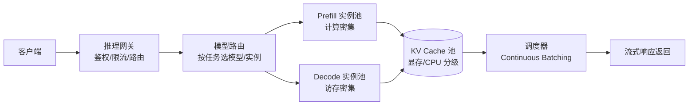

# LLM 推理服务设计

> 本篇聚焦**把 LLM 部署成一个高吞吐、低延迟、可弹性伸缩的在线服务**。底层优化原理（KV Cache、连续批处理、量化等）见 [[AI与Agent/知识/八股/73-LLM推理优化|LLM推理优化]]、[[AI与Agent/知识/八股/65-AI应用架构设计|AI应用架构设计]]。

## 设计目标
在线推理服务的核心矛盾：**贵（显存/算力）+ 慢（自回归逐 token）+ 波动大（请求长短不一）**。系统设计要在吞吐、延迟、成本三者间权衡。

## 服务总体架构

## 模块一：推理网关
- **鉴权与配额**：API Key、按租户限流、费用上限。
- **请求路由**：简单问题路由到小模型，复杂问题到大模型；长上下文请求单独队列，避免拖累短请求。
- **超时与降级**：超时返回部分结果或降级模型。

## 模块二：模型放置（Placement）
- **同构放置**：同型号 GPU 放一起，便于张量/流水线并行。
- **异构分层**：热门模型常驻显存，长尾模型按需加载（或卸载到 CPU）。
- **多副本 + 负载均衡**：应对并发，副本间无状态（状态在 KV Cache/外部存储）。

## 模块三：Prefill / Decode 分离
Prefill（处理整段输入，计算密集）与 Decode（逐 token，访存密集）瓶颈不同。分离部署可各自优化：
- Prefill 池用高算力 GPU，批大、重计算。
- Decode 池用高带宽 GPU，专注低延迟生成。
- 二者通过 **KV Cache 传输/共享**衔接（如把 Prefill 产出的 KV 直接传给 Decode 实例），这是高并发推理的关键架构（如 DistServe、Splitwise 思路）。

## 模块四：KV Cache 管理
- **显存分级**：热 KV 留 GPU 显存，冷 KV 换到 CPU/SSD（分页式管理，见 vLLM PagedAttention）。
- **复用**：多轮对话的 system prompt、Few-shot 示例等前缀 KV 可复用，避免重复 Prefill。
- **量化**：KV Cache 量化（INT8/INT4）显著降低显存，见 [[AI与Agent/知识/八股/73-LLM推理优化|LLM推理优化]]。

## 关键权衡

| 问题 | 设计回答要点 |
| ------ | ------ |
| 为什么 Prefill/Decode 要分离？ | 二者瓶颈不同（计算密集 vs 访存密集），混部会互相拖累；分离后各自扩缩容，整体吞吐与尾延迟更优 |
| 如何提升 GPU 利用率？ | Continuous Batching（动态拼批）+ PagedAttention（消除 KV 碎片）+ 前缀 KV 复用 |
| 长上下文很贵怎么办？ | KV Cache 量化/驱逐 + 分级存储 + 仅在必要时放大上下文（见 RAG系统设计 的"渐进式披露"） |
| 如何保证 SLA？ | 网关限流 + 超时降级 + 长短请求分级队列 + 副本冗余 |

---

## 速记卡（面试闪卡）

**Q1：一句话讲清「LLM 推理服务设计」到底是什么？**
A：在线推理服务的核心矛盾：**贵（显存/算力）+ 慢（自回归逐 token）+ 波动大（请求长短不一）**。系统设计要在吞吐、延迟、成本三者间权衡。

**Q2：设计目标 —— 怎么理解？**
A：在线推理服务的核心矛盾：**贵（显存/算力）+ 慢（自回归逐 token）+ 波动大（请求长短不一）**。系统设计要在吞吐、延迟、成本三者间权衡。

**Q3：模块一：推理网关 —— 怎么理解？**
A：**鉴权与配额**：API Key、按租户限流、费用上限。
**请求路由**：简单问题路由到小模型，复杂问题到大模型；长上下文请求单独队列，避免拖累短请求。
**超时与降级**：超时返回部分结果或降级模型。

**Q4：模块二：模型放置（Placement） —— 怎么理解？**
A：**同构放置**：同型号 GPU 放一起，便于张量/流水线并行。
**异构分层**：热门模型常驻显存，长尾模型按需加载（或卸载到 CPU）。
**多副本 + 负载均衡**：应对并发，副本间无状态（状态在 KV Cache/外部存储）。

**Q5：核心速记主线有哪些？**
A：抓住这几根：设计目标、服务总体架构、模块一：推理网关、模块二：模型放置（Placement）、模块三：Prefill / Decode 分离、模块四：KV Cache 管理。

## 相关链接
- [[AI与Agent/知识/八股/73-LLM推理优化|LLM推理优化]]
- [[AI与Agent/知识/八股/65-AI应用架构设计|AI应用架构设计]]
- [[12-Agent流式推理服务设计|Agent流式推理服务设计]]
- [[八股文学习清单]]
- [[00-全局导航|全局导航]]

---

## 快速问答

| 问题 | 参考答案 |
| ------ | --------- |
| 推理服务为什么延迟高？ | 自回归 Decode 每 token 都要读整段 KV Cache，访存密集；加上排队、Prefill 耗时。靠批处理、KV 复用、分离部署优化。 |
| Prefill/Decode 分离的核心收益？ | 把计算密集与访存密集拆开，各自最优配置与扩缩容，避免长短请求互相拖累，提升吞吐、压低尾延迟。 |
| KV Cache 为什么要分级管理？ | 全留显存太贵、全放 CPU 太慢；按冷热分级（GPU→CPU→SSD）在成本与延迟间取平衡，配合分页避免碎片。 |
| 在线推理如何控本？ | 小模型路由简单请求、量化、批处理提利用率、长尾模型按需加载、KV 前缀复用。 |
