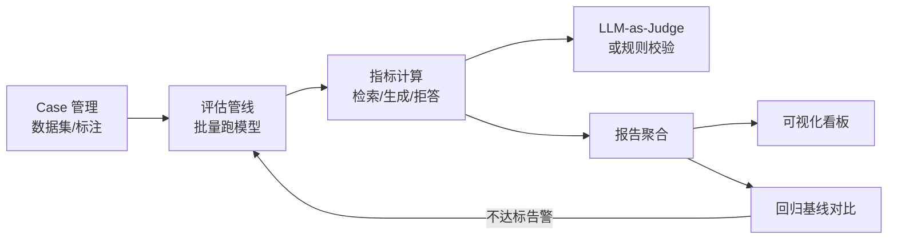

# AI 评测平台设计

> 本篇聚焦**如何把"模型/ Agent 好不好"变成可量化、可回归、可协作的工程能力**。指标定义见 [[AI与Agent/知识/八股/22-RAG评估指标|RAG评估指标]]、[[AI与Agent/知识/八股/11-LLM评估与基准测试|LLM评估与基准测试]]、[[AI与Agent/知识/八股/10-LLM幻觉与可靠性|LLM幻觉与可靠性]]。

## 为什么需要独立评测平台
没有评测平台时，效果靠"主观试几条"，改一次 Prompt 不知道是变好还是变坏。平台要解决：**Case 可沉淀、评估可自动化、回归可对比、结果可可视化**。

## 平台总体架构

## 模块一：Case 管理
- **数据集分层**：冒烟集（快速）、回归集（核心）、压力集（边界/对抗）。
- **标注与版本**：每条 Case 含输入、期望输出/评分标准、标签（难度/类型）。
- **去隐私**：生产日志回流评测前脱敏。

## 模块二：自动化评估管线
- 批量跑待测版本，支持并发与断点续跑。
- **指标分层**（参考 Agent 评测四层）：
  - 结果级：最终答案是否正确/有用。
  - 轨迹级：中间步骤/工具调用是否合理。
  - 体验级：延迟、格式、引用质量。
  - 稳定性：多次运行一致性。

## 模块三：指标与 Judge
- 检索侧：Context Precision / Recall。
- 生成侧：Faithfulness（忠实度）、Answer Relevance、拒答 F1。
- **LLM-as-Judge**：用强模型按评估 Prompt 打分，注意自洽性偏差（同一题多次评可能不一致），需加规则校验兜底，详见 LLM-as-Judge 工程实现思路（待补充）。

## 模块四：可视化和回归基线
- 每次评估生成报告，与**基线版本**对比：哪些 Case 变差、整体指标涨跌。
- 看板展示趋势，回归不达标自动告警，阻断劣化上线。
- 评估可视化工具选型参考 Agent 可观测性工具选型（待补充）。

## 关键权衡

| 问题 | 设计回答要点 |
| ------ | ------ |
| 规则评测 vs LLM-Judge 怎么选？ | 客观题（格式/是否含引用）用规则快且稳；主观题（相关性/质量）用 LLM-Judge，但要防自洽性偏差，二者结合 |
| 如何防止评测集过拟合？ | 评测集与训练/调参集隔离，定期补充对抗/边界 Case，保留未公开 hold-out |
| 回归基线怎么定？ | 选定"当前最优稳定版"为基线，每次变更对比基线，指标显著下降则拦截 |

---

## 速记卡（面试闪卡）

**Q1：一句话讲清「AI 评测平台设计」到底是什么？**
A：没有评测平台时，效果靠"主观试几条"，改一次 Prompt 不知道是变好还是变坏。平台要解决：**Case 可沉淀、评估可自动化、回归可对比、结果可可视化**。

**Q2：为什么需要独立评测平台 —— 怎么理解？**
A：没有评测平台时，效果靠"主观试几条"，改一次 Prompt 不知道是变好还是变坏。平台要解决：**Case 可沉淀、评估可自动化、回归可对比、结果可可视化**。

**Q3：模块一：Case 管理 —— 怎么理解？**
A：**数据集分层**：冒烟集（快速）、回归集（核心）、压力集（边界/对抗）。
**标注与版本**：每条 Case 含输入、期望输出/评分标准、标签（难度/类型）。
**去隐私**：生产日志回流评测前脱敏。

**Q4：模块二：自动化评估管线 —— 怎么理解？**
A：批量跑待测版本，支持并发与断点续跑。
**指标分层**（参考 Agent 评测四层）：
结果级：最终答案是否正确/有用。
轨迹级：中间步骤/工具调用是否合理。
体验级：延迟、格式、引用质量。
稳定性：多次运行一致性。

**Q5：核心速记主线有哪些？**
A：抓住这几根：为什么需要独立评测平台、平台总体架构、模块一：Case 管理、模块二：自动化评估管线、模块三：指标与 Judge、模块四：可视化和回归基线。

## 相关链接
- [[AI与Agent/知识/八股/22-RAG评估指标|RAG评估指标]]
- [[AI与Agent/知识/八股/11-LLM评估与基准测试|LLM评估与基准测试]]
- [[AI与Agent/知识/八股/10-LLM幻觉与可靠性|LLM幻觉与可靠性]]
- [[01-RAG系统设计|RAG系统设计]]
- [[08-RAG知识库系统设计|RAG知识库系统设计]]
- [[八股文学习清单]]
- [[00-全局导航|全局导航]]

---

## 快速问答

| 问题 | 参考答案 |
| ------ | --------- |
| AI 评测平台的核心模块？ | Case 管理（数据集/标注）+ 自动化评估管线 + 指标与 Judge + 可视化与回归基线对比。 |
| 为什么 LLM-as-Judge 要加规则校验？ | 强模型打分存在自洽性偏差（同题多次结果不一）和立场偏差，规则校验做兜底，提升评测稳定性。 |
| 如何判断一次 Prompt 改动是否"变好"？ | 跑回归集对比基线：整体指标涨跌 + 变差 Case 清单；显著下降则拦截，不靠主观感受。 |
| RAG 和 Agent 的评测有何不同？ | RAG 偏检索+生成指标（Faithfulness/Recall）；Agent 多一层轨迹级（工具调用合理性）与稳定性（多次一致性）。 |
