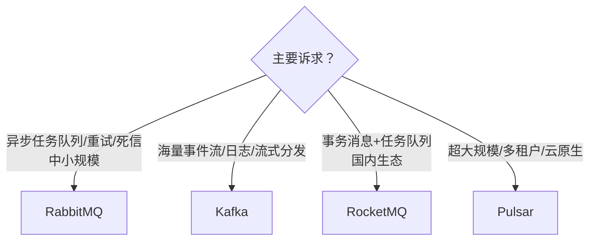

# 高并发 MQ 选型（AI 场景）

> 本篇站在 **AI 系统高并发**视角做 MQ 选型，原理与三大 MQ 对比见 [[计算机基础/分布式-系统设计/06-消息队列MQ|消息队列MQ（含三大 MQ 选型对比）]]。

## AI 场景对 MQ 的特殊需求
AI 系统里 MQ 不只是"解耦/异步/削峰"，还承担：
- **LLM 调用异步化**：推理慢（秒级~分钟级），必须入队异步，否则阻塞 Web 请求。
- **任务队列语义**：需要任务级优先级、重试、死信、进度追踪（不像纯日志流）。
- **流式分发**：Agent 多步结果经 MQ 推给前端/下游。
- **削峰**：突发流量（活动、批量导入）被 MQ 吸收，保护昂贵的 GPU 资源。

## 四选型场景对比

| 维度 | RabbitMQ | Kafka | RocketMQ | Pulsar |
| ------ | ------ | ------ | ------ | ------ |
| 模型 | 队列/路由（AMQP） | 持久日志流 | 队列+事务 | 分层（计算/存储分离） |
| 吞吐 | 中 | 极高 | 高 | 极高 |
| 延迟 | 低（ms） | 低~中 | 低 | 低 |
| 任务队列能力 | ⭐⭐⭐ 强（优先级/死信/ACK） | ⭐ 弱（需自建） | ⭐⭐⭐ 强 | ⭐⭐ 中 |
| 流式/日志 | 弱 | ⭐⭐⭐ | 中 | ⭐⭐⭐ |
| 运维复杂度 | 低 | 中 | 中 | 高 |
| AI 适配 | 中小规模任务队列首选 | 海量日志/事件流 | 电商级事务+任务 | 超大规模多租户 |

## 选型决策

## AI 实战组合建议
- **推理任务队列**：RabbitMQ / RocketMQ（要任务级重试、死信、优先级）。
- **行为日志 / 训练数据管道**：Kafka（高吞吐、可重放）。
- **多 Agent 消息总线**：可选 RabbitMQ（路由灵活）或 Kafka（审计留痕）。
- 与限流、降级配合见 [[11-Agent降级与容错系统设计|Agent降级与容错系统设计]]、[[计算机基础/分布式-系统设计/08-限流与熔断降级|限流与熔断降级]]。

## 关键权衡

| 问题 | 设计回答要点 |
| ------ | ------ |
| AI 推理为什么必须异步+MQ？ | 推理秒~分级，同步会拖垮 Web 并发；MQ 异步化+削峰保护 GPU，任务可重试/追踪进度 |
| Kafka 做任务队列有什么坑？ | 它是日志流，没有原生任务优先级/死信/单条 ACK，需自建消费位移与重试逻辑 |
| 怎么防 MQ 积压拖垮下游？ | 消费侧限流 + 动态扩容消费者 + 死信隔离劣质任务 + 监控积压告警 |

---

## 速记卡（面试闪卡）

**Q1：一句话讲清「高并发 MQ 选型（AI 场景）」到底是什么？**
A：高并发 MQ 选型在 AI 场景里，既要做传统的解耦/异步/削峰，还要扛 LLM 慢推理的任务队列语义——按诉求在 RabbitMQ/Kafka/RocketMQ/Pulsar 间挑。

**Q2：AI 场景对 MQ 的特殊需求 —— 怎么理解？**
A：AI 系统里 MQ 不只是「解耦/异步/削峰」，还承担 LLM 调用异步化（推理秒级不能阻塞 Web）、任务队列语义（优先级/重试/死信/进度）、流式分发和削峰护 GPU——像快递柜既要收件也要能「重新投递」。

**Q3：四选型场景对比 —— 怎么理解？**
A：RabbitMQ 任务队列强（优先级/死信/ACK），Kafka 是海量日志流，RocketMQ 事务+任务，Pulsar 分层架构玩超大规模多租户——就像选车：市区代步、货车、商务、还是车队调度。

**Q4：选型决策树 —— 怎么理解？**
A：要任务队列/重试/死信就 RabbitMQ 或 RocketMQ；要海量事件流/日志就 Kafka；要事务+国内生态用 RocketMQ；要超大规模/多租户/云原生上 Pulsar。

**Q5：AI 实战组合与防积压 —— 怎么理解？**
A：推理任务队列用 RabbitMQ/RocketMQ，行为日志管道用 Kafka，多 Agent 总线二者皆可；防积压靠消费侧限流 + 动态扩容 + 死信隔离劣质任务 + 监控告警。

**Q6：核心速记主线有哪些？**
- AI 场景四特殊需求：异步化/任务队列/流式/削峰护 GPU
- 四 MQ 对比：RabbitMQ/Kafka/RocketMQ/Pulsar 各有所长
- 选型决策：按主要诉求（任务/日志/事务/规模）分流
- AI 实战组合：推理队列 + 日志管道 + 多 Agent 总线
- 防积压：限流 + 扩容 + 死信 + 告警

**口诀**
A：高并发选 MQ，AI 场景要异步；
推理入队护 GPU，慢活不把 web 误；
任务队列四家强，按需分流不盲目；
积压靠限流死信，扩容告警守得住。

## 相关链接
- [[计算机基础/分布式-系统设计/06-消息队列MQ|消息队列MQ]]
- [[计算机基础/分布式-系统设计/06-消息队列MQ|消息队列MQ（含三大 MQ 选型对比）]]
- [[计算机基础/分布式-系统设计/08-限流与熔断降级|限流与熔断降级]]
- [[11-Agent降级与容错系统设计|Agent降级与容错系统设计]]
- [[八股文学习路线图]]
- [[00-全局导航|全局导航]]

---

## 快速问答

| 问题 | 参考答案 |
| ------ | --------- |
| AI 系统里 MQ 主要解决什么？ | 把慢推理异步化、削峰保护 GPU、任务级重试与进度追踪、Agent 间消息分发。 |
| 任务队列语义该选哪个 MQ？ | RabbitMQ / RocketMQ（原生支持优先级、死信、ACK）；Kafka 需自建，不适合纯任务队列。 |
| 为什么不用 Kafka 直接做推理任务队列？ | Kafka 是持久日志，没有单条任务重试/死信/优先级的原生语义，消费位移管理复杂。 |
| MQ 积压了怎么处理？ | 监控告警 → 扩容消费者 → 消费侧限流 → 死信隔离问题任务 → 必要时降级非核心消费。 |
