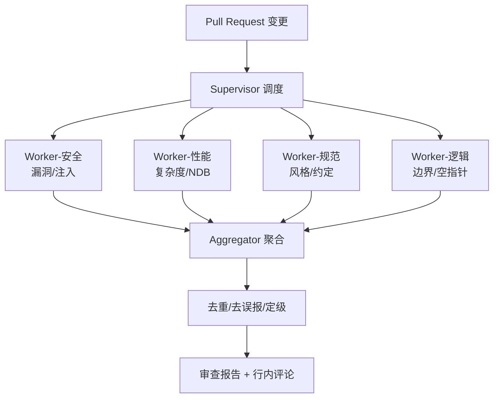

# 多 Agent 代码审查系统设计

> 典型**多 Agent 协作**落地：用 Supervisor-Worker 架构把一次 Code Review 拆给多个专职 Agent 并行审，再聚合报告。协作模式总览见 [[AI与Agent/知识/八股/29-多Agent协作基础与框架选型|多Agent协作Multi-Agent]]、[[AI与Agent/知识/八股/23-Agent架构与核心组件|Agent架构与ReAct]]。

## 为什么用多 Agent 而非单 Agent
单个 Agent 一次审完，容易顾此失彼、上下文爆炸、视角单一。拆成多个专职 Worker（安全/性能/规范/逻辑），**并行 + 专业分工**，质量与速度都更好。但引入了协调、聚合、一致性成本。

## Supervisor-Worker 架构

## 模块设计
- **Supervisor**：切分变更文件、按文件/维度派发任务、控制并发与超时、收集结果。
- **Worker（专职）**：每个 Worker 只负责一个维度，System Prompt 聚焦，工具各取所需（AST 解析、grep、单测运行）。
- **Aggregator**：合并多个 Worker 的结论，**去重、过滤误报、按严重度定级**（阻塞/建议/提示）。
- **反馈闭环**：被开发者标记为"误报"的结论回流，用于优化 Worker Prompt/规则。

## 工程要点
- **并行限界**：Worker 数受 LLM 并发与成本限制，按变更规模动态决定并行度。
- **上下文隔离**：每个 Worker 只看自己负责的文件片段，避免上下文溢出。
- **确定性**：同一 PR 多次审阅结果应稳定，需固定模型与去随机。
- 多 Agent 的通信与一致性问题见 [[AI与Agent/知识/八股/29-多Agent协作基础与框架选型|多Agent协作Multi-Agent]]、[[AI与Agent/知识/八股/43-多Agent编排四种模式|多Agent编排模式]]、[[45-多Agent幻觉放大问题与解决方案|多Agent幻觉放大]]。

## 关键权衡

| 问题 | 设计回答要点 |
| ------ | ------ |
| 多 Agent 比单 Agent 好在哪？ | 专业分工 + 并行，视角更全、质量更高；代价是协调/聚合/一致性成本 |
| 怎么处理多个 Worker 结论冲突？ | Aggregator 去重+定级，按严重度与证据强度裁决；冲突项升级人工 |
| Worker 太多会不会很贵？ | 按变更规模动态并行度、上下文隔离控 token、误报回流降后续成本 |
| 如何防止误报淹没开发者？ | 严格定级（阻塞/建议/提示）+ 去重 + 误报反馈闭环，只把高置信结论评论到 PR |

---

## 速记卡（面试闪卡）

**Q1：一句话讲清「多 Agent 代码审查系统设计」到底是什么？**
A：单个 Agent 一次审完，容易顾此失彼、上下文爆炸、视角单一。拆成多个专职 Worker（安全/性能/规范/逻辑），**并行 + 专业分工**，质量与速度都更好。但引入了协调、聚合、一致性成本。

**Q2：为什么用多 Agent 而非单 Agent —— 怎么理解？**
A：单个 Agent 一次审完，容易顾此失彼、上下文爆炸、视角单一。拆成多个专职 Worker（安全/性能/规范/逻辑），**并行 + 专业分工**，质量与速度都更好。但引入了协调、聚合、一致性成本。

**Q3：模块设计 —— 怎么理解？**
A：**Supervisor**：切分变更文件、按文件/维度派发任务、控制并发与超时、收集结果。
**Worker（专职）**：每个 Worker 只负责一个维度，System Prompt 聚焦，工具各取所需（AST 解析、grep、单测运行）。
**Aggregator**：合并多个 Worker 的结论，**去重、过滤误报、按严重度定级**（阻塞/建议/提示）。

**Q4：工程要点 —— 怎么理解？**
A：**并行限界**：Worker 数受 LLM 并发与成本限制，按变更规模动态决定并行度。
**上下文隔离**：每个 Worker 只看自己负责的文件片段，避免上下文溢出。
**确定性**：同一 PR 多次审阅结果应稳定，需固定模型与去随机。
多 Agent 的通信与一致性问题见 、、。

**Q5：核心速记主线有哪些？**
A：抓住这几根：为什么用多 Agent 而非单 Agent、Supervisor-Worker 架构、模块设计、工程要点、关键权衡、快速问答。

## 相关链接
- [[AI与Agent/知识/八股/29-多Agent协作基础与框架选型|多Agent协作Multi-Agent]]
- [[AI与Agent/知识/八股/23-Agent架构与核心组件|Agent架构与ReAct]]
- [[AI与Agent/知识/八股/43-多Agent编排四种模式|多Agent编排四种模式]]
- [[AI与Agent/知识/八股/45-多Agent幻觉放大问题与解决方案|多Agent幻觉放大问题]]
- [[八股文学习清单]]
- [[00-全局导航|全局导航]]

---

## 快速问答

| 问题 | 参考答案 |
| ------ | --------- |
| 多 Agent 代码审查的架构？ | Supervisor 派发 → 多个专职 Worker 并行审（安全/性能/规范/逻辑）→ Aggregator 去重定级 → 报告。 |
| 为什么不直接让一个 Agent 审完？ | 单 Agent 上下文易溢出、视角单一、易遗漏；多 Worker 专业分工+并行，质量与速度更优。 |
| 多个 Worker 结论冲突怎么办？ | Aggregator 按严重度与证据强度裁决，冲突项升级人工；最终只评论高置信结论。 |
| 如何控制成本与误报？ | 动态并行度 + 上下文隔离控 token；去重定级 + 误报反馈闭环降噪声。 |
