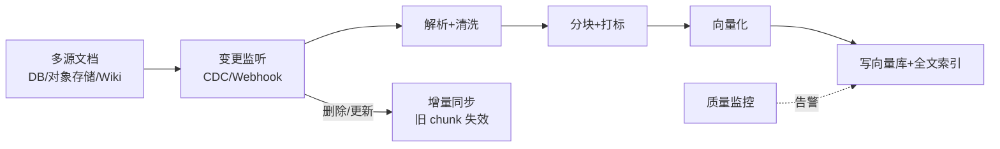

# RAG 知识库系统设计（规模视角）

> 与 [[01-RAG系统设计|RAG系统设计]]（通用双路径）互补：本篇从**大规模知识库**角度谈数据摄入 Pipeline、分块调优与检索质量监控。原理见 [[AI与Agent/知识/八股/13-RAG检索增强生成|RAG检索增强生成]]、[[AI与Agent/知识/八股/14-文档解析与分块策略|文档解析与分块策略]]、[[AI与Agent/知识/八股/17-语义搜索与混合检索|语义搜索与混合检索]]。

## 规模带来的新挑战
文档从"几百篇"到"百万篇"时，问题从"能不能检索"变成"检索质量是否稳定、摄入是否可运维、成本是否可控"。三个重点：**可运维的摄入 Pipeline、可实验的分块调优、可量化的检索监控**。

## 数据摄入 Pipeline（可运维）

- **增量同步**：文档更新/删除要能定位并失效对应 chunk，避免检索到陈旧内容。
- **幂等**：同一文档重复摄入不产生重复 chunk（用 doc_id + chunk_hash 去重）。
- **失败重试**：解析/向量化失败进死信，可重跑，不丢文档。

## 分块策略调优（实验驱动）
- 不同文档类型用不同分块策略（结构化用递归/语义，纯文本用固定窗口）。
- **建立实验框架**：固定评测集，扫 chunk_size/overlap/分块方式，选最优组合，见 [[AI与Agent/知识/八股/14-文档解析与分块策略|文档解析与分块策略]]。
- 元数据驱动：用来源/时间/权限标签做检索前过滤，缩小候选集提升精度。

## 检索质量监控（可量化）
- 在线埋点：检索命中率、Top-K 相关性分布、生成 Faithfulness。
- 离线回归：定期用评测集跑全库，监控指标漂移，见 [[04-AI评测平台设计|AI评测平台设计]]、[[AI与Agent/知识/八股/22-RAG评估指标|RAG评估指标]]。
- 坏 Case 回流：低分检索进人工标注，反推分块/嵌入/检索参数问题。

## 关键权衡

| 问题 | 设计回答要点 |
| ------ | ------ |
| 百万文档怎么保证检索不退化？ | 元数据预过滤缩小候选 + 混合检索 + 持续监控指标漂移 + 坏 Case 回流调参 |
| 文档更新了，旧 chunk 怎么办？ | 增量同步：用 doc_id+chunk_hash 定位并失效/替换旧 chunk，保证幂等与可重跑 |
| 分块策略能"一套通吃"吗？ | 不能，按文档类型分策略，用固定评测集做实验选优，结构化文档优先语义/递归分块 |

---

## 速记卡（面试闪卡）

**Q1：一句话讲清「RAG 知识库系统设计（规模视角）」到底是什么？**
A：文档从"几百篇"到"百万篇"时，问题从"能不能检索"变成"检索质量是否稳定、摄入是否可运维、成本是否可控"。三个重点：**可运维的摄入 Pipeline、可实验的分块调优、可量化的检索监控**。

**Q2：规模带来的新挑战 —— 怎么理解？**
A：文档从"几百篇"到"百万篇"时，问题从"能不能检索"变成"检索质量是否稳定、摄入是否可运维、成本是否可控"。三个重点：**可运维的摄入 Pipeline、可实验的分块调优、可量化的检索监控**。

**Q3：数据摄入 Pipeline（可运维） —— 怎么理解？**
A：**增量同步**：文档更新/删除要能定位并失效对应 chunk，避免检索到陈旧内容。
**幂等**：同一文档重复摄入不产生重复 chunk（用 doc_id + chunk_hash 去重）。
**失败重试**：解析/向量化失败进死信，可重跑，不丢文档。

**Q4：分块策略调优（实验驱动） —— 怎么理解？**
A：不同文档类型用不同分块策略（结构化用递归/语义，纯文本用固定窗口）。
**建立实验框架**：固定评测集，扫 chunk_size/overlap/分块方式，选最优组合，见 。
元数据驱动：用来源/时间/权限标签做检索前过滤，缩小候选集提升精度。

**Q5：检索质量监控（可量化） —— 怎么理解？**
A：在线埋点：检索命中率、Top-K 相关性分布、生成 Faithfulness。
离线回归：定期用评测集跑全库，监控指标漂移，见 、。
坏 Case 回流：低分检索进人工标注，反推分块/嵌入/检索参数问题。

**Q6：核心速记主线有哪些？**
A：抓住这几根：规模带来的新挑战、数据摄入 Pipeline（可运维）、分块策略调优（实验驱动）、检索质量监控（可量化）、关键权衡、快速问答。

## 相关链接
- [[01-RAG系统设计|RAG系统设计]]
- [[AI与Agent/知识/八股/13-RAG检索增强生成|RAG检索增强生成]]
- [[AI与Agent/知识/八股/14-文档解析与分块策略|文档解析与分块策略]]
- [[AI与Agent/知识/八股/17-语义搜索与混合检索|语义搜索与混合检索]]
- [[AI与Agent/知识/八股/22-RAG评估指标|RAG评估指标]]
- [[04-AI评测平台设计|AI评测平台设计]]
- [[八股文学习清单]]
- [[00-全局导航|全局导航]]

---

## 快速问答

| 问题 | 参考答案 |
| ------ | --------- |
| 大规模知识库和小型 RAG 最大区别？ | 重点从"能不能检索"转移到"摄入可运维、分块可实验、检索质量可量化监控"。 |
| 文档更新如何同步到向量库？ | 增量同步：变更监听 → 解析 → 用 doc_id+chunk_hash 定位旧 chunk 失效/替换；保证幂等与失败重试。 |
| 怎么知道检索质量在变差？ | 在线埋点（命中率/Faithfulness）+ 离线回归集监控漂移 + 坏 Case 标注回流，形成可量化闭环。 |
| 分块要不要统一策略？ | 不必，按文档类型分策略并用固定评测集做实验选优，结构化文档优先语义/递归分块。 |
