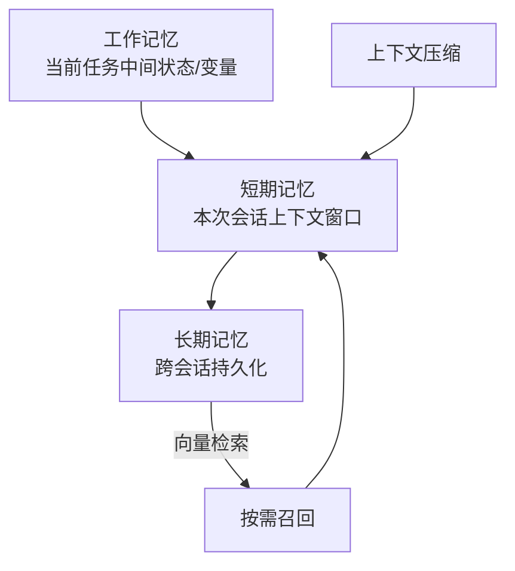

# Agent 记忆系统设计

> 本篇从**系统设计**角度谈 Agent 的记忆分层、存储选型、生命周期与上下文压缩。概念与状态管理见 [[AI与Agent/知识/八股/28-Agent记忆基础与状态管理|Agent记忆与状态管理]]、[[AI与Agent/知识/八股/23-Agent架构与核心组件|Agent架构与ReAct]]。

## 为什么记忆需要"系统设计"
记忆不是"把对话塞进上下文"这么简单：上下文有长度上限、跨会话要持久、长期记忆会污染、新旧冲突要解决。需要分层 + 存储 + 治理。

## 记忆分层

| 层级 | 存储 | 生命周期 | 作用 |
| ------ | ------ | ------ | ------ |
| 工作记忆 | 变量/状态对象 | 单次任务 | 中间结果、工具返回值 |
| 短期记忆 | LLM 上下文窗口 | 本次会话 | 近期对话，受 token 限制 |
| 长期记忆 | 向量库 + KV/DB | 跨会话 | 用户偏好、历史经验、知识 |

## 关键设计点
- **存储选型**：长期记忆用向量库（语义检索）+ 结构化存储（精确字段，如用户画像）。记忆系统 vs RAG 的区别见 [[39-记忆系统vs-RAG本质区别|记忆系统 vs RAG 本质区别]]。
- **生命周期管理**：记忆写入条件（什么值得存）、过期/遗忘策略、重要度加权。
- **上下文压缩三级策略**：选节点压缩 → 压缩 → 校验是否破坏关键信息，见 [[AI与Agent/知识/八股/41-上下文压缩三级策略|上下文压缩三级策略]]。
- **记忆污染与纠错**：模型结论写进记忆后如何检测与恢复，见 [[AI与Agent/知识/八股/42-记忆污染与纠错机制|记忆污染与纠错机制]]。
- **记忆治理**：什么值得存、何时召回、新旧冲突解决，见 [[40-记忆治理策略-存储召回与冲突解决|记忆治理策略]]。

## 关键权衡

| 问题 | 设计回答要点 |
| ------ | ------ |
| 记忆系统和 RAG 什么区别？ | 记忆是 Agent 私有经验（偏好/历史），RAG 是外部知识库；一个"我是谁"，一个"我知道什么" |
| 上下文太长怎么压缩？ | 三级策略：选压缩节点 → 摘要/裁剪 → 校验关键信息不丢；重要信息加权保留 |
| 记忆会不会越存越乱？ | 会，需治理：写入门槛、过期策略、冲突解决、污染检测与纠错 |
| 长期记忆存向量库还是数据库？ | 语义检索用向量库，精确字段（画像/状态）用结构化存储，两者配合 |

---

## 速记卡（面试闪卡）

**Q1：一句话讲清「Agent 记忆系统设计」到底是什么？**
A：Agent 记忆不是"把对话塞进上下文"这么简单——上下文有长度上限、跨会话要持久、长期记忆会污染、新旧还会冲突。所以得像设计数据库一样，给记忆做分层、选存储、上治理。

**Q2：为什么记忆需要"系统设计" —— 怎么理解？**
A：你以为记忆就是聊天记录？错了。上下文窗口有上限、单次会话一关就没了、长期记忆堆久了会互相污染、新记忆和旧记忆还可能打架。所以得用"分层 + 存储 + 治理"三件套来管，而不是随手往上下文里塞。

**Q3：记忆分层 —— 怎么理解？**
A：记忆分三层，像人的短期和长期记忆。工作记忆是任务里的临时变量和工具返回值；短期记忆是本次会话的上下文窗口，受 token 限制；长期记忆跨会话持久化，用向量库（语义检索）+ 结构化存储（比如用户画像字段）来存。需要的时候再从长期记忆里做向量检索召回，塞回短期记忆。

**Q4：关键设计点 —— 怎么理解？**
A：四个坑要填。一是存储选型：语义检索用向量库，精确字段用 KV/数据库，两者配合。二是生命周期管理：什么值得写、什么时候过期遗忘、重要度怎么加权。三是上下文压缩三级策略——选压缩节点、压缩、校验关键信息没丢。四是记忆污染与纠错：模型结论写进记忆后，怎么检测和恢复。最后还要治理：什么值得存、何时召回、新旧冲突怎么解决。

**Q5：关键权衡 —— 怎么理解？**
A：几个高频面试题。记忆系统和 RAG 什么区别？一个"我是谁"（私有经验、偏好、历史），一个"我知道什么"（外部知识库）。上下文太长怎么压？三级策略 + 重要信息加权。记忆会不会越存越乱？会，靠写入门槛、过期策略、冲突解决、污染检测来治。长期记忆存向量库还是数据库？语义检索用向量，精确字段用结构化，配合着来。

**Q6：核心速记主线有哪些？**
A：抓住这几根：为什么需要系统设计（分层+存储+治理）、记忆三层架构（工作/短期/长期）、关键设计点（存储/生命周期/压缩/污染/治理）、关键权衡（vs RAG、怎么压、怎么防乱）。

**口诀**
A：记忆三层莫塞堆，工作短期长期分；
向量结构双存储，压缩污染要治理。

## 相关链接
- [[AI与Agent/知识/八股/28-Agent记忆基础与状态管理|Agent记忆与状态管理]]
- [[AI与Agent/知识/八股/23-Agent架构与核心组件|Agent架构与ReAct]]
- [[AI与Agent/知识/八股/39-记忆系统vs-RAG本质区别|记忆系统 vs RAG 本质区别]]
- [[AI与Agent/知识/八股/41-上下文压缩三级策略|上下文压缩三级策略]]
- [[AI与Agent/知识/八股/40-记忆治理策略-存储召回与冲突解决|记忆治理策略]]
- [[八股文学习路线图]]
- [[00-全局导航|全局导航]]

---

## 快速问答

| 问题 | 参考答案 |
| ------ | --------- |
| Agent 记忆分几层？ | 工作记忆（任务状态）、短期记忆（会话上下文）、长期记忆（跨会话持久化），各用不同存储。 |
| 记忆系统和 RAG 本质区别？ | 记忆是 Agent 私有经验（偏好/历史），RAG 是外部知识库；前者服务"个性化"，后者服务"知识补全"。 |
| 上下文压缩怎么不破坏关键信息？ | 三级策略：选节点 → 压缩（摘要/裁剪）→ 校验关键信息是否保留，重要信息加权优先保留。 |
| 长期记忆如何防污染？ | 写入门槛 + 过期/遗忘策略 + 冲突解决规则 + 污染检测与纠错机制。 |
