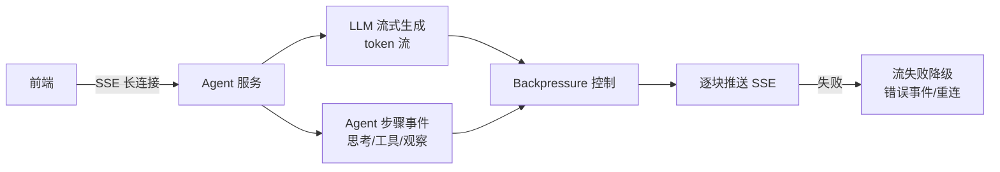

# Agent 流式推理服务设计

> 用户等一个 10 秒的回答会很焦躁，但看到逐字"打字机"输出就舒服很多。本篇谈 **SSE 推送 + Backpressure 控制 + 流失败降级**。SSE 实现见 [[语言与框架/FastAPI/八股/07-SSE流式响应StreamingResponse|SSE流式响应]]；推理原理见 [[AI与Agent/知识/八股/73-LLM推理优化|LLM推理优化]]。

## 为什么用流式
- **体验**：首字延迟（TTFT）从"整段生成完"降到"第一个 token 出来"，体感快很多。
- **长任务可视化**：Agent 多步执行中，把"正在查数据库""正在调用工具"逐步推给前端。
- **早失败**：上游出错可立即在流里通知，不用等超时。

## 流式服务架构

## ① SSE 推送
- 用 `text/event-stream` 长连接，服务端用 `data:` 帧逐步推送（token 或结构化事件）。
- 每个事件可带类型：`token`（文本流）、`step`（步骤状态）、`error`、`done`。
- FastAPI 用 `StreamingResponse` 实现，见 [[语言与框架/FastAPI/八股/07-SSE流式响应StreamingResponse|SSE流式响应]]。

## ② Backpressure 控制
- 服务端生成快、客户端消费慢时，中间缓冲会爆。需要背压：
  - 限制单连接未确认数据量，超阈值暂停生成/丢弃非关键事件。
  - Agent 步骤事件可做"合并/节流"，避免高频小事件淹没网络。
- 与推理批处理配合：Continuous Batching 见 [[AI与Agent/知识/八股/73-LLM推理优化|LLM推理优化]]。

## ③ 流失败降级
- **中途出错**：在流里发 `error` 事件并优雅结束，而不是断连让前端无提示。
- **客户端断连**：服务端检测到断开应停止后续生成，释放 GPU（否则白算）。
- **超时/降级**：超过预算转降级模型，并把"已生成部分 + 说明"推给前端，见 [[11-Agent降级与容错系统设计|Agent降级与容错系统设计]]。
- 与 [[05-高并发MQ选型|高并发MQ选型]] 配合：超长任务可改为"入队→流式通知进度"模式。

## 关键权衡

| 问题 | 设计回答要点 |
| ------ | ------ |
| SSE 和 WebSocket 怎么选？ | 单向服务端推（token/事件）用 SSE 更简单；需双向交互（前端中途改指令）才上 WebSocket |
| 背压不做会怎样？ | 服务端生成快于客户端消费，内存缓冲膨胀甚至 OOM；需限未确认数据量+事件节流 |
| 流式中间失败怎么处理？ | 发 error 事件优雅结束 + 客户端断连即停生成释放 GPU + 超时转降级模型 |
| 长任务流式还是 MQ？ | 秒级用 SSE 直推；分钟级超大任务改 MQ 入队 + 进度事件通知，避免长连接占用 |

---

## 速记卡（面试闪卡）

**Q1：一句话讲清「Agent 流式推理服务设计」到底是什么？**
A：用 SSE 把 LLM 的 token 和步骤逐步推给前端，配合背压与降级。

**Q2：为什么用流式 —— 怎么理解？**
A：像看打字机而非等整封信：首字延迟（TTFT）从"整段生成完"降到"第一个 token 出来"，长任务能看见进度，上游出错也能早失败早通知。TTFT 叫 Time To First Token。

**Q3：① SSE 推送 —— 怎么理解？**
A：像电台单向广播：用 text/event-stream 长连接，服务端用 data: 帧逐步推，事件带类型（token/step/error/done），FastAPI 用 StreamingResponse 实现。SSE 叫 Server-Sent Events。

**Q4：② Backpressure 控制 —— 怎么理解？**
A：像水管装阀门：服务端生成快、客户端慢时缓冲会爆，于是限制单连接未确认数据量、对步骤事件合并节流，必要时暂停生成。背压叫 Backpressure。

**Q5：③ 流失败降级 —— 怎么理解？**
A：像直播卡顿切备用信号：中途出错发 error 事件优雅结束、客户端断连就停生成释放 GPU、超时转降级模型，超长任务改 MQ 入队 + 进度通知。降级叫 Degradation。

**Q6：核心速记主线有哪些？**
- 为什么用流式：降 TTFT、长任务可视化、早失败
- SSE 单向推送 token/步骤事件
- Backpressure：限未确认量 + 事件节流防 OOM
- 流失败降级：error 事件 + 断连停生成 + 超时转降级

**口诀**
A：流式靠 SSE 推，token 步骤一步步；
背压防 OOM，限流节流不爆库；
失败 error 优雅退，断连停算省 GPU；
超时转降级模，长任务改 MQ 路。

## 相关链接
- [[语言与框架/FastAPI/八股/07-SSE流式响应StreamingResponse|SSE流式响应]]
- [[AI与Agent/知识/八股/73-LLM推理优化|LLM推理优化]]
- [[11-Agent降级与容错系统设计|Agent降级与容错系统设计]]
- [[05-高并发MQ选型|高并发MQ选型]]
- [[八股文学习路线图]]
- [[00-全局导航|全局导航]]

---

## 快速问答

| 问题 | 参考答案 |
| ------ | --------- |
| Agent 流式推理的核心价值？ | 降低首字延迟（TTFT）改善体感、长任务步骤可视化、早失败早通知。 |
| 背压（Backpressure）为什么重要？ | 生成快于消费会撑爆缓冲/OOM；需限制未确认数据量并对步骤事件节流。 |
| 流式过程中 LLM 报错怎么办？ | 推 error 事件优雅结束；客户端断连则停止生成释放 GPU；超时转降级模型。 |
| SSE 还是 WebSocket？ | 单向服务端推用 SSE 足够简单；需前端中途反向指令才用 WebSocket。 |
