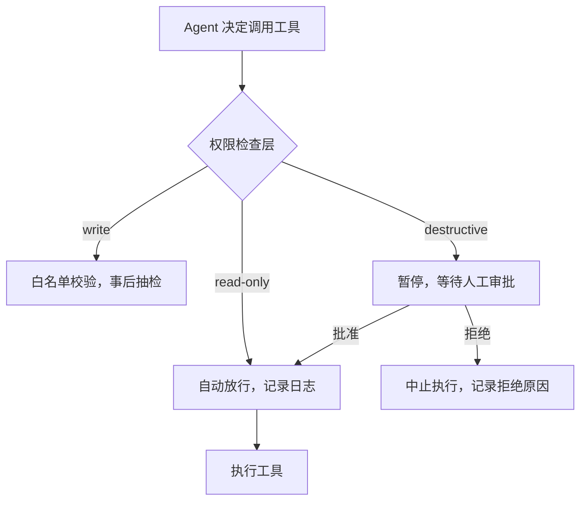
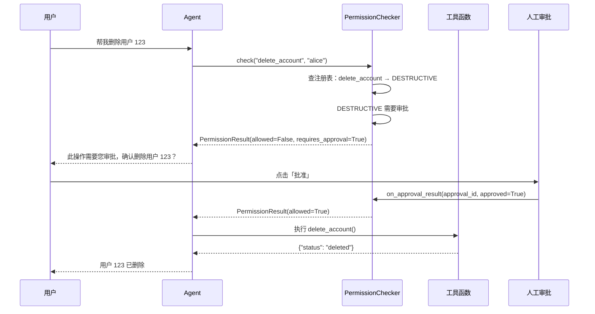

---

title: "工具权限三级：read-only-write-destructive设计与实现"

created: "2026-07-21"

tags:

  - 技术学习

  - agent安全

---

# 工具权限三级：read-only-write-destructive设计与实现

> **一句话**：Agent 安全的第一道闸门——把工具按破坏力分成 read-only（只读）、write（可写）、destructive（高危）三级，调用前由权限层统一拦截，低风险自动放行、高风险强制人工审批。

## 基本原理

普通程序的用户能做什么是开发者**预先写死**的——按钮"查看订单"只能查，"删除"按钮才有删的权限。但 Agent 不同：它根据自然语言指令**自己决定**调用哪个工具，执行路径不可预枚举。如果你给 Agent 一把"万能钥匙"，攻击者通过 Prompt Injection 就可能让它删库。

核心思路：**最小权限原则（Principle of Least Privilege）**——每个 Agent 只拥有完成当前任务所必需的最小权限。落地方式是给每个工具贴"权限标签"，在工具调用链路中设一道权限检查层。



## 代码实现
### 权限等级定义 + 权限检查器 + 装饰器

```python

"""

工具权限三级：read-only / write / destructive 设计与实现。

包含：权限枚举、权限检查器、声明式装饰器、完整的工具注册与调用流程。

运行方式：python permission_system.py

"""

from __future__ import annotations

import functools

import logging

from enum import Enum

from dataclasses import dataclass, field

from typing import Any, Callable, Optional

# ---- 配置日志格式，方便观察权限检查过程 ----

logging.basicConfig(

    level=logging.INFO,

    format="%(asctime)s [%(levelname)s] %(message)s",

    datefmt="%H:%M:%S",

)

logger = logging.getLogger(__name__)

# ============================================================

class PermissionLevel(Enum):

    """

    工具权限等级，按破坏力从低到高排列。

    READ_ONLY  —— 蓝色工牌：只能看不能改。如查数据库 SELECT、搜知识库。

    WRITE      —— 黄色工牌：能改常规数据，但限定在白名单范围内。

    DESTRUCTIVE —— 红色工牌：不可逆的破坏性操作，必须人工审批。

    NEVER      —— 禁区：Agent 永远不能碰。如改自身权限、读密钥库。

    """

    READ_ONLY = "read_only"        # 只读：查数据库、搜知识库、读文件

    WRITE = "write"               # 可写：建记录、改状态、批量打标签

    DESTRUCTIVE = "destructive"   # 高危：删数据、转账、生产环境部署

    NEVER = "never"               # 禁区：改安全配置、读密钥库、自复制

# ============================================================

@dataclass

class PermissionResult:

    """

    权限检查的返回结果。

    不止告诉调用方"能不能执行"，还告诉它"如果不能，为什么"，

    以及"如果需要审批，审批单 ID 是什么"。

    """

    allowed: bool                              # 是否允许执行

    reason: str = ""                           # 拒绝或批准的原因说明

    requires_approval: bool = False            # 是否需要人工审批

    approval_id: Optional[str] = None          # 审批单 ID，需要审批时有值

    log_level: str = "info"                    # 日志级别：info / warning / critical

# ============================================================

class PermissionChecker:

    """

    权限检查器：在每次工具调用前，根据工具注册的权限等级决定是否放行。

    设计要点：

    - 任何未注册的工具默认拒绝（Default Deny 原则）

    - NEVER 级别直接拒绝，不走审批流程

    - DESTRUCTIVE 级别暂停并生成审批单

    - READ_ONLY 和 WRITE 级别自动放行

    """

    def __init__(self) -> None:

        # 需要强制人工审批的权限级别（可配置）

        self._approval_required_levels: set[PermissionLevel] = {

            PermissionLevel.DESTRUCTIVE,

            PermissionLevel.NEVER,

        }

        # 工具名 → 权限等级 的注册表

        self._tool_permissions: dict[str, PermissionLevel] = {}

    def register_tool(

        self, tool_name: str, level: PermissionLevel

    ) -> None:

        """

        注册工具及其权限等级。

        必须在工具上线前调用。同一个工具重复注册时覆盖上次的级别。

        这一注册动作本身会被记录到日志中，形成审计线索。

        """

        self._tool_permissions[tool_name] = level

        logger.info(

            "工具权限注册: tool=%s level=%s", tool_name, level.value

        )

    def check(

        self,

        tool_name: str,

        user_id: str,

        context: Optional[dict[str, Any]] = None,

    ) -> PermissionResult:

        """

        检查 user_id 是否有权调用 tool_name。

        这是每次工具调用必须经过的闸门。调用链路中的中间件应先调此方法，

        根据返回的 PermissionResult 决定是放行、拒绝还是暂停等审批。

        参数:

            tool_name: 要调用的工具名称

            user_id: 发起操作的用户标识

            context: 可选的请求上下文（如 IP、User-Agent 等），用于扩展规则

        """

        # 第一步：查工具是否已注册权限等级

        level = self._tool_permissions.get(tool_name)

        if level is None:

            # 未注册 = 默认拒绝。不能假设未知工具是安全的。

            return PermissionResult(

                allowed=False,

                reason=f"工具 '{tool_name}' 未注册权限等级，默认拒绝",

                log_level="warning",

            )

        # 第二步：NEVER 级别直接拒绝，不走审批——这是写死的硬规则

        if level == PermissionLevel.NEVER:

            return PermissionResult(

                allowed=False,

                reason=f"工具 '{tool_name}' 属于禁区操作，Agent 不可执行",

                log_level="critical",

            )

        # 第三步：需要审批的级别，返回"暂停，等人批"

        if level in self._approval_required_levels:

            approval_id = f"approval_{tool_name}_{user_id}"

            return PermissionResult(

                allowed=False,  # 暂时不放行

                reason=f"工具 '{tool_name}' 属于高危操作，需要人工审批",

                requires_approval=True,

                approval_id=approval_id,

                log_level="critical",

            )

        # 第四步：read-only 和 write 级别自动放行

        return PermissionResult(

            allowed=True,

            reason=f"工具 '{tool_name}' 权限等级 {level.value}，自动放行",

        )

    def on_approval_result(

        self, approval_id: str, approved: bool

    ) -> PermissionResult:

        """

        人工审批完成后调用此方法，将审批结果传回权限检查器。

        参数:

            approval_id: 之前 check() 返回的审批单 ID

            approved: True=批准执行，False=拒绝执行

        """

        if approved:

            return PermissionResult(

                allowed=True,

                reason=f"审批 {approval_id} 已通过，转为放行",

            )

        return PermissionResult(

            allowed=False,

            reason=f"审批 {approval_id} 被拒绝，操作中止",

            log_level="warning",

        )

    def get_tool_level(self, tool_name: str) -> Optional[PermissionLevel]:

        """查询某工具的权限等级，用于调试和审计。"""

        return self._tool_permissions.get(tool_name)

# 全局权限检查器实例（生产环境中通过依赖注入容器管理）

_checker = PermissionChecker()

def require_permission(level: PermissionLevel):

    """

    装饰器：声明被装饰的函数所需的权限等级。

    用法示例:

        @require_permission(PermissionLevel.READ_ONLY)

        def search_knowledge_base(query: str) -> list[dict]:

            ...

    装饰器在模块加载时自动把函数注册到 PermissionChecker。

    每次函数被调用时，装饰器会自动执行权限检查。

    """

    def decorator(func: Callable) -> Callable:

        # ---- 模块加载时：注册工具的权限等级 ----

        tool_name = func.__name__

        _checker.register_tool(tool_name, level)

        @functools.wraps(func)

        def wrapper(*args: Any, **kwargs: Any) -> Any:

            # ---- 每次调用时：执行权限检查 ----

            # user_id 由上层（如 Gateway 中间件）通过 contextvars 注入

            user_id = kwargs.pop("_user_id", "unknown")

            result = _checker.check(tool_name, user_id)

            if not result.allowed:

                if result.requires_approval:

                    # 抛出特定异常，让上层 UnifiedToolExecutor 捕获并暂停

                    raise PermissionPendingError(

                        tool_name=tool_name,

                        approval_id=result.approval_id or "",

                        message=result.reason,

                    )

                raise PermissionDeniedError(

                    tool_name=tool_name,

                    message=result.reason,

                )

            logger.info(

                "权限检查通过: tool=%s user=%s level=%s",

                tool_name,

                user_id,

                _checker.get_tool_level(tool_name).value,

            )

            return func(*args, **kwargs)

        return wrapper

    return decorator

# ============================================================

class PermissionDeniedError(Exception):

    """权限被永久拒绝（未注册 或 NEVER 级别）。"""

    def __init__(self, tool_name: str, message: str) -> None:

        self.tool_name = tool_name

        self.message = message

        super().__init__(f"[{tool_name}] {message}")

class PermissionPendingError(Exception):

    """需要人工审批，暂时未放行。上层应捕获此异常并触发审批流程。"""

    def __init__(

        self, tool_name: str, approval_id: str, message: str

    ) -> None:

        self.tool_name = tool_name

        self.approval_id = approval_id

        self.message = message

        super().__init__(f"[{tool_name}] {message}")

```

### 工具注册 + 调用示例：完整可运行

```python

# ============================================================

@require_permission(PermissionLevel.READ_ONLY)

def search_knowledge_base(query: str) -> list[dict]:

    """只读工具：搜知识库。只需要 READ_ONLY 权限。"""

    # 模拟查询结果

    return [

        {"title": "Python 异步编程", "score": 0.95},

        {"title": "asyncio 最佳实践", "score": 0.88},

    ]

@require_permission(PermissionLevel.WRITE)

def update_resume_tags(resume_id: str, tags: list[str]) -> dict:

    """可写工具：批量更新简历标签。需要 WRITE 权限。"""

    # 模拟写入操作

    return {"resume_id": resume_id, "tags": tags, "status": "updated"}

@require_permission(PermissionLevel.DESTRUCTIVE)

def delete_account(user_id: str) -> dict:

    """高危工具：删除用户账号。需要 DESTRUCTIVE 权限 + 人工审批。"""

    # 模拟删除操作

    return {"user_id": user_id, "status": "deleted"}

# ============================================================

class UnifiedToolExecutor:

    """

    统一工具执行器：所有工具的入口。

    职责：

    1. 从 contextvars 获取当前用户身份

    2. 调用权限检查（在装饰器层自动完成）

    3. 处理审批流程（暂停 / 恢复）

    4. 记录审计日志

    """

    def __init__(self, checker: PermissionChecker) -> None:

        self._checker = checker

        # 待审批的操作暂存在这里（生产环境应持久化到数据库）

        self._pending_approvals: dict[str, dict] = {}

    def execute(

        self, tool_func: Callable, user_id: str, **kwargs: Any

    ) -> Any:

        """

        执行一个工具调用。

        工具函数的装饰器会自动做权限检查。

        如果权限检查抛出 PermissionPendingError，

        说明需要人工审批——我们暂存请求并通知用户。

        """

        try:

            return tool_func(_user_id=user_id, **kwargs)

        except PermissionPendingError as e:

            # 高危操作：暂存请求，等待人工审批

            self._pending_approvals[e.approval_id] = {

                "tool_name": e.tool_name,

                "user_id": user_id,

                "kwargs": kwargs,

                "tool_func": tool_func,

            }

            logger.warning("操作暂停等待审批: %s", e.approval_id)

            return {

                "status": "pending_approval",

                "approval_id": e.approval_id,

                "message": "此操作需要人工审批，审批单已生成",

                "tool": e.tool_name,

            }

        except PermissionDeniedError as e:

            logger.error("权限被拒绝: %s", e)

            return {

                "status": "denied",

                "message": str(e),

            }

    def approve(self, approval_id: str) -> Any:

        """

        人工审批通过后，恢复执行之前暂存的工具调用。

        """

        if approval_id not in self._pending_approvals:

            return {"status": "error", "message": "审批单不存在"}

        pending = self._pending_approvals.pop(approval_id)

        logger.info("审批通过，恢复执行: %s", approval_id)

        # 审批通过，直接执行（跳过装饰器中的权限检查）

        return pending["tool_func"](

            _user_id=pending["user_id"], **pending["kwargs"]

        )

    def reject(self, approval_id: str) -> dict:

        """

        人工审批拒绝，丢弃暂存的请求。

        """

        if approval_id not in self._pending_approvals:

            return {"status": "error", "message": "审批单不存在"}

        pending = self._pending_approvals.pop(approval_id)

        logger.warning(

            "审批被拒绝: %s tool=%s user=%s",

            approval_id, pending["tool_name"], pending["user_id"],

        )

        return {

            "status": "rejected",

            "message": "审批被拒绝，操作未执行",

            "tool": pending["tool_name"],

        }

# ============================================================

if __name__ == "__main__":

    executor = UnifiedToolExecutor(checker=_checker)

    print("=" * 60)

    print("场景 1: 只读工具 → 自动放行")

    print("=" * 60)

    result = executor.execute(

        search_knowledge_base, user_id="alice", query="异步编程"

    )

    print(f"结果: {result}\n")

    print("=" * 60)

    print("场景 2: 可写工具 → 自动放行")

    print("=" * 60)

    result = executor.execute(

        update_resume_tags, user_id="alice",

        resume_id="res_001", tags=["Python", "Agent"],

    )

    print(f"结果: {result}\n")

    print("=" * 60)

    print("场景 3: 高危工具 → 暂停等审批")

    print("=" * 60)

    result = executor.execute(

        delete_account, user_id="alice", user_id_arg="user_123"

    )

    print(f"结果: {result}\n")

    # 模拟审批通过

    approval_id = result["approval_id"]

    print("=" * 60)

    print(f"场景 4: 人工审批通过 → 恢复执行 ({approval_id})")

    print("=" * 60)

    result = executor.approve(approval_id)

    print(f"结果: {result}\n")

```

### 权限检查时序图



## 速记卡（面试闪卡）

**Q1：一句话讲清「工具权限三级：read-only-write-destructive设计与实现」到底是什么？**

A：把工具按破坏力分成只读、可写、高危三级，调用前由权限层统一拦截。

**Q2：基本原理 —— 怎么理解？**

A：像给员工发三色工牌：蓝牌(read-only)只能看、黄牌(write)能改常规数据、红牌(destructive)删库转账必须主管批。普通程序按钮权限写死，Agent 自己决定调工具，给万能钥匙会被 Prompt 注入删库——所以按最小权限原则分层拦截。

**Q3：代码实现 —— 怎么理解？**

A：像门禁系统三层代码：PermissionLevel 给工具贴工牌(read-only/write/destructive/never)，PermissionChecker 每次调用前查注册表——未注册默认拒绝、never 直接拒、destructive 暂停等审批。require_permission 装饰器一行给函数贴级，UnifiedToolExecutor 统一收口。

**Q4：权限等级定义 + 权限检查器 + 装饰器 —— 怎么理解？**

A：给每个工具发"三色工牌"：READ_ONLY(蓝,只读查库搜知识)、WRITE(黄,改状态打标签)、DESTRUCTIVE(红,删数据部署)、NEVER(禁区,改权限读密钥)。PermissionChecker 是门禁引擎：未注册默认拒、NEVER 硬拒不走审批、DESTRUCTIVE 生成审批单。

**Q5：工具注册 + 调用示例：完整可运行 —— 怎么理解？**

A：像前台登记加叫号：register_tool 把工具名映射到权限级形成注册表；UnifiedToolExecutor.execute 跑工具时装饰器自动查权限，高危抛 PermissionPendingError 暂存等审批，approve 通过才真执行。演示里删账号触发审批、批准后才删除。

**Q6：核心速记主线有哪些？**

- 最小权限原则：Agent 只拿当前任务必需的最小权限

- 三级+禁区：read-only / write / destructive / never 四档

- Default Deny：未注册工具一律拒绝，绝不假设安全

- 高危审批：destructive 与 never 暂停等人工批准才放行

**口诀**

A：三色工牌分级戴，蓝看黄改红等批

未注册就默认拒，禁区永不碰

最小权限是底线，高危先问人

门禁层层拦，删库不慌张

## 相关链接

- 上一篇：无（本专题第一篇）

- 下一篇：[[2-审计日志：操作全量记录-溯源-异常行为熔断]]

---

→ [[技术学习路线图#Agent 安全防护]]

