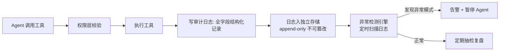

> **一句话**：审计日志是 Agent 安全的"监控录像"——每一次工具调用都结构化记录 who/when/what/result/permission，日志不可篡改、与 Agent 存储分离，并基于日志做异常行为检测（半夜狂查、突然删数据），发现异常自动熔断。

## 基本原理

权限分级管的是"事前"（能不能做），审计日志管的是"事后"（做了什么）。两者缺一不可——只有闸门没录像，出事查不清；只有录像没闸门，坏事照样发生。

审计日志必须满足三个硬约束：

1. **结构化**：每条记录字段齐全，能回答"谁、什么时候、用了什么工具、传了什么参数、返回了什么、什么权限、谁批准的"
2. **不可篡改**：只能追加（append-only），不能修改或删除
3. **隔离存储**：日志存在 Agent 访问不到的独立存储中——否则 Agent 可能删掉自己的作案记录



## 代码实现

### 审计事件 + 日志记录器 + 异常检测

```python
"""
审计日志系统：结构化记录、不可篡改存储、异常行为熔断。
包含：AuditEvent 数据类、AuditLogger 追加式日志、AnomalyDetector 异常检测。

运行方式：python audit_log.py
"""
from __future__ import annotations

import json
import os
import time
import hashlib
import logging
import threading
from dataclasses import dataclass, field, asdict
from datetime import datetime, timedelta
from typing import Any, Optional
from collections import defaultdict

# ---- 配置日志 ----
logging.basicConfig(
    level=logging.INFO,
    format="%(asctime)s [%(levelname)s] %(message)s",
    datefmt="%H:%M:%S",
)
logger = logging.getLogger(__name__)


# ============================================================
# 1. 审计事件数据类 —— 每条工具调用生成一条
# ============================================================
@dataclass
class AuditEvent:
    """
    一条不可篡改的审计记录。

    字段设计原则：必须能回答五个问题——
    谁做的？什么时候？做了什么？结果如何？当时有什么权限？
    """
    # ---- 身份链：谁发起的 ----
    user_id: str                              # 终端用户 ID
    agent_id: str                             # 执行操作的 Agent ID
    session_id: str                           # 会话 ID，用于串联同一会话的所有操作

    # ---- 时间链：什么时候 ----
    timestamp: str                            # ISO 8601 格式的时间戳
    event_id: str                             # 全局唯一的事件 ID

    # ---- 操作链：做了什么 ----
    tool_name: str                            # 调用的工具名称
    action_type: str                          # 操作类型：read / write / destructive
    input_params: dict[str, Any]              # 工具入参（敏感字段需脱敏后记录）
    input_hash: str                           # 入参的哈希值，用于检测重放攻击

    # ---- 结果链：结果如何 ----
    success: bool                             # 操作是否成功
    output_summary: str                       # 输出摘要（前 500 字符，防日志膨胀）
    error_message: str = ""                   # 错误信息（如果失败）

    # ---- 权限链：有没有越权 ----
    permission_level: str = "read_only"       # 工具的权限等级
    approved_by: str = ""                     # 审批人 ID（空字符串表示无需审批）

    # ---- 完整性链：日志本身有没有被改过 ----
    previous_event_hash: str = ""             # 前一条事件的哈希，构成哈希链
    event_hash: str = ""                      # 本条事件的哈希，在 finalize() 中计算


# ============================================================
# 2. 审计日志记录器 —— append-only 存储
# ============================================================
class AuditLogger:
    """
    审计日志记录器。

    设计要点：
    - 只追加（append），不提供修改和删除接口
    - 每条事件通过哈希链相连——改一条就会破坏整条链
    - 存储与 Agent 隔离——Agent 没有此对象的引用
    - 线程安全——多个 Agent 并发写日志不会乱
    """

    def __init__(self, log_dir: str = "./audit_logs") -> None:
        """
        初始化审计日志记录器。

        参数:
            log_dir: 日志文件存储目录。生产环境应指向 Agent 无法访问的路径，
                     如独立的日志服务器或只写权限的挂载卷。
        """
        self._log_dir = log_dir
        self._lock = threading.Lock()  # 线程安全锁
        os.makedirs(log_dir, exist_ok=True)

        # 当前日志文件（按天轮转）
        today = datetime.now().strftime("%Y-%m-%d")
        self._current_log_file = os.path.join(log_dir, f"audit_{today}.jsonl")

        # 哈希链的最后一个哈希值（用于构建不可篡改链）
        self._last_event_hash: str = self._load_last_hash()

    def _load_last_hash(self) -> str:
        """
        加载上一条事件的哈希值，用于构建哈希链。

        如果日志文件不存在或为空，返回全零哈希作为链的起点。
        """
        if not os.path.exists(self._current_log_file):
            return hashlib.sha256(b"GENESIS").hexdigest()

        with open(self._current_log_file, "r", encoding="utf-8") as f:
            lines = f.readlines()
            if not lines:
                return hashlib.sha256(b"GENESIS").hexdigest()
            # 取最后一行，解析出上一条事件的哈希
            last_event = json.loads(lines[-1])
            return last_event.get("event_hash", "")

    def record(
        self,
        user_id: str,
        agent_id: str,
        session_id: str,
        tool_name: str,
        action_type: str,
        input_params: dict[str, Any],
        success: bool,
        output_summary: str,
        permission_level: str = "read_only",
        approved_by: str = "",
        error_message: str = "",
    ) -> AuditEvent:
        """
        记录一条审计事件并持久化到磁盘。

        此方法：
        1. 构建 AuditEvent 对象
        2. 计算 input_hash 和 event_hash
        3. 将 previous_event_hash 指向上一条事件的哈希
        4. 追加写入 JSONL 文件（一行一条记录）

        返回:
            创建并已持久化的 AuditEvent 对象
        """
        # ---- 构建事件对象 ----
        event = AuditEvent(
            user_id=user_id,
            agent_id=agent_id,
            session_id=session_id,
            timestamp=datetime.now().isoformat(),
            event_id=f"audit_{int(time.time() * 1_000_000)}_{tool_name}",
            tool_name=tool_name,
            action_type=action_type,
            input_params=input_params,
            input_hash=hashlib.sha256(
                json.dumps(input_params, sort_keys=True).encode()
            ).hexdigest(),
            success=success,
            output_summary=output_summary[:500],  # 截断，防止日志膨胀
            error_message=error_message,
            permission_level=permission_level,
            approved_by=approved_by,
            previous_event_hash=self._last_event_hash,
        )

        # ---- 计算本条事件的哈希（包含上一跳哈希，形成链） ----
        event.event_hash = self._compute_event_hash(event)

        # ---- 线程安全地追加写入 ----
        with self._lock:
            with open(self._current_log_file, "a", encoding="utf-8") as f:
                f.write(json.dumps(asdict(event), ensure_ascii=False) + "\n")
            # 更新哈希链末端
            self._last_event_hash = event.event_hash

        logger.info(
            "审计记录已写入: tool=%s user=%s success=%s",
            tool_name, user_id, success,
        )
        return event

    def _compute_event_hash(self, event: AuditEvent) -> str:
        """
        计算事件的唯一哈希值。

        哈希的输入包含：
        - 前一条事件的哈希（previous_event_hash）——这是链的关键
        - 所有关键字段

        如果攻击者修改了中间某条记录，它的 event_hash 会变，
        下一条的 previous_event_hash 就对不上了——整条链断裂。
        """
        content = (
            f"{event.previous_event_hash}"
            f"{event.event_id}"
            f"{event.timestamp}"
            f"{event.user_id}"
            f"{event.agent_id}"
            f"{event.tool_name}"
            f"{event.input_hash}"
            f"{str(event.success)}"
            f"{event.output_summary}"
            f"{event.permission_level}"
        )
        return hashlib.sha256(content.encode()).hexdigest()

    def verify_chain_integrity(self, log_file: str) -> bool:
        """
        验证审计日志的哈希链完整性。

        从头到尾逐条验证，确保没有记录被篡改。
        如果返回 False，说明日志已被篡改——触发安全告警。
        """
        if not os.path.exists(log_file):
            return True  # 空日志文件视为完整

        with open(log_file, "r", encoding="utf-8") as f:
            events = [json.loads(line) for line in f if line.strip()]

        if not events:
            return True

        # 逐条验证：每条事件的 previous_event_hash 必须等于上条事件的 event_hash
        for i in range(1, len(events)):
            prev_hash = events[i - 1].get("event_hash", "")
            curr_prev_hash = events[i].get("previous_event_hash", "")
            if prev_hash != curr_prev_hash:
                logger.critical(
                    "审计链断裂！第 %d 条记录的 previous_event_hash 不匹配", i
                )
                return False

        logger.info("审计链完整性验证通过，共 %d 条记录", len(events))
        return True

    def query(
        self,
        user_id: Optional[str] = None,
        tool_name: Optional[str] = None,
        start_time: Optional[str] = None,
        end_time: Optional[str] = None,
    ) -> list[dict]:
        """
        按条件查询审计日志。只读接口，不修改任何数据。
        """
        results: list[dict] = []
        if not os.path.exists(self._current_log_file):
            return results

        with open(self._current_log_file, "r", encoding="utf-8") as f:
            for line in f:
                if not line.strip():
                    continue
                event = json.loads(line)
                # 按条件过滤
                if user_id and event.get("user_id") != user_id:
                    continue
                if tool_name and event.get("tool_name") != tool_name:
                    continue
                if start_time and event.get("timestamp", "") < start_time:
                    continue
                if end_time and event.get("timestamp", "") > end_time:
                    continue
                results.append(event)

        return results


# ============================================================
# 3. 异常行为检测器 —— 基于规则的实时检测
# ============================================================
@dataclass
class AnomalyAlert:
    """异常告警。"""
    alert_id: str
    rule_name: str
    description: str
    severity: str           # low / medium / high / critical
    user_id: str
    triggered_at: str
    evidence: dict[str, Any]  # 触发告警的证据数据


class AnomalyDetector:
    """
    异常行为检测器：扫描审计日志，发现可疑模式。

    检测规则（可扩展）：
    1. 深夜高频操作：凌晨 0-6 点短时间内大量操作
    2. 突发删除潮：短时间内多个 destructive 操作
    3. 单一用户异常膨胀：某用户的工具调用量突然暴涨
    4. 未知工具调用：日志中出现未注册的工具名
    """

    def __init__(self, audit_logger: AuditLogger) -> None:
        self._audit_logger = audit_logger
        # 已触发的告警（去重，同一个问题不重复告警）
        self._fired_alerts: set[str] = set()

    def detect(self) -> list[AnomalyAlert]:
        """
        执行全量异常检测，返回所有新告警。

        生产环境中应通过定时任务（如 cron 每 5 分钟）调用此方法。
        """
        alerts: list[AnomalyAlert] = []

        # 加载最近 24 小时的审计日志
        start_time = (datetime.now() - timedelta(hours=24)).isoformat()
        events = self._audit_logger.query(start_time=start_time)

        # ---- 规则 1：深夜高频操作 ----
        alerts.extend(self._check_night_activity(events))

        # ---- 规则 2：突发破坏性操作 ----
        alerts.extend(self._check_destructive_burst(events))

        # ---- 规则 3：单用户调用量异常 ----
        alerts.extend(self._check_user_spike(events))

        return alerts

    def _check_night_activity(self, events: list[dict]) -> list[AnomalyAlert]:
        """
        规则 1：检测凌晨 0-6 点的高频操作。

        正常用户这个时间段不应该有大量操作。
        如果某个用户在凌晨短时间内执行了超过阈值次数的操作，触发告警。
        """
        NIGHT_START = 0   # 凌晨 0 点
        NIGHT_END = 6     # 凌晨 6 点
        THRESHOLD = 10    # 超过 10 次触发告警

        # 按用户分组统计深夜操作次数
        night_counts: dict[str, int] = defaultdict(int)
        for event in events:
            ts = datetime.fromisoformat(event["timestamp"])
            if NIGHT_START <= ts.hour < NIGHT_END:
                night_counts[event["user_id"]] += 1

        alerts: list[AnomalyAlert] = []
        for user_id, count in night_counts.items():
            if count >= THRESHOLD:
                alert_key = f"night_{user_id}"
                if alert_key not in self._fired_alerts:
                    self._fired_alerts.add(alert_key)
                    alerts.append(AnomalyAlert(
                        alert_id=alert_key,
                        rule_name="深夜高频操作",
                        description=(
                            f"用户 {user_id} 在凌晨 {NIGHT_START}:00-{NIGHT_END}:00 "
                            f"执行了 {count} 次操作（阈值 {THRESHOLD}）"
                        ),
                        severity="high",
                        user_id=user_id,
                        triggered_at=datetime.now().isoformat(),
                        evidence={"count": count, "threshold": THRESHOLD},
                    ))
        return alerts

    def _check_destructive_burst(
        self, events: list[dict]
    ) -> list[AnomalyAlert]:
        """
        规则 2：检测突发破坏性操作。

        如果短时间内（10 分钟窗口）destructive 操作超过阈值，
        可能是攻击者拿到了 Agent 控制权在疯狂删数据。
        """
        WINDOW_MINUTES = 10
        THRESHOLD = 3  # 10 分钟内超过 3 次触发告警

        # 只取 destructive 操作
        destructive_events = [
            e for e in events
            if e.get("action_type") == "destructive"
        ]
        if len(destructive_events) < THRESHOLD:
            return []

        # 用滑动窗口检测密集度
        destructive_events.sort(key=lambda e: e["timestamp"])
        alerts: list[AnomalyAlert] = []

        for i in range(len(destructive_events) - THRESHOLD + 1):
            first_ts = datetime.fromisoformat(
                destructive_events[i]["timestamp"]
            )
            last_ts = datetime.fromisoformat(
                destructive_events[i + THRESHOLD - 1]["timestamp"]
            )
            window = (last_ts - first_ts).total_seconds() / 60

            if window <= WINDOW_MINUTES:
                alert_key = f"destructive_burst_{first_ts.isoformat()}"
                if alert_key not in self._fired_alerts:
                    self._fired_alerts.add(alert_key)
                    alerts.append(AnomalyAlert(
                        alert_id=alert_key,
                        rule_name="突发破坏性操作",
                        description=(
                            f"在 {window:.1f} 分钟内检测到 {THRESHOLD} 次 "
                            f"destructive 操作"
                        ),
                        severity="critical",
                        user_id=destructive_events[i]["user_id"],
                        triggered_at=datetime.now().isoformat(),
                        evidence={
                            "window_minutes": window,
                            "count": THRESHOLD,
                            "first_event": destructive_events[i]["tool_name"],
                        },
                    ))
        return alerts

    def _check_user_spike(self, events: list[dict]) -> list[AnomalyAlert]:
        """
        规则 3：检测单用户调用量异常膨胀。

        比较最近 1 小时和过去 24 小时平均值的差异。
        如果最近 1 小时的调用量超过平均值的 5 倍，触发告警。
        """
        SPIKE_MULTIPLIER = 5.0
        now = datetime.now()
        one_hour_ago = (now - timedelta(hours=1)).isoformat()

        # 统计每个用户的总调用量和最近 1 小时调用量
        user_total: dict[str, int] = defaultdict(int)
        user_recent: dict[str, int] = defaultdict(int)

        for event in events:
            uid = event["user_id"]
            user_total[uid] += 1
            if event["timestamp"] >= one_hour_ago:
                user_recent[uid] += 1

        alerts: list[AnomalyAlert] = []
        for uid, total in user_total.items():
            # 样本太小跳过
            if total < 20:
                continue
            avg_per_hour = total / 24.0
            recent = user_recent.get(uid, 0)
            if recent > avg_per_hour * SPIKE_MULTIPLIER:
                alert_key = f"user_spike_{uid}"
                if alert_key not in self._fired_alerts:
                    self._fired_alerts.add(alert_key)
                    alerts.append(AnomalyAlert(
                        alert_id=alert_key,
                        rule_name="用户调用量异常膨胀",
                        description=(
                            f"用户 {uid} 最近 1 小时 {recent} 次调用，"
                            f"远超 24h 均值 {avg_per_hour:.1f}/h（{SPIKE_MULTIPLIER}x 阈值）"
                        ),
                        severity="medium",
                        user_id=uid,
                        triggered_at=now.isoformat(),
                        evidence={
                            "recent_hour": recent,
                            "avg_per_hour": round(avg_per_hour, 1),
                            "multiplier": round(recent / avg_per_hour, 1),
                        },
                    ))
        return alerts


# ============================================================
# 4. 熔断器 —— 检测到异常后自动阻断 Agent
# ============================================================
class CircuitBreaker:
    """
    熔断器：当异常检测器连续触发告警时，自动暂停 Agent 的执行能力。

    状态机：
    CLOSED  → 正常执行
    OPEN    → 熔断中，所有操作被拒绝
    HALF_OPEN → 冷却期后允许少量探测请求
    """

    def __init__(
        self,
        failure_threshold: int = 5,       # 连续多少次告警后熔断
        cooldown_seconds: int = 300,      # 熔断冷却时间（秒）
    ) -> None:
        self._failure_threshold = failure_threshold
        self._cooldown_seconds = cooldown_seconds
        self._failure_count = 0
        self._state = "CLOSED"            # CLOSED / OPEN / HALF_OPEN
        self._last_failure_time: Optional[float] = None
        self._lock = threading.Lock()

    def record_failure(self) -> bool:
        """
        记录一次安全告警。如果达到阈值，触发熔断。

        返回:
            True 表示熔断已触发（Agent 应立即停止）
        """
        with self._lock:
            self._failure_count += 1
            self._last_failure_time = time.time()

            if self._failure_count >= self._failure_threshold:
                self._state = "OPEN"
                logger.critical(
                    "熔断器触发！连续 %d 次告警，Agent 已暂停",
                    self._failure_count,
                )
                return True
            return False

    def allow_request(self) -> bool:
        """
        检查当前是否允许执行请求。

        CLOSED: 允许所有请求
        OPEN: 拒绝所有请求（除非冷却期已过，转为 HALF_OPEN）
        HALF_OPEN: 允许少量请求（如果成功则恢复，失败则重新熔断）
        """
        with self._lock:
            if self._state == "CLOSED":
                return True

            if self._state == "OPEN":
                # 检查冷却期是否结束
                if self._last_failure_time is not None:
                    elapsed = time.time() - self._last_failure_time
                    if elapsed >= self._cooldown_seconds:
                        self._state = "HALF_OPEN"
                        logger.info("熔断器进入 HALF_OPEN 状态，允许探测请求")
                        return True
                return False

            # HALF_OPEN: 允许请求（调用方应在成功后调用 record_success）
            return True

    def record_success(self) -> None:
        """一次请求成功后调用，将熔断器恢复为 CLOSED 状态。"""
        with self._lock:
            if self._state == "HALF_OPEN":
                self._state = "CLOSED"
                self._failure_count = 0
                logger.info("熔断器恢复为 CLOSED 状态")

    @property
    def state(self) -> str:
        return self._state


# ============================================================
# 5. 完整使用演示
# ============================================================
if __name__ == "__main__":
    # ---- 初始化 ----
    audit_logger = AuditLogger(log_dir="./audit_logs_demo")
    detector = AnomalyDetector(audit_logger)
    breaker = CircuitBreaker(failure_threshold=3, cooldown_seconds=10)

    # ---- 模拟正常的工具调用，同时记录审计日志 ----
    print("=" * 60)
    print("模拟正常操作：记录审计日志")
    print("=" * 60)

    for i in range(5):
        audit_logger.record(
            user_id="alice",
            agent_id="agent-001",
            session_id="sess_abc",
            tool_name="search_knowledge_base",
            action_type="read",
            input_params={"query": f"Python 异步编程 第{i}次"},
            success=True,
            output_summary=f"找到 3 条结果（第{i}次查询）",
            permission_level="read_only",
        )

    # ---- 模拟深夜异常操作 ----
    print("\n" + "=" * 60)
    print("模拟深夜异常操作")
    print("=" * 60)

    for i in range(15):
        audit_logger.record(
            user_id="bob",
            agent_id="agent-002",
            session_id="sess_xyz",
            tool_name="delete_account",
            action_type="destructive",
            input_params={"user_id": f"victim_{i}"},
            success=True,
            output_summary=f"账号 victim_{i} 已删除",
            permission_level="destructive",
            approved_by="",  # 无人审批 = 异常
        )

    # ---- 运行异常检测 ----
    print("\n" + "=" * 60)
    print("运行异常检测")
    print("=" * 60)

    alerts = detector.detect()
    for alert in alerts:
        print(f"[{alert.severity.upper()}] {alert.rule_name}: {alert.description}")
        # 每次告警触发熔断器记录
        if breaker.record_failure():
            print(f">>> 熔断器状态: {breaker.state} — Agent 已暂停！")

    # ---- 验证审计链完整性 ----
    print("\n" + "=" * 60)
    print("验证审计链完整性")
    print("=" * 60)

    log_file = audit_logger._current_log_file
    if audit_logger.verify_chain_integrity(log_file):
        print("审计链完整，未被篡改")
    else:
        print("警告：审计链断裂！")

    print(f"\n熔断器最终状态: {breaker.state}")
    print(f"告警总数: {len(alerts)}")
```

## 速记卡（面试闪卡）

**Q1：一句话讲清「---- 配置日志 ----」到底是什么？**
A：权限分级管的是"事前"（能不能做），审计日志管的是"事后"（做了什么）。两者缺一不可——只有闸门没录像，出事查不清；只有录像没闸门，坏事照样发生。
审计日志必须满足三个硬约束：
**结构化**：每条记录字段齐全，能回答"谁、什么时候、用了什么工具、传了什么参数、返回了什么、什么权限、谁批准的"
**不可篡改**：只能追加（append-only），不能修改或删除

**Q2：基本原理 —— 怎么理解？**
A：权限分级管的是"事前"（能不能做），审计日志管的是"事后"（做了什么）。两者缺一不可——只有闸门没录像，出事查不清；只有录像没闸门，坏事照样发生。
审计日志必须满足三个硬约束：
**结构化**：每条记录字段齐全，能回答"谁、什么时候、用了什么工具、传了什么参数、返回了什么、什么权限、谁批准的"
**不可篡改**：只能追加（append-only），不能修改或删除

**Q3：核心速记主线有哪些？**
A：抓住这几根：基本原理、代码实现。


## 相关链接

- 上一篇：[[1-工具权限三级：read-only-write-destructive设计与实现]]
- 下一篇：[[3-MCP Gateway鉴权：Bearer Token + JWT中间件实现]]
- 项目实践：[[项目实战/cr-agent笔记/01-技术研读/10-安全加固四道防线#第二级：防线详解|cr-agent: 安全四道防线]]
- 项目实践：[[项目实战/ai-resume笔记/02_项目复盘/03_生产与安全加固#二、逐个讲：问题 → 怎么想 → 怎么解|ai-resume: 安全加固]]

---
→ [[技术学习清单#Agent 安全防护]]
