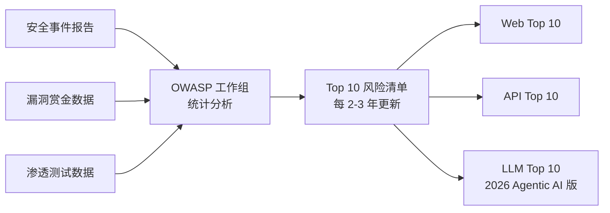
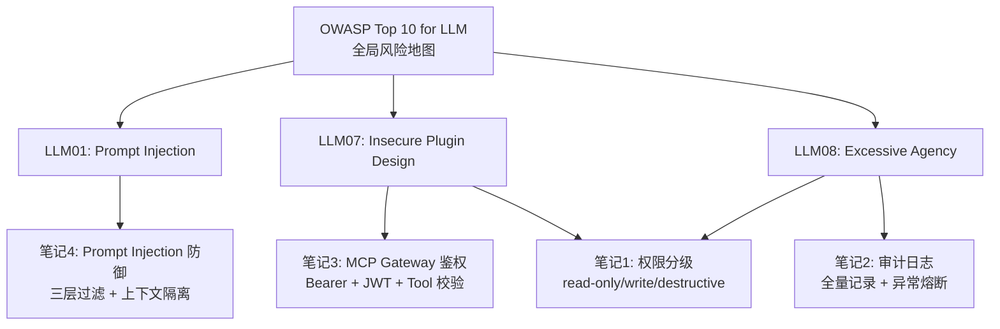
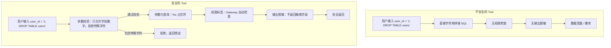

# OWASP Top 10 for Agentic AI概念了解

> **一句话**：OWASP Top 10 for LLM Applications 是 LLM 应用安全的权威风险清单，2026 版针对 Agentic AI 新增了工具/插件安全、过度自主权、供应链风险三项。前四篇学的 Prompt Injection 排第 1，MCP 安全在第 7，权限控制在第 8。背下这 10 项 + 对应的防御手段就够了。

## 基本原理

OWASP（Open Worldwide Application Security Project，开放全球应用安全项目）是一个非营利组织，定期发布 Web / API / LLM 等领域的安全风险 Top 10 清单。这份清单不是理论论文——它基于真实攻击数据和安全事故统计，每一条背后都有实际案例。



## OWASP Top 10 for LLM（2026 版）速览

| # | 风险名称 | 大白话解释 | 与 Agent 的关系 |
|:---:|---------|-----------|---------------|
| 1 | **Prompt Injection** | 用户输入里塞指令让 LLM 干坏事 | Agent 调工具时放大——一条注入可能触发一串危险操作 |
| 2 | **Insecure Output Handling** | LLM 输出直接拼 SQL/命令执行 | Agent 把 LLM 结果当工具参数，不做校验就传 |
| 3 | **Training Data Poisoning** | 训练数据被下毒 | RAG 场景中检索到的文档可能就是投毒载体 |
| 4 | **Model Denial of Service** | 用超长输入/大量并发打垮模型 | Agent 循环中一个工具调用超时炸整条链 |
| 5 | **Supply Chain Vulnerabilities** | 引用的第三方模型/插件有漏洞 | 2026 新增：MCP 插件生态的恶意 Tool 风险 |
| 6 | **Sensitive Information Disclosure** | 模型无意泄露隐私 | Agent 的上下文记忆含 PII，跨会话泄露 |
| 7 | **Insecure Plugin Design** | 工具/插件本身不安全 | 2026 新增：MCP Tool 的参数校验和输出消毒是重点 |
| 8 | **Excessive Agency** | Agent 权限太大 | 2026 新增：Agent 自主决策后权限必须最小化 |
| 9 | **Overreliance** | 盲目信任 LLM 输出 | Agent 自动调 tool 而无人把关 |
| 10 | **Vector & Embedding Weaknesses** | 向量/Embedding 环节漏洞 | 恶意构造文本影响 RAG 检索结果 |

2026 版最大变化：从"LLM 安全"升级为"Agentic AI 安全"。新增的 5、7、8 都是 Agent 有了工具调用能力后才出现的攻击面。

### LLM01: Prompt Injection —— 与前一篇的直接对应

排在第一位不是因为它最难防，而是攻击面最广——任何接受用户输入的 LLM 都可能被注入。Agent 场景下注入破坏力被放大：LLM 不光说错话，还会调工具执行危险操作。

防御措施已在 [[4-PromptInjection防御：输入过滤-上下文隔离-前置规则]] 中详细实现：输入过滤 + 上下文隔离 + 前置规则。

### LLM07: Insecure Plugin Design —— 对应 MCP 工具安全

这是 Agentic AI 独有的风险，两个子类：

- **输入校验缺失**：MCP Tool 收到 `user_id = "1; DROP TABLE users;"` 直接拼 SQL
- **输出不安全**：Tool 返回值嵌入前端页面不做转义，Tool 返回 `{"name": "<script>alert('xss')</script>"}` 直接渲染

防御措施：[[3-MCPGateway鉴权：BearerToken+JWT中间件实现]] 中的 Gateway 统一入口 + Tool 参数校验；[[1-工具权限三级：read-only-write-destructive设计与实现]] 中的权限标签体系。

### LLM08: Excessive Agency —— 对应权限分级

核心命题：Agent 有了自主决策权后，权限必须卡死。用户说"帮我整理数据"，Agent 自己决定"查库→导出→群发邮件→删原始数据"——其中发邮件和删数据就超出了合理范围。

防御措施：[[1-工具权限三级：read-only-write-destructive设计与实现]] 的三级工牌 + [[2-审计日志：操作全量记录-溯源-异常行为熔断]] 的全程留痕 + 异常熔断。



### Agent 部署安全检查脚本

```python
"""
Agent 部署安全检查清单 —— 可执行的 Python 版本。
部署前运行此脚本，任何检查项未通过则阻塞部署。

运行方式：python security_checklist.py
"""
from __future__ import annotations

import sys
import json
from dataclasses import dataclass, field
from typing import Callable, Optional


# ============================================================
@dataclass
class SecurityCheckItem:
    """
    一个安全检查项。

    name: 检查项名称（对应 OWASP 编号）
    description: 检查内容说明
    check_fn: 返回 True 表示通过，False 表示不通过
    severity: 不通过时的严重程度 —— error（阻塞部署）或 warn（允许但告警）
    """
    name: str                                # 检查项名称
    description: str                         # 检查内容说明
    check_fn: Callable[[], bool]             # 检查函数，返回 True=通过
    severity: str = "error"                  # error = 阻塞部署，warn = 仅告警
    owasp_mapping: str = ""                  # 对应的 OWASP 编号


@dataclass
class SecurityAuditReport:
    """安全检查报告。"""
    passed: int = 0
    failed: int = 0
    warned: int = 0
    details: list[dict] = field(default_factory=list)

    def is_deployable(self) -> bool:
        """有 error 级别的失败项 = 不能部署。"""
        return self.failed == 0


class SecurityAudit:
    """
    安全检查审计器：运行所有检查项并生成报告。

    使用方式：
        audit = SecurityAudit()
        audit.add_check(SecurityCheckItem(...))
        report = audit.run_all()
        if not report.is_deployable():
            sys.exit(1)  # 阻塞部署
    """

    def __init__(self) -> None:
        self._checks: list[SecurityCheckItem] = []

    def add_check(self, check: SecurityCheckItem) -> None:
        """注册一个检查项。"""
        self._checks.append(check)

    def run_all(self) -> SecurityAuditReport:
        """
        运行所有检查项，返回完整报告。

        每个检查项独立运行，一个失败不影响后续检查。
        """
        report = SecurityAuditReport()

        for check in self._checks:
            # ---- 执行检查 ----
            try:
                passed = check.check_fn()
            except Exception as e:
                # 如果检查函数本身抛异常，视为不通过
                passed = False
                print(f"  [ERROR] 检查 '{check.name}' 执行异常: {e}")

            # ---- 记录结果 ----
            detail = {
                "name": check.name,
                "description": check.description,
                "passed": passed,
                "severity": check.severity,
                "owasp": check.owasp_mapping,
            }
            report.details.append(detail)

            if passed:
                report.passed += 1
                print(f"  [PASS] {check.name}: {check.description}")
            elif check.severity == "error":
                report.failed += 1
                print(f"  [FAIL] {check.name}: {check.description}")
            else:
                report.warned += 1
                print(f"  [WARN] {check.name}: {check.description}")

        # ---- 打印总结 ----
        print(f"\n总计: {report.passed} 通过, {report.failed} 失败, {report.warned} 警告")
        if report.is_deployable():
            print("结果: 可以部署")
        else:
            print("结果: 阻塞部署 —— 请修复上面的 FAIL 项")

        return report


# 模拟的 Agent 配置（生产环境中从配置文件或环境变量读取）
MOCK_CONFIG = {
    "input_filter_enabled": True,
    "output_validation_enabled": True,
    "tool_param_validation_enabled": True,
    "permission_check_enabled": True,
    "audit_log_enabled": True,
    "timeout_per_tool_seconds": 30,
    "circuit_breaker_enabled": True,
    "human_approval_enabled": True,
    "max_agent_steps": 50,
    "dependencies_scanned": False,            # 模拟：还没扫描
    "sensitive_info_masking_enabled": True,
}


def check_input_filter() -> bool:
    """检查输入过滤是否启用（OWASP LLM01）。"""
    return MOCK_CONFIG.get("input_filter_enabled", False)


def check_output_validation() -> bool:
    """检查 LLM 输出校验是否启用（OWASP LLM02）。"""
    return MOCK_CONFIG.get("output_validation_enabled", False)


def check_tool_param_validation() -> bool:
    """检查 Tool 参数校验是否启用（OWASP LLM07）。"""
    return MOCK_CONFIG.get("tool_param_validation_enabled", False)


def check_permission_control() -> bool:
    """检查权限分级是否启用（OWASP LLM08）。"""
    return MOCK_CONFIG.get("permission_check_enabled", False)


def check_audit_log() -> bool:
    """检查审计日志是否启用（OWASP LLM08）。"""
    return MOCK_CONFIG.get("audit_log_enabled", False)


def check_timeout_circuit_breaker() -> bool:
    """检查超时与熔断是否配置（OWASP LLM04）。"""
    has_timeout = MOCK_CONFIG.get("timeout_per_tool_seconds", 0) > 0
    has_cb = MOCK_CONFIG.get("circuit_breaker_enabled", False)
    return has_timeout and has_cb


def check_human_approval() -> bool:
    """检查高危操作人工审批是否启用（OWASP LLM08/LLM09）。"""
    return MOCK_CONFIG.get("human_approval_enabled", False)


def check_max_steps() -> bool:
    """检查 Agent 最大执行步数是否设限（OWASP LLM04/LLM08）。"""
    max_steps = MOCK_CONFIG.get("max_agent_steps", 0)
    # 有上限且不超过 100
    return 0 < max_steps <= 100


def check_dependency_scan() -> bool:
    """检查第三方依赖是否做过安全扫描（OWASP LLM05）。"""
    return MOCK_CONFIG.get("dependencies_scanned", False)


def check_sensitive_info_masking() -> bool:
    """检查敏感信息脱敏是否启用（OWASP LLM06）。"""
    return MOCK_CONFIG.get("sensitive_info_masking_enabled", False)


# ============================================================
if __name__ == "__main__":
    print("=" * 60)
    print("Agent 部署安全检查")
    print("=" * 60)

    audit = SecurityAudit()

    # ---- 逐个注册检查项 ----
    audit.add_check(SecurityCheckItem(
        name="输入过滤",
        description="用户输入正则筛查 + 零宽字符清理已启用",
        check_fn=check_input_filter,
        owasp_mapping="LLM01",
    ))
    audit.add_check(SecurityCheckItem(
        name="输出校验",
        description="LLM 输出 Schema 验证（Pydantic）已启用",
        check_fn=check_output_validation,
        owasp_mapping="LLM02",
    ))
    audit.add_check(SecurityCheckItem(
        name="Tool 参数校验",
        description="每个 MCP Tool 入口统一做参数类型/范围/特殊字符校验",
        check_fn=check_tool_param_validation,
        owasp_mapping="LLM07",
    ))
    audit.add_check(SecurityCheckItem(
        name="权限分级",
        description="每个 Tool 标注了权限等级，Gateway 统一校验",
        check_fn=check_permission_control,
        owasp_mapping="LLM08",
    ))
    audit.add_check(SecurityCheckItem(
        name="审计日志",
        description="每次 Tool 调用记录 who/when/what/result/permission",
        check_fn=check_audit_log,
        owasp_mapping="LLM08",
    ))
    audit.add_check(SecurityCheckItem(
        name="超时与熔断",
        description="每个 Tool 设超时 + 连续失败 N 次熔断",
        check_fn=check_timeout_circuit_breaker,
        owasp_mapping="LLM04",
    ))
    audit.add_check(SecurityCheckItem(
        name="人工审批",
        description="destructive 级操作必须人工审批",
        check_fn=check_human_approval,
        owasp_mapping="LLM08/LLM09",
    ))
    audit.add_check(SecurityCheckItem(
        name="最大执行步数",
        description="Agent 全局最大执行步数已设限（不超过 100）",
        check_fn=check_max_steps,
        owasp_mapping="LLM04/LLM08",
    ))
    audit.add_check(SecurityCheckItem(
        name="依赖安全扫描",
        description="pip/poetry 依赖已做安全扫描 + 版本锁定",
        check_fn=check_dependency_scan,
        severity="warn",           # 依赖扫描失败不阻塞部署，但告警
        owasp_mapping="LLM05",
    ))
    audit.add_check(SecurityCheckItem(
        name="敏感信息脱敏",
        description="日志/输出中的手机号/身份证/密码已自动脱敏",
        check_fn=check_sensitive_info_masking,
        owasp_mapping="LLM06",
    ))

    # ---- 执行检查 ----
    report = audit.run_all()

    # ---- 根据报告决定是否允许部署 ----
    if not report.is_deployable():
        print("\n部署已被阻塞。请修复 FAIL 项后重新检查。")
        sys.exit(1)
```

### 安全 vs 不安全的 Tool 定义对比

```python
"""
安全与不安全的 MCP Tool 定义对比。
展示 OWASP LLM07（Insecure Plugin Design）和 LLM08（Excessive Agency）
在实际代码中的区别。
"""
from __future__ import annotations


# ============================================================
def unsafe_query_user(user_id: str) -> dict:
    """
    不安全：直接拼接 SQL，没有参数校验，没有权限检查。

    问题：
    1. SQL 注入 —— user_id 直接拼入 SQL 字符串
    2. 无权限控制 —— 任何人都能查任意用户
    3. 无输入校验 —— user_id 可能包含任意内容
    """
    # 危险：直接拼接用户输入到 SQL 中
    sql = f"SELECT * FROM users WHERE id = {user_id}"

    # 执行查询（假设有这个函数）
    result = execute_raw_sql(sql)

    # 危险：返回所有字段，可能包含密码哈希
    return {"user": result}


def unsafe_delete_all_data(confirmation: str) -> dict:
    """
    不安全：Agent 可以直接调用删除操作，无审批机制。

    问题：
    1. Excessive Agency —— Agent 不应该有删除全表的能力
    2. 无人工审批 —— 只要 Agent 决定就能执行
    3. 不可逆 —— 删了就没了
    """
    # 危险：没有权限检查
    sql = "DROP TABLE users"
    execute_raw_sql(sql)
    return {"status": "deleted"}


# ============================================================
from enum import Enum


class SafePermissionLevel(Enum):
    """权限等级（简化版，完整版见笔记1）。"""
    READ_ONLY = "read_only"
    WRITE = "write"
    DESTRUCTIVE = "destructive"


def validate_user_id(user_id: str) -> str:
    """
    参数校验函数 —— Tool 入口的第一道防线。

    校验规则：
    - 只允许数字和字母，防止 SQL 注入中的特殊字符
    - 长度限制在 1-50 字符
    """
    import re
    if not re.match(r"^[a-zA-Z0-9_-]{1,50}$", user_id):
        raise ValueError(f"非法的 user_id 格式: {user_id}")
    return user_id


def safe_query_user(user_id: str) -> dict:
    """
    安全：参数校验 + 参数化查询 + 权限标签 + 输出脱敏。

    改进点：
    1. 参数校验（validate_user_id）阻塞恶意输入
    2. 参数化查询（%s 占位符）防止 SQL 注入
    3. 输出脱敏（不返回密码哈希）
    4. 权限标签让 Gateway 自动做权限检查
    """
    # Step 1: 参数校验 —— 防止恶意输入进入后续流程
    clean_user_id = validate_user_id(user_id)

    # Step 2: 参数化查询 —— 用户输入作为参数绑定，而不是拼入 SQL
    sql = "SELECT id, name, email, created_at FROM users WHERE id = %s"
    result = execute_parameterized_sql(sql, (clean_user_id,))

    # Step 3: 输出脱敏 —— 不返回敏感字段（如 password_hash）
    if result:
        return {
            "user": {
                "id": result["id"],
                "name": result["name"],
                "email": mask_email(result["email"]),  # 邮箱脱敏
            }
        }
    return {"user": None}


def mask_email(email: str) -> str:
    """邮箱脱敏：user@example.com → u***@example.com"""
    if "@" not in email:
        return email
    local, domain = email.split("@", 1)
    return f"{local[0]}***@{domain}"


# 模拟的数据访问函数（仅用于演示接口）
def execute_raw_sql(sql: str) -> dict:
    """模拟原始 SQL 执行（仅供演示，生产环境禁用）。"""
    return {"id": 1, "name": "test", "password_hash": "xxx"}


def execute_parameterized_sql(sql: str, params: tuple) -> Optional[dict]:
    """
    模拟参数化查询。

    参数化查询的核心：SQL 结构和数据分离。
    数据库驱动会把 %s 占位符替换为经过正确转义的参数值，
    无论参数内容是什么，都不会被当作 SQL 指令执行。
    """
    return {"id": params[0], "name": "test_user",
            "email": "user@example.com", "created_at": "2026-01-01"}
```




## 速记卡（面试闪卡）

**Q1：一句话讲清「OWASP Top 10 for Agentic AI概念了解」到底是什么？**
A：OWASP Top 10 是 LLM 应用安全风险清单，2026 版升级为 Agentic AI 安全，新增工具/权限/供应链攻击面。

**Q2：这份清单从哪来、为啥信它 —— 怎么理解？**
A：OWASP（Open Worldwide Application Security Project，开放全球应用安全项目）是非营利组织，基于真实攻击数据、漏洞赏金、渗透测试统计出清单，每条背后都有案例，不是纸上谈兵。它覆盖 Web/API/LLM，每 2-3 年更新一次，相当于安全界的"事故年鉴"。

**Q3：2026 版十项，谁最该怕 —— 怎么理解？**
A：10 项里 Prompt Injection（LLM01 提示注入）排第一——攻击面最广，Agent 调工具时一条注入能触发一串危险操作；Insecure Output Handling（LLM02 输出不严）直接拼 SQL/命令；Training Data Poisoning（LLM03 数据投毒）污染 RAG；Model DoS（LLM04 模型拒绝服务）打垮链路。供应链/插件/过度自主权是新增的 Agent 专属坑。

**Q4：三个重点像「门、插件、工牌」 —— 怎么理解？**
A：LLM01 注入：防御靠输入过滤+上下文隔离+前置规则，Agent 场景破坏力被放大。LLM07 不安全插件设计：MCP Tool 参数不校验会拼 SQL、输出不消毒会 XSS（跨站脚本），防御靠 Gateway 统一入口+参数校验。LLM08 过度自主权：Agent 权限太大，用户说"整理数据"它却自己删库，防御靠权限三级+审计日志+异常熔断。

**Q5：部署前安全检查像「出厂质检单」 —— 怎么理解？**
A：笔记给了一套可执行脚本，把每条 OWASP 风险映射成检查项（输入过滤、输出校验、Tool 参数校验、权限分级、审计日志、超时熔断、人工审批、最大步数、依赖扫描、敏感脱敏），任一 error 级不通过就阻塞部署。还对比不安全 vs 安全 Tool：前者直接拼 SQL 无脱敏，后者参数校验+参数化查询+权限标签+输出脱敏。

**Q6：核心速记主线有哪些？**
- 清单来源：OWASP 基于真实攻击数据，每 2-3 年更新
- 2026 版：LLM01 注入居首，新增供应链/插件/过度自主权
- 三重点：注入防御、插件参数校验、权限最小化
- 落地：部署前检查脚本 + 安全 Tool 写法对照

**口诀**
A：OWASP 十项记心间，注入居首面最广；
插件权限供应链，二六新增 Agent 防；
部署前过质检单，一项不过就拦下；
安全 Tool 四件套，校验脱敏加标签。

## 相关链接

- 上一篇：[[4-PromptInjection防御：输入过滤-上下文隔离-前置规则]]
- 下一篇：无（本专题最后一篇）
- 专题起点：[[1-工具权限三级：read-only-write-destructive设计与实现]]

---
→ [[技术学习路线图#Agent 安全防护]]
