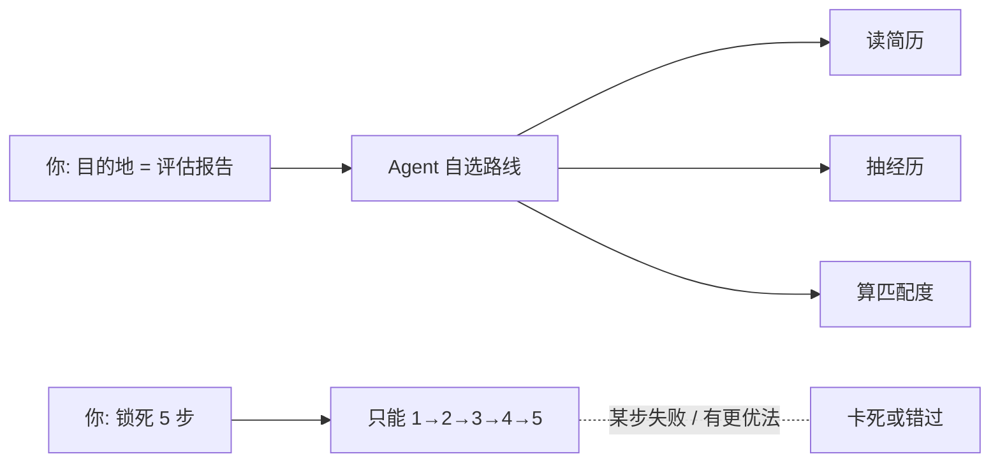

---

title: "给目标不给步骤"

tags:

  - agent方法论

  - prompt-2.0

  - 黄金法则

created: "2026-07-21"

---

# 给目标，不给步骤

> 本条目是「Prompt 2.0 方法论」的第 1 部分，对应学习清单条目 2.1.1。

>

> **前置依赖**：认知升级：四层模型

> **为以下铺垫**：结构化Prompt设计、Maker-Checker模式

---

## 一、核心观点

> **给目标，不给步骤**：定义「完成状态」，而不是执行路径。

> 就像你打车只说「去机场」，不会手把手教司机走哪条路——你信他的导航，他比你更懂实时路况。

---

## 二、定义与原理（类比先行）
### 2.1 定义

- **目标**：完成状态，即「什么算做完」（destination）

- **步骤**：执行路径，即「怎么做」（the route）

- **原则**：告诉 Agent（智能体）「要什么」，而不是「怎么做」

### 2.2 类比：实习生 vs 操作手册

把 Agent 想成一名能力很强、但对你公司业务不熟的实习生。

- ❌ **给步骤**：你塞给他一本 50 页的《SOP 操作手册》，第 3 步写「先点 A 再点 B」。结果他严格照做，哪怕发现 B 已经下线了也不敢绕路。

- ✅ **给目标**：你说「周五前把这版财报整理成给老板看的一页纸摘要」，他自会去查最新模板、问同事、挑重点——因为他理解「目标」。

> 关键洞察：**Agent 的工具和逻辑链比人迭代得更快**。你今天写死的第 3 步，下个月可能就是累赘。锁死步骤，等于给一辆法拉利焊死方向盘。

---

## 三、为什么「给目标」更有效？

1. **利用最新能力**：Agent 能用上你写 Prompt 时还不存在的新工具、新接口，路径由它实时选。

2. **找到更优解**：你设计的步骤往往是「够用」，Agent 可能发现你没想到的最短路径。

3. **可扩展**：目标明确后，换工具、换环境都不用改 Prompt——只改「目的地」即可。



---

## 四、示例对比
### 4.1 ❌ 差的写法（给步骤）

```text

请按以下步骤处理简历：

1. 先读取简历文件

2. 提取工作经历

3. 提取技能

4. 计算匹配度

5. 生成报告

```

**问题**：锁死路径；某步失败整条链路卡死；Agent 无法用更聪明的办法。

### 4.2 ✅ 好的写法（给目标）

```text

分析这份简历，生成一份评估报告，包含：

- 工作经历与岗位的匹配度（0-100分）

- 技能匹配情况

- 改进建议

要求：结构清晰、有数据支撑、30 秒内看懂关键信息。

```

**优点**：定义了「完成状态」；Agent 自由选路径；更灵活、更可扩展。

---

## 五、实践场景
### 5.1 代码审查

- ❌ 给步骤：读 diff → 查类型 → 查性能 → 查安全 → 出报告

- ✅ 给目标：识别潜在问题并生成报告（风险等级、具体问题、改进建议；优先关注类型安全、性能、安全）

### 5.2 文档生成

- ❌ 给步骤：读代码 → 提签名 → 写注释 → 格式化

- ✅ 给目标：生成可嵌入 README 的 API 文档（函数说明、参数、返回值、示例）

---

## 六、最新研究与企业数据（2024–2026）

- **Anthropic《Building Effective Agents》(2024-12)**：明确建议「从最简单的方案起步，只有当简单方案不够时才加复杂性」；许多任务一个带检索的 LLM 调用就够，不必上 Agent。这背后的逻辑正是「给目标」而非「写死流程」。

- **Anthropic《Prompt engineering best practices for 2026》**：直接给出实操建议——「Be explicit about your actual goal. Provide context about why you're asking（明确说出真实目标，并解释为什么这么问）」，因为模型会更精准地对齐你的意图。

---

## 七、学习资源

- **权威指南**：Anthropic《Building Effective Agents》

- **实践指南**：Anthropic《Prompt engineering best practices for 2026》

- **进阶**：[[02-评估标准写进指令|把评估标准写进指令]]——定义了目标，还得让 Agent 知道什么算「做完」

---

## 核心要点

| 要点 | 速记 |
|------|------|
| 核心 | 给目标（完成状态），不给步骤（执行路径） |
| 类比 | 打车只说目的地，不教司机走哪条路 |
| 为什么 | Agent 工具迭代快；锁死步骤=焊死方向盘；目标更可扩展 |
| 反例信号 | Prompt 里出现「第一步…第二步…」= 危险气味 |
| 正例信号 | Prompt 里出现「包含…」「要求…」「算做完的标准是…」 |

**下一篇**：[[02-评估标准写进指令|把评估标准写进指令]]——光给目标还不够，还得让 Agent 知道「什么算做完」。

---

## 参考来源（一手链接 · 可溯源深挖）

- **Anthropic (2024-12)**《Building Effective Agents》：[anthropic.com/engineering/building-effective-agents](https://www.anthropic.com/engineering/building-effective-agents)

- **Anthropic (2026)**《Prompt engineering best practices for 2026》：[claude.com/blog/best-practices-for-prompt-engineering](https://claude.com/blog/best-practices-for-prompt-engineering)

## 速记卡（面试闪卡）

**Q1：一句话讲清「给目标，不给步骤」到底是什么？**

A：给目标不给步骤：只定义"做完啥样"，不锁死"怎么走"。

**Q2：一、核心观点 —— 怎么理解？**

A：像打车只说"去机场"，绝不手把手教司机走哪条路——你信他导航比你还懂路况。给目标（Goal）就是告诉 Agent"目的地"，把路线交给它实时选。

**Q3：二、定义与原理（实习生类比） —— 怎么理解？**

A：把 Agent 当个能力强但不懂你业务的实习生：塞 50 页 SOP 他照做、B 下线了也不敢绕路；只说"周五交一页摘要"他自己会查模板问同事。锁死步骤等于给法拉利焊死方向盘。

**Q4：三、为什么"给目标"更有效？ —— 怎么理解？**

A：三个好处：能用上你写 Prompt 时还不存在的新工具；可能找到你没想到的捷径；换环境只改"目的地"不用改全文。Agent 的工具链比你迭代快，写死步骤下月就成累赘。

**Q5：四、示例对比 —— 怎么理解？**

A：差写法列 1→5 步，某步挂了整条链卡死；好写法只定"含匹配度评分、技能、建议，30 秒看懂"。前者是"操作手册"，后者是"完成状态"——Anthropic 也建议 Be explicit about your goal（明确真实目标）。

**Q6：核心速记主线有哪些？**

- 给目标定义"完成态"，不锁路径

- 类比打车：说目的地，别教路线

- 锁步骤=焊死方向盘，难扩展

- Anthropic 建议：明确真实目标

**口诀**

A：目标给清路自挑，

打车只说去哪好；

步骤锁死方向盘，

灵活扩展错不了。

## 相关链接

- 系列清单：[[学习路线图/Agent方法论与产品思维学习路线图|Agent 方法论与产品思维学习路线图]]

- 上一层级：[[00-Agent方法论与产品思维|Prompt 2.0 方法论 · 索引]]

- 同主题：[[02-评估标准写进指令|评估标准写进指令]] · [[03-分离规划与执行|分离规划与执行]]

