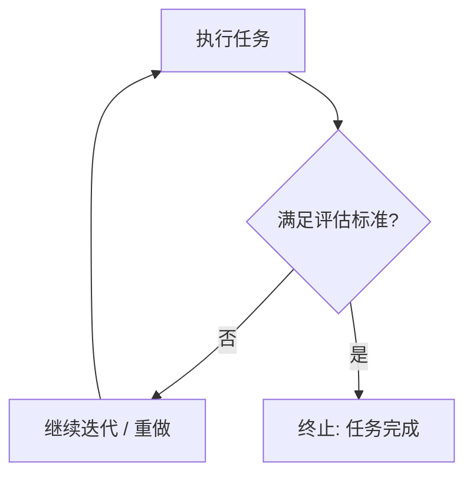

# 把评估标准写进指令

> 本条目是「Prompt 2.0 方法论」的第 2 部分，对应学习清单条目 2.1.2。
>
> **前置依赖**：给目标不给步骤
> **为以下铺垫**：结构化Prompt设计、Maker-Checker模式

---

## 一、核心观点

> **把评估标准写进指令**：让 Agent 知道「什么算做完」。
> 这就像减肥先上秤——没有数字，你永远在「感觉瘦了」，而脂肪一笑置之。

---

## 二、定义与原理（类比先行）

### 2.1 定义

评估标准（evaluation criteria）就是**终止条件**，回答三个问题：

- 什么算「做好」
- 什么算「足够好」
- 什么算「重做」

### 2.2 类比：没有终点的马拉松

给 Agent 一个目标（比如「审查这段代码」）却不给终止条件，就像让一个人跑马拉松却不告诉他终点在哪。他不会停，会一直跑、一直「优化」、一直自我感动，直到你把电拔了。

> Agent 不是不会做，而是**不知道什么时候该停**。你必须在指令里把「终点线」画清楚。

---

## 三、为什么需要评估标准？

1. **没有终止条件，Agent 不会停**：避免无限循环和资源浪费。
2. **保证质量**：明确的标准挡住「差不多就行」的糊弄。
3. **可验证**：有了标准，Maker-Checker 里的 Checker 才知道审什么（见 [[09-Maker-Checker概念|Maker-Checker 概念]]）。

---

## 四、评估标准的类型

### 4.1 确定性标准（可自动化验证）

| 类型 | 示例 | 验证方式 |
|------|------|----------|
| 测试 | pytest 全绿 | 自动化测试 |
| Lint | ruff 无报错 | 静态检查 |
| 类型检查 | mypy 无错误 | 类型检查 |
| 覆盖率 | 测试覆盖率 ≥ 85% | 覆盖率工具 |

### 4.2 模糊标准（需要判断）

| 类型 | 示例 | 验证方式 |
|------|------|----------|
| 可读性 | 代码易读 | 人工 / Checker 审查 |
| 设计合理性 | 架构合理 | 人工验收 |
| 业务符合度 | 符合需求 | 人工验收 |



---

## 五、示例对比

### 5.1 ❌ 差的写法（没有评估标准）

```text
请审查这段代码，找出问题并修复。
```

**问题**：没有「审查完」的定义；质量无门禁；Agent 想停就停。

### 5.2 ✅ 好的写法（有评估标准）

```text
请审查这段代码，找出问题并修复。
评估标准：
- 测试覆盖率不低于 85%
- pytest 全绿
- ruff 无报错
- 最终回答必须包含数据来源
满足以上标准，则审查完成。
```

---

## 六、最新研究与企业数据（2024–2026）

- **Anthropic《Harness design for long-running application development》(2025)**：提出「让独立评分 Agent 在全新上下文窗口里，按开发者定义的明确标准评估输出」——这要求标准本身必须**可分级、可客观判定**，否则评分 Agent 无从下手。即：标准要先写清，验证才有效。
- **Anthropic《Building Effective Agents》(2024-12)**：把「evaluator-optimizer（生成—评估—修订）」列为最实用的 Agent 工作流之一，其前提正是「你有清晰、可判定的评估标准」。

---

## 七、学习资源

- **权威指南**：Anthropic《Building Effective Agents》
- **深入阅读**：Anthropic《Harness design for long-running application development》
- **进阶**：[[03-分离规划与执行|分离规划与执行]]——标准写好后，用 Maker-Checker 来审

---

## 核心要点

| 要点 | 速记 |
|------|------|
| 核心 | 评估标准 = 终止条件 = 终点线 |
| 类比 | 减肥先上秤，没数字=永远「感觉瘦了」 |
| 两类 | 确定性（测试/lint/覆盖率，机器判）+ 模糊（可读性，Checker/人工判） |
| 写法信号 | 「满足以下标准则完成」、「pytest 全绿才算完」 |
| 衔接 | 没有标准，Maker-Checker 的 Checker 不知道审什么 |

**下一篇**：[[03-分离规划与执行|分离规划与执行]]——目标与标准都有了，下一步把「生成」和「审查」拆成两个角色。

---

## 参考来源（一手链接 · 可溯源深挖）

- **Anthropic (2024-12)**《Building Effective Agents》：[anthropic.com/engineering/building-effective-agents](https://www.anthropic.com/engineering/building-effective-agents)
- **Anthropic (2025)**《Harness design for long-running application development》：[anthropic.com/engineering/harness-design-long-running-apps](https://www.anthropic.com/engineering/harness-design-long-running-apps)

**相关链接**：
- 系列清单：[[学习路线图/Agent 方法论与产品思维学习清单|Agent 方法论与产品思维学习清单]]
- 上一层级：[[00-Agent 方法论与产品思维|Prompt 2.0 方法论 · 索引]]
- 同主题：[[01-给目标不给步骤|给目标不给步骤]] · [[09-Maker-Checker概念|Maker-Checker 概念]]

## 速记卡（面试闪卡）

**Q1：一句话讲清「把评估标准写进指令」到底是什么？**
A：**把评估标准写进指令**：让 Agent 知道「什么算做完」。
这就像减肥先上秤——没有数字，你永远在「感觉瘦了」，而脂肪一笑置之。
---

**Q2：一、核心观点 —— 怎么理解？**
A：**把评估标准写进指令**：让 Agent 知道「什么算做完」。
这就像减肥先上秤——没有数字，你永远在「感觉瘦了」，而脂肪一笑置之。
---

**Q3：二、定义与原理（类比先行） —— 怎么理解？**
A：评估标准（evaluation criteria）就是**终止条件**，回答三个问题：
什么算「做好」
什么算「足够好」
什么算「重做」
给 Agent 一个目标（比如「审查这段代码」）却不给终止条件，就像让一个人跑马拉松却不告诉他终点在哪。他不会停，会一直跑、一直「优化」、一直自我感动，直到你把电拔了。
Agent 不是不会做，而是**不知道什么时候该停**。你必须在指令里把「终点线」画清楚。
---

**Q4：三、为什么需要评估标准？ —— 怎么理解？**
A：**没有终止条件，Agent 不会停**：避免无限循环和资源浪费。
**保证质量**：明确的标准挡住「差不多就行」的糊弄。
**可验证**：有了标准，Maker-Checker 里的 Checker 才知道审什么（见 ）。
---

**Q5：四、评估标准的类型 —— 怎么理解？**
A：| 类型 | 示例 | 验证方式 |
|------|------|----------|
| 测试 | pytest 全绿 | 自动化测试 |
| Lint | ruff 无报错 | 静态检查 |
| 类型检查 | mypy 无错误 | 类型检查 |
| 覆盖率 | 测试覆盖率 ≥ 85% | 覆盖率工具 |
| 类型 | 示例 | 验证方式 |
|------|------|----------|

**Q6：核心速记主线有哪些？**
A：抓住这几根：一、核心观点、二、定义与原理（类比先行）、三、为什么需要评估标准？、四、评估标准的类型、五、示例对比、六、最新研究与企业数据（2024–2026）。

