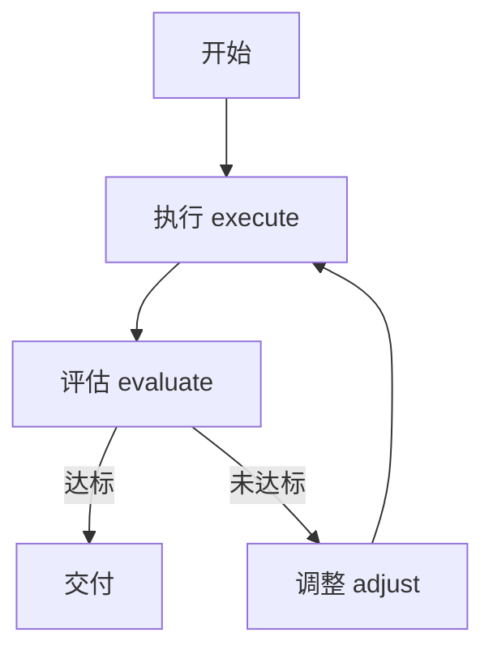

---

title: "设计反馈闭环"

tags:

  - agent方法论

  - prompt-2.0

  - 黄金法则

created: "2026-07-21"

---

# 设计反馈闭环

> 本条目是「Prompt 2.0 方法论」的第 4 部分，对应学习清单条目 2.1.4。

>

> **前置依赖**：给目标不给步骤、评估标准写进指令、分离规划与执行

> **为以下铺垫**：结构化Prompt设计、Loop Engineering

---

## 一、核心观点

> **设计反馈闭环**：从「单次 Prompt」升级到「execute → evaluate → adjust」循环。

> 一次没做对不丢人，丢人的是没能力发现「一次没做对」还继续错下去——这跟健身一个道理：不称体重，练再久也只是「看起来很努力」。

---

## 二、定义与原理（类比先行）
### 2.1 定义

反馈闭环（feedback loop）由三步组成：

- **执行（execute）**：Agent 干活

- **评估（evaluate）**：拿结果对照标准

- **调整（adjust）**：不行就改，再来一轮

### 2.2 类比： thermostat（恒温器）

普通 Prompt 像个「手动风扇」——你按一下它转一下。反馈闭环像 **thermostat（恒温器）**：它持续测室温、对比目标温度、自动开/关空调，直到房间稳定在你设定的温度。Agent 也该如此：有目标、有测量、有自动纠偏。

> 这其实就是 **Chain-of-Thought（思维链，CoT）** 的工程放大版——CoT 让模型「一步步想」，反馈闭环让 Agent「做一步、验一步、改一步」。

---

## 三、为什么需要反馈闭环？

1. **持续改进**：每次迭代都更接近目标。

2. **防止「一次错到底」**：错误在早期就被抓住，不会滚雪球。

3. **质量可预期**：靠循环收敛，而不是靠「一次写对」的运气。

---

## 四、反馈闭环的类型

- **单层反馈**：执行 → 评估 → 调整 → 执行（写代码 → 跑测试 → 修 → 再跑）

- **多层反馈**：多个门禁串起来（测试 → lint → 类型检查）

- **嵌套反馈**：外层开发循环套内层函数级循环



---

## 五、示例（精简版）

```text

第一步：审查代码，生成修复方案

第二步：验证 —— 跑测试 / 跑 lint / 对标准

第三步：不通过则分析原因并调整，回到第一步

```

> 注意：必须设**最大迭代次数**（比如 3 轮），否则「纠偏」本身会变成死循环——详见 [[15-Reflexion框架|Reflexion 框架]]。

---

## 六、最新研究与企业数据（2024–2026）

- **Anthropic《Building Effective Agents》(2024-12)**：把 **evaluator-optimizer（生成—评估—修订）** 列为最实用的工作流之一——「LLMs 更擅长识别错误，而非避免错误」，所以让它先出草稿、再评估、再修订，质量显著优于一次直出。

- **Chain-of-Thought (Wei et al., 2022, Google)**：思维链显著提升复杂推理，是「分步 + 反馈」有效性的底层理论支撑（arXiv:2201.11903）。

- **Anthropic《Harness design》(2025)**：多小时编码中，靠「generator–evaluator 循环 + 上下文重置」才让 Agent 稳定产出可用结果，单轮直出会早早跑偏。

---

## 七、学习资源

- **权威指南**：Anthropic《Building Effective Agents》（evaluator-optimizer 章节）

- **论文**：Chain-of-Thought Prompting（arXiv:2201.11903）

- **进阶**：[[15-Reflexion框架|Reflexion 框架]] · [[13-ReAct框架|ReAct 框架]]

---

## 核心要点

| 要点 | 速记 |
|------|------|
| 核心 | execute → evaluate → adjust 的循环 |
| 类比 | thermostat：测温度、比目标、自动纠偏 |
| 为什么 | 错误早抓不放任；质量靠收敛不靠运气 |
| 三层 | 单层 / 多层 / 嵌套反馈 |
| 铁律 | 必须设最大迭代次数，防死循环 |

**下一篇**：[[05-结构化Prompt六段式|结构化Prompt六段式]]——四大黄金法则讲完，进入「具体怎么写」。

---

## 参考来源（一手链接 · 可溯源深挖）

- **Anthropic (2024-12)**《Building Effective Agents》：[anthropic.com/engineering/building-effective-agents](https://www.anthropic.com/engineering/building-effective-agents)

- **Wei et al. (2022)** Chain-of-Thought Prompting（Google）：[arXiv:2201.11903](https://arxiv.org/abs/2201.11903)

- **Anthropic (2025)**《Harness design for long-running application development》：[anthropic.com/engineering/harness-design-long-running-apps](https://www.anthropic.com/engineering/harness-design-long-running-apps)

## 速记卡（面试闪卡）

**Q1：一句话讲清「设计反馈闭环」到底是什么？**

A：把"单次 Prompt"升级成执行-评估-调整(execute-evaluate-adjust)的循环，让 Agent 自我纠偏。

**Q2：一、核心观点 —— 怎么理解？**

A：像健身不称体重永远只是"看起来努力"：一次没做对不丢人，丢人的是没能力发现错还继续错。反馈闭环就是从"写一次"升级到"做一步验一步改一步"的循环。

**Q3：二、定义与原理（类比先行） —— 怎么理解？**

A：反馈闭环(feedback loop)三步：execute 干活、evaluate 对照标准、adjust 不行就改。像 thermostat(恒温器)——持续测室温、比目标、自动开关空调直到稳温。本质是 Chain-of-Thought 的工程放大版。

**Q4：三、为什么需要反馈闭环？ —— 怎么理解？**

A：三个好处：持续改进(每轮更近目标)、防"一次错到底"(错误早抓不滚雪球)、质量可预期(靠收敛不靠运气)。

**Q5：四、反馈闭环的类型 —— 怎么理解？**

A：三类：单层反馈(写码→跑测试→修→再跑)、多层反馈(测试→lint→类型检查串成门禁)、嵌套反馈(外层开发循环套内层函数级循环)。记住设最大迭代次数防死循环。

**Q6：核心速记主线有哪些？**

- 核心：execute → evaluate → adjust 的循环

- 类比：thermostat 测温度比目标自动纠偏

- 三层：单层 / 多层 / 嵌套反馈

- 铁律：设最大迭代次数，防纠偏变死循环

**口诀**

A：单次 Prompt 易跑偏，闭环三步才稳

执行评估再调整，thermostat 来管

单层多层嵌套环，错误早抓不放任

最大迭代要设限，死循环别来烦

## 相关链接

- 系列清单：[[学习路线图/Agent方法论与产品思维学习路线图|Agent 方法论与产品思维学习路线图]]

- 上一层级：[[00-Agent方法论与产品思维|Prompt 2.0 方法论 · 索引]]

- 同主题：[[15-Reflexion框架|Reflexion 框架]] · [[03-分离规划与执行|分离规划与执行]]

