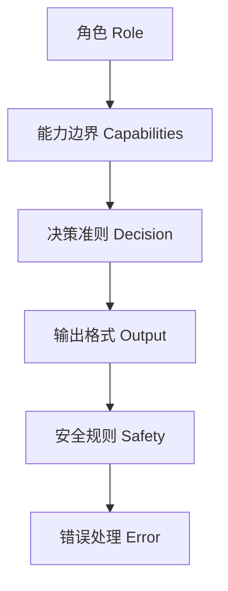

---

title: "结构化Prompt六段式"

tags:

  - agent方法论

  - prompt-2.0

  - 结构化设计

created: "2026-07-21"

---

# 结构化 Prompt 六段式设计

> 本条目是「Prompt 2.0 方法论」的第 5 部分，对应学习清单条目 2.2.1。

>

> **前置依赖**：四大黄金法则

> **为以下铺垫**：反例约束、Maker-Checker模式

---

## 一、核心观点

> **Prompt 分层的标准结构**：角色 → 能力边界 → 决策准则 → 输出格式 → 安全规则 → 错误处理。

> Agent 不是答题的学生，是替你干活的同事——你不会只甩一句「去干活」，而是得说清「你是谁、能碰啥、优先啥、交啥样、红线在哪、出事咋办」。

---

## 二、定义与原理（类比先行）
### 2.1 类比：一份「岗位说明书」

把六段式想成给新同事的入职 JD（Job Description）：

- **角色** = 你是谁、对啥负责

- **能力边界** = 你会啥、不碰啥

- **决策准则** = 遇到矛盾先保哪个

- **输出格式** = 交付物长啥样

- **安全规则** = 绝对不能碰的红线

- **错误处理** = 拿不准时怎么办

### 2.2 六段式结构

| 段落 | 作用 | 示例 |

|------|------|------|

| **角色** | 我是谁、对什么负责 | 你是代码审查助手，专注 Python 类型安全 |

| **能力边界** | 我会什么、不会什么 | 会分析 diff、跑静态检查；不直接改代码 |

| **决策准则** | 遇到 A 选 X、遇到 B 选 Y | 优先保持行为兼容，其次优化性能 |

| **输出格式** | 结果必须长什么样 | Markdown 报告：风险等级、证据、建议 |

| **安全规则** | 绝不能碰的红线 | 不执行破坏性命令，不读非目标文件 |

| **错误处理** | 失败/不确定时怎么办 | 无法确定风险则标「待人工确认」并说明理由 |



---

## 三、为什么是这六段？

- **角色 + 能力边界**：防止 Agent 越权、乱作为。

- **决策准则**：把「优先级」写死，避免它在两难时随机选。

- **输出格式**：下游好解析、好接 Checker（见 [[09-Maker-Checker概念|Maker-Checker]]）。

- **安全规则 + 错误处理**：生产环境的「安全带」与「降落伞」。

---

## 四、实践示例（代码审查）

```text

角色：资深 Python 工程师，专注代码审查与类型安全。

能力边界：会分析 diff、跑静态检查、识别问题；不会直接改代码、跑测试、部署。

决策准则：1. 类型安全 > 性能 > 可读性  2. 保持行为兼容 > 优化性能。

输出格式：Markdown 报告（风险等级 / 问题描述 / 代码位置 / 改进建议）。

安全规则：不执行破坏性命令，不读取非目标文件。

错误处理：无法确定风险时，标注「待人工确认」并说明理由。

```

---

## 五、优劣势

- ✅ 完整、可预期、易接 Checker 与测试门禁

- ✅ 出错时易定位是「哪段没写清」

- ❌ 比一句式 Prompt 长；需随任务迭代

---

## 六、最新研究与企业数据（2024–2026）

- **Anthropic《Claude 4 prompt engineering best practices》(2025/2026)**：明确建议「Be explicit with your instructions（指令要显式）」「Control the format of responses（控制输出格式）」，并指出 Claude 4 训练得更「听指令」，但正因如此，想要「超出预期」的行为反而要更显式地要求。

- 同一指南还强调「Tell Claude what to do instead of what not to do（说要做什么，而非不要做什么）」——这正是下一篇 [[07-反例约束|反例约束]] 与 [[08-禁止模糊词|禁止模糊词]] 的理论根基。

---

## 七、学习资源

- **权威指南**：Anthropic《Claude 4 prompt engineering best practices》

- **实践指南**：Anthropic《Prompt engineering best practices for 2026》

- **进阶**：[[06-约束数量控制|约束数量控制]] · [[07-反例约束|反例约束]]

---

## 核心要点

| 要点 | 速记 |

|------|------|

| 六段 | 角色 → 能力边界 → 决策准则 → 输出格式 → 安全规则 → 错误处理 |

| 类比 | 给同事的岗位 JD |

| 决策准则 | 把「优先级」写死，防两难时随机选 |

| 输出格式 | 为接 Checker / 测试门禁铺路 |

| 一手依据 | Anthropic：指令要显式、格式要可控 |

**下一篇**：[[06-约束数量控制|约束数量控制]]——六段式里每段塞多少条约束？有讲究。

---

## 参考来源（一手链接 · 可溯源深挖）

- **Anthropic (2025/2026)**《Claude 4 prompt engineering best practices》：[docs.anthropic.com/.../claude-4-best-practices](https://docs.anthropic.com/en/docs/build-with-claude/prompt-engineering/claude-4-best-practices)

- **Anthropic (2026)**《Prompt engineering best practices for 2026》：[claude.com/blog/best-practices-for-prompt-engineering](https://claude.com/blog/best-practices-for-prompt-engineering)

## 速记卡（面试闪卡）

**Q1：一句话讲清「结构化 Prompt 六段式设计」到底是什么？**

A：结构化 Prompt 六段式是给 Agent 的岗位 JD：角色→边界→准则→格式→安全→错误处理。

**Q2：一、核心观点 —— 怎么理解？**

A：像给新同事写入职 JD：Agent 不是答题的学生，是替你干活的同事。你不会只甩一句"去干活"，而得说清"你是谁、能碰啥、优先啥、交啥样、红线在哪、出事咋办"——这就是六段。

**Q3：二、定义与原理（类比先行） —— 怎么理解？**

A：像六格岗位说明书：角色=你是谁；能力边界=会啥不碰啥；决策准则=矛盾先保哪个；输出格式=交付物长啥样；安全规则=绝对红线；错误处理=拿不准怎么办。六段串成一条责任链。

**Q4：三、为什么是这六段？ —— 怎么理解？**

A：像给 Agent 系安全带：角色+能力边界防越权乱作为；决策准则把优先级写死，避免两难时随机选；输出格式好解析、好接 Checker；安全规则+错误处理是生产的"安全带"与"降落伞"。

**Q5：四、实践示例（代码审查） —— 怎么理解？**

A：像一份现成模板：角色=资深 Python 工程师；边界=会分析 diff 不直改代码；准则=类型安全>性能>可读；格式=Markdown 报告（等级/位置/建议）；安全=不跑破坏命令；错误处理=标"待人工确认"。照填即可。

**Q6：核心速记主线有哪些？**

- 结构：角色→能力边界→决策准则→输出格式→安全规则→错误处理

- 类比：给同事的岗位 JD，每段对应 JD 一项

- 目的：防越权、写死优先级、好接 Checker 与测试门禁

- 依据：Anthropic 建议指令要显式、格式要可控

**口诀**

A：六段像 JD，角色定身份；

边界划红线，准则写死优先；

格式好接 Checker，安全加保险；

错误处理兜底，显式最稳妥。

## 相关链接

- 系列清单：[[学习路线图/Agent方法论与产品思维学习路线图|Agent 方法论与产品思维学习路线图]]

- 上一层级：[[00-Agent方法论与产品思维|Prompt 2.0 方法论 · 索引]]

- 同主题：[[06-约束数量控制|约束数量控制]] · [[07-反例约束|反例约束]]

