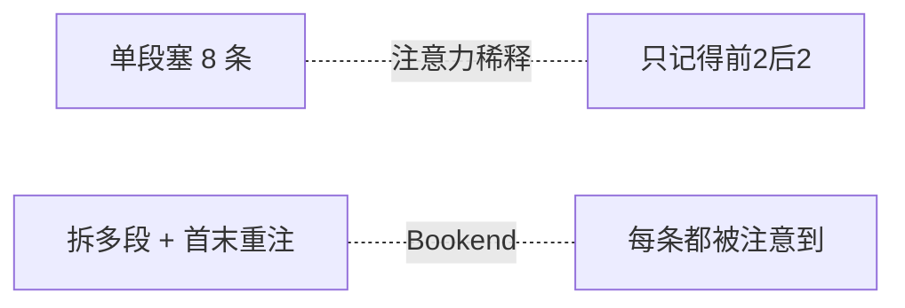

---

title: "约束数量控制"

tags:

  - agent方法论

  - prompt-2.0

  - 结构化设计

created: "2026-07-21"

---

# 约束数量控制

> 本条目是「Prompt 2.0 方法论」的第 6 部分，对应学习清单条目 2.2.2。

>

> **前置依赖**：结构化Prompt六段式

> **为以下铺垫**：反例约束、Context Engineering

---

## 一、核心观点

> **单个 section 约束数量控制在 1–6 条以内**（超过 6 条可靠性下降）。

> 给 Prompt 塞约束，像往一个托盘上堆杯子——前几个稳，堆到第 7、8 个，最下面的早被挤到边缘，随时翻。

---

## 二、定义与原理（类比先行）
### 2.1 类比：托盘上的杯子

LLM 的注意力是有限的「托盘」。你在一个段落里平铺 8 条约束，模型会**选择性注意**靠前的和靠后的，中间的被「挤掉」。

### 2.2 与「首末重注入」的关系

这跟 **Lost in the Middle（中间迷失）** 现象同源：长上下文里，模型对开头和结尾的信息记得最牢，中间最容易被忽略（arXiv:2307.03172）。所以解决方案不是「压成一条」，而是：

> **拆成多个独立 section，并把关键约束放在 Prompt 的开头和末尾**——这叫 Bookend Reinforcement（首末重注入），属 Context Engineering 的常用手法。

---

## 三、为什么是 1–6 条？

- **注意力稀释**：单段约束越多，每条被遵循的概率越低。

- **经验法则**：一线工程普遍把单段上限设在 6 条左右。

- **（来源待核实：「1–6 条」是实践 heuristics，并非某篇论文的严格结论；Anthropic 2026 指南给的是方向性建议——「把复杂任务拆成聚焦的子任务，质量更稳定」，未给出精确数字。引用时建议表述为「经验上限约 6 条」而非「论文证明 ≤6」。）**

---

## 四、示例对比
### 4.1 ❌ 超过 6 条约束（单段平铺 8 条）

```text

请审查代码，注意：类型错误 / 性能 / 安全 / 风格 / 覆盖率 / 文档 / 依赖版本 / 许可证

```

### 4.2 ✅ 拆成多个 section + 首尾重注

```text

请审查这段代码。

第一部分（类型和安全）：1. 类型错误  2. 安全漏洞

第二部分（质量和合规）：3. 风格  4. 覆盖率  5. 文档

第三部分（依赖和许可）：6. 依赖版本  7. 许可证

（开头已说「重点看类型和安全」，结尾再强调一次）

```



---

## 五、实践提示

- 真要很多约束？用结构化列表 + 多个 section，别堆一段。

- 极重要的约束，开头说一遍、结尾再说一遍。

- 能用确定性测试判的（覆盖率、lint），就别靠 Prompt 约束——交给门禁。

---

## 六、最新研究与企业数据（2024–2026）

- **Lost in the Middle (Liu et al., 2023, Stanford/Anthropic)**（arXiv:2307.03172）：证明 LLM 对长上下文**首尾**信息遵循最好、中间最差，是「拆段 + 首末重注」的理论依据。

- **Anthropic《Prompt engineering best practices for 2026》**：明确建议「把大任务拆成聚焦的子任务（focused subtasks）……一个边界清晰的聚焦任务，比在一个 Prompt 里完成多个目标质量更高」——即「约束分散到多段」。

---

## 七、学习资源

- **论文**：Lost in the Middle（arXiv:2307.03172）

- **实践指南**：Anthropic《Prompt engineering best practices for 2026》

- **进阶**：[[07-反例约束|反例约束]] · [[../03-Context Engineering/01-LostintheMiddle|Context Engineering · Lost in the Middle]]

---

## 核心要点

| 要点 | 速记 |
|------|------|
| 核心 | 单段约束 ≤ 6 条（经验上限） |
| 类比 | 托盘堆杯子，第 7、8 个必翻 |
| 理论 | Lost in the Middle：首尾记得牢、中间易丢 |
| 解法 | 拆多段 + 首尾重注（Bookend） |
| 兜底 | 能机器判的就别靠 Prompt |

**下一篇**：[[07-反例约束|反例约束]]——约束不仅要「少」，还要「说清不要什么」。

---

## 参考来源（一手链接 · 可溯源深挖）

- **Liu et al. (2023)** Lost in the Middle（Stanford/Anthropic）：[arXiv:2307.03172](https://arxiv.org/abs/2307.03172)

- **Anthropic (2026)**《Prompt engineering best practices for 2026》：[claude.com/blog/best-practices-for-prompt-engineering](https://claude.com/blog/best-practices-for-prompt-engineering)

## 速记卡（面试闪卡）

**Q1：一句话讲清「约束数量控制」到底是什么？**

A：约束数量控制建议单个 Prompt 段落的约束条数控制在 1–6 条，超过则可靠性下降。

**Q2：一、核心观点 —— 怎么理解？**

A：像往托盘堆杯子：前几个稳，堆到第 7、8 个最下面的被挤到边缘随时翻（Constraint Budget，约束预算）。

**Q3：二、定义与原理（类比先行） —— 怎么理解？**

A：像首尾记牢中间忘：LLM 注意力有限，拆多段加首尾重注对抗 Lost in the Middle（Bookend Reinforcement，首末重注入）。

**Q4：三、为什么是 1–6 条？ —— 怎么理解？**

A：像稀释果汁：单段约束越多每条被遵循概率越低；1–6 是工程经验上限非论文结论（Attention Dilution，注意力稀释）。

**Q5：四、示例对比 —— 怎么理解？**

A：像乱堆对比分格：8 条平铺只记得前 2 后 2；拆三段加首尾重注每条都被注意到（Prompt Sectioning，分段提示）。

**Q6：核心速记主线有哪些？**

- 核心观点：单段约束不超过 6 条（经验上限）

- 原理：LLM 注意力有限，首尾记得牢中间易丢

- 解法：拆多段加首尾重注（Bookend）

- 兜底：能机器判的（覆盖率/lint）别靠 Prompt

**口诀**

A：单段约束不过六，

托盘堆杯易翻覆；

首尾重注中间顾，

机器判的别靠诉。

## 相关链接

- 系列清单：[[学习路线图/Agent方法论与产品思维学习路线图|Agent 方法论与产品思维学习路线图]]

- 上一层级：[[00-Agent方法论与产品思维|Prompt 2.0 方法论 · 索引]]

- 同主题：[[05-结构化Prompt六段式|结构化Prompt六段式]] · [[07-反例约束|反例约束]]

