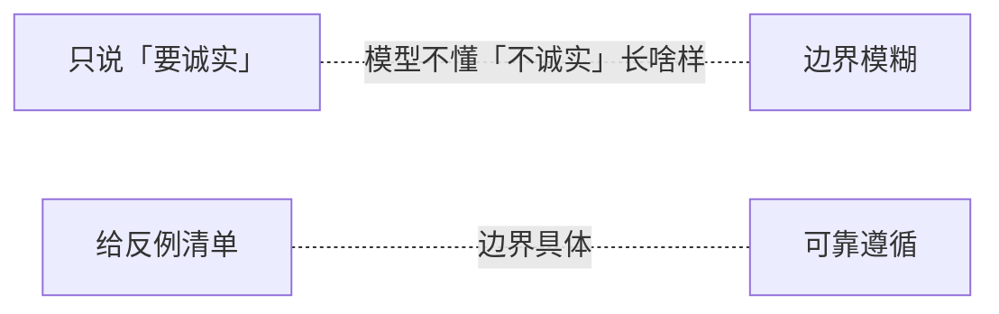

---

title: "反例约束"

tags:

  - agent方法论

  - prompt-2.0

  - 结构化设计

created: "2026-07-21"

---

# 反例约束：写「不做」比「做」更重要

> 本条目是「Prompt 2.0 方法论」的第 7 部分，对应学习清单条目 2.2.3。

>

> **前置依赖**：结构化Prompt六段式、约束数量控制

> **为以下铺垫**：禁止模糊词、Maker-Checker模式

---

## 一、核心观点

> **反例约束 Hard Gate**：不只说「要做什么」，更要说「不要做什么、长什么样」。

> 你说「请诚实」，模型一脸懵——它不知道「不诚实」长啥样；但你说「别出现『作为 AI 语言模型』这种开场」，它秒懂边界在哪。

---

## 二、定义与原理（类比先行）
### 2.1 类比：给画家说「别画蓝」

正向约束像说「画一幅好看的画」——太虚。反例约束像说「不要用蓝色、不要画天空、不要加边框」——画家立刻知道边界。模型同理：**具体的反例把抽象的「好」翻译成可执行的「不」**。

### 2.2 定义

反例约束 = 给出具体反例，让边界变具体：

- 不只是「不要废话」

- 而是「不要：填充短语 / 企业行话 / 免责声明 / 『作为 AI』开场」

---

## 三、为什么反例比正向更有效？

1. **模型不知道「不诚实」长啥样**：抽象禁令无锚点。

2. **反例给锚点**：边界被具体事例钉死。

3. **更可靠**：Checker（见 [[09-Maker-Checker概念|Maker-Checker]]）也能照单核对。



---

## 四、反例约束的类型

- **语言风格反例**：不要填充短语、企业行话（赋能/抓手/闭环）、免责声明、情感化表达

- **行为反例**：不执行 `rm -rf`、不跑未验证代码、不改生产库

- **输出格式反例**：不用纯文本列表（用表格）、不给无证据的结论、不写过于简短的回答

---

## 五、示例对比
### 5.1 ❌ 弱的写法

```text

不要输出废话。

```

### 5.2 ✅ 强的写法

```text

不要出现：

- 填充短语（如「在当今快节奏的世界中」）

- 企业行话（如「赋能」「抓手」「闭环」）

- 不必要的免责声明

- 「作为 AI 语言模型」式开场

```

---

## 六、最新研究与企业数据（2024–2026）

- **Anthropic《Claude 4 prompt engineering best practices》(2025/2026)**：明确建议「Tell Claude what to do instead of what not to do（说要做什么，而非不要做什么）」——但同一指南也强调「Be vigilant with examples & details（对示例和细节保持警惕）」，即**用具体示例（含反例）来校准行为**。

- 实操上：与其写「不要 markdown」，不如写「用流畅散文段落」——把「不要 X」转成「要 Y + 反例清单」，效果最佳。

---

## 七、学习资源

- **权威指南**：Anthropic《Claude 4 prompt engineering best practices》

- **实践指南**：Anthropic《Prompt engineering best practices for 2026》

- **进阶**：[[08-禁止模糊词|禁止模糊词]] · [[09-Maker-Checker概念|Maker-Checker 概念]]

---

## 核心要点

| 要点 | 速记 |
|------|------|
| 核心 | 写「不做、长什么样」比写「要做」更可靠 |
| 类比 | 跟画家说「别画蓝」比「画好看」更清楚 |
| 三类 | 语言风格 / 行为 / 输出格式 反例 |
| 技巧 | 「不要 X」转成「要 Y + 反例清单」 |
| 一手依据 | Anthropic：用具体示例校准；说要做什么而非不要 |

**下一篇**：[[08-禁止模糊词|禁止模糊词]]——反例要具体，正向词更不能留「退路」。

---

## 参考来源（一手链接 · 可溯源深挖）

- **Anthropic (2025/2026)**《Claude 4 prompt engineering best practices》：[docs.anthropic.com/.../claude-4-best-practices](https://docs.anthropic.com/en/docs/build-with-claude/prompt-engineering/claude-4-best-practices)

- **Anthropic (2026)**《Prompt engineering best practices for 2026》：[claude.com/blog/best-practices-for-prompt-engineering](https://claude.com/blog/best-practices-for-prompt-engineering)

## 速记卡（面试闪卡）

**Q1：一句话讲清「反例约束：写「不做」比「做」更重要」到底是什么？**

A：反例约束是 Hard Gate：不只说"要做什么"，更要列清"不要做什么、长什么样"——具体反例把抽象的"好"翻译成可执行的边界，比正向约束更可靠。

**Q2：一、核心观点 —— 怎么理解？**

A：你说"请诚实"，模型一脸懵——它不知"不诚实"长啥样。但你说"别出现'作为 AI 语言模型'式开场"，它秒懂边界。反例约束就是给边界钉具体事例，而不是留一句虚的"要做好"。

**Q3：二、定义与原理（类比） —— 怎么理解？**

A：正向约束像说"画一幅好看的画"——太虚。反例约束像说"别用蓝、别画天空、别加边框"——画家立刻知道边界。模型同理：具体反例把抽象的"好"翻成可执行的"不"。定义上不是"不要废话"而是"不要填充短语/行话/免责声明/AI 开场"。

**Q4：三、为什么反例比正向有效 —— 怎么理解？**

A：三点：①模型不知"不诚实"长啥样，抽象禁令无锚点；②反例给锚点，边界被事例钉死；③更可靠，Checker（Maker-Checker）也能照单核对。一手依据 Anthropic 也强调用具体示例校准行为。

**Q5：四、反例的类型与技巧 —— 怎么理解？**

A：三类反例：语言风格（填充短语/企业行话/免责声明/情感化）、行为（不 rm -rf、不跑未验证代码、不改生产库）、输出格式（用表格不用纯文本列表、不给无证据结论）。技巧：把"不要 X"转成"要 Y + 反例清单"效果最佳。

**Q6：核心速记主线有哪些？**

- 核心：写"不做、长什么样"比"要做"更可靠

- 类比：跟画家说"别画蓝"比"画好看"更清

- 三类：语言风格 / 行为 / 输出格式 反例

- 为什么：给锚点、可核对、比正向更稳

- 技巧："不要 X"转"要 Y + 反例清单"

**口诀**

A：正向太虚反例清，别画蓝就边界明；

语言行为格式三，具体清单钉锚钉；

抽象禁令无落点，事例一出模型醒；

不要 X 转要 Y 行，Maker 核对照单应。

## 相关链接

- 系列清单：[[学习路线图/Agent方法论与产品思维学习路线图|Agent 方法论与产品思维学习路线图]]

- 上一层级：[[00-Agent方法论与产品思维|Prompt 2.0 方法论 · 索引]]

- 同主题：[[06-约束数量控制|约束数量控制]] · [[08-禁止模糊词|禁止模糊词]]

