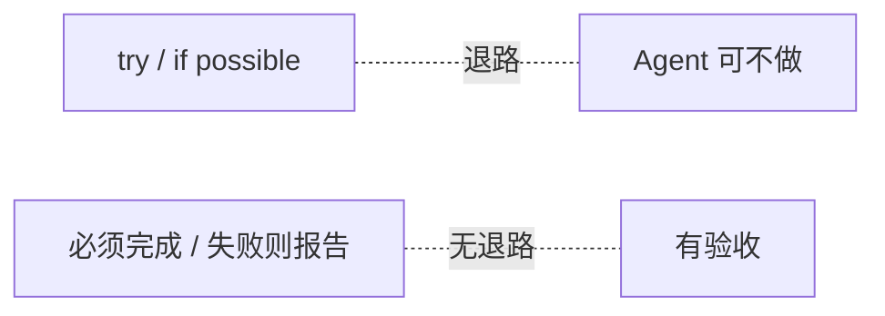

---

title: "禁止模糊词"

tags:

  - agent方法论

  - prompt-2.0

  - 结构化设计

created: "2026-07-21"

---

# 禁止模糊词：把「漏洞」堵死

> 本条目是「Prompt 2.0 方法论」的第 8 部分，对应学习清单条目 2.2.4。

>

> **前置依赖**：反例约束

> **为以下铺垫**：Maker-Checker模式、Skill Engineering

---

## 一、核心观点

> **禁止出现模糊词**：`try` `ideally` `if possible`——都是漏洞。

> 它们像合同里的「尽量」「争取」——真出事了，对方一句「我尽力了」你就没辙。Prompt 里留退路，Agent 就真会退。

---

## 二、定义与原理（类比先行）
### 2.1 类比：合同里的「尽力而为」

你雇人写代码，合同写「尽量周五前交付」——周五没交付，他没错，因为你没说死。模糊词在 Prompt 里干的就是这事：给 Agent 合法摸鱼的空间。

### 2.2 模糊词清单

| 模糊词 | 为什么危险 | 替换写法 |

|--------|------------|----------|

| `try` | 没承诺，失败也能交差 | 「必须完成；失败则报告原因」 |

| `ideally` | 可做可不做 | 「必须满足 A，否则失败」 |

| `if possible` | 直接给退路 | 「先检查可行性；不可行则报告原因」 |

| `best effort` | 没验收标准 | 给具体成功指标 |

| `concise` | 没量化 | 「200 字以内，只留结论」 |



---

## 三、为什么危险？

1. **留退路**：Agent 可以选择不做。

2. **无验收标准**：你无法判断是否完成。

3. **易被忽略**：模型倾向走阻力最小的路。

---

## 四、示例对比
### 4.1 ❌ 使用模糊词

```text

请尝试修复这个 bug，如果可能的话，尽量简洁地解释原因。

```

### 4.2 ✅ 使用具体写法

```text

请修复这个 bug。要求：必须修复，失败则报告具体原因；解释原因控制在 200 字以内，只留核心信息。

```

---

## 五、实践提示

- 写完 Prompt 做一遍「模糊词扫描」：把 `try / ideally / if possible / best effort / concise / 尽量 / 争取` 全删掉或替换。

- 凡要验收的，给**可量化**的成功指标（字数、覆盖率、通过率）。

- 允许「不知道」时要显式授权——见下「最新研究」中的 Anthropic 建议。

---

## 六、最新研究与企业数据（2024–2026）

- **Anthropic《Prompt engineering best practices for 2026》**：给出几条直接相关的铁律——「Don't assume the AI reads minds（别假设 AI 会读心）」「Be specific about what you want（具体说你要什么）」；并建议**显式授权说「不知道」**：「Explicitly give permission to say 'I don't know' when uncertain（不确定时明确允许说不知道）」，这比含糊的 `best effort` 更能防编造。

- 同一指南把「任务太复杂、结果不可靠」的解法列为「拆成多个 Prompt（chaining），每个只做一件事」——与 [[06-约束数量控制|约束数量控制]] 一致。

---

## 七、学习资源

- **实践指南**：Anthropic《Prompt engineering best practices for 2026》

- **权威指南**：Anthropic《Claude 4 prompt engineering best practices》

- **进阶**：[[09-Maker-Checker概念|Maker-Checker 概念]] · [[../01-认知升级/07-四层嵌套关系|四层嵌套关系]]

---

## 核心要点

| 要点 | 速记 |

|------|------|

| 核心 | 模糊词 = 合同里的「尽力而为」= 合法摸鱼 |

| 黑名单 | try / ideally / if possible / best effort / concise / 尽量 |

| 替换 | 「必须完成，失败则报告」+ 量化指标 |

| 反直觉 | 允许说「不知道」要显式写，反而更防胡编 |

| 一手依据 | Anthropic：别假设 AI 读心；具体说你要什么 |

**下一篇**：[[09-Maker-Checker概念|Maker-Checker 概念]]——结构化设计讲完，进入 Maker-Checker 模式。

---

## 参考来源（一手链接 · 可溯源深挖）

- **Anthropic (2026)**《Prompt engineering best practices for 2026》：[claude.com/blog/best-practices-for-prompt-engineering](https://claude.com/blog/best-practices-for-prompt-engineering)

- **Anthropic (2025/2026)**《Claude 4 prompt engineering best practices》：[docs.anthropic.com/.../claude-4-best-practices](https://docs.anthropic.com/en/docs/build-with-claude/prompt-engineering/claude-4-best-practices)

## 速记卡（面试闪卡）

**Q1：一句话讲清「禁止模糊词：把「漏洞」堵死」到底是什么？**

A：禁止模糊词就是删掉 try/ideally/if possible 这类退路词，让 Prompt 无漏洞、Agent 没空子可钻。

**Q2：模糊词像合同里的「尽量」 —— 怎么理解？**

A：你雇人写代码，合同写"尽量周五前交付"——周五没交付他没错，因为你没说死。模糊词在 Prompt 里干的就是这事：给 Agent 合法摸鱼的空间。try/if possible 一写，Agent 失败也能交差。所以要显式写"必须完成，失败则报告原因"。

**Q3：模糊词黑名单与替换 —— 怎么理解？**

A：黑名单：try（没承诺）、ideally（可做可不做）、if possible（直接给退路）、best effort（没验收标准）、concise（没量化）。替换法：给具体成功指标，比如"200 字以内只留结论"。Anthropic 2026 指南也铁律：别假设 AI 会读心，具体说你要什么。

**Q4：为啥模糊词特别危险 —— 怎么理解？**

A：三宗罪：留退路（Agent 可选择不做）、无验收标准（你无法判断是否完成）、易被忽略（模型天然走阻力最小的路）。三条叠一起，模糊词基本等于"这条约束我可听可不听"。

**Q5：反直觉：允许说「不知道」要显式写 —— 怎么理解？**

A：Anthropic 建议显式授权"不确定时明确说不知道"——这比含糊的 best effort 更防编造。允许不知道不等于模糊，而是把"可拒答"写清楚。配合把复杂任务拆成多个 Prompt（chaining），每个只做一件事。

**Q6：核心速记主线有哪些？**

- 黑名单：try/ideally/if possible/best effort/concise/尽量

- 类比：合同"尽量"=给 Agent 合法摸鱼空间

- 替换：给可量化成功指标（字数/覆盖率/通过率）

- 反直觉：允许说"不知道"要显式授权反而更防胡编

**口诀**

A：模糊词是退路，try ideally 删；

合同写尽量，Agent 就摸鱼；

验收要量化，指标给具体；

不知要明说，反而防胡编。

## 相关链接

- 系列清单：[[学习路线图/Agent方法论与产品思维学习路线图|Agent 方法论与产品思维学习路线图]]

- 上一层级：[[00-Agent方法论与产品思维|Prompt 2.0 方法论 · 索引]]

- 同主题：[[07-反例约束|反例约束]] · [[09-Maker-Checker概念|Maker-Checker 概念]]

