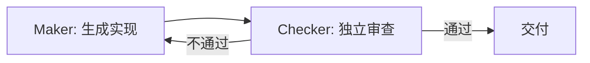

# Maker-Checker 概念

> 本条目是「Prompt 2.0 方法论」的第 9 部分，对应学习清单条目 2.4.1。
>
> **前置依赖**：四大黄金法则、结构化Prompt设计
> **为以下铺垫**：Maker-Checker落地、成本考量、Skill Engineering

---

## 一、核心观点

> **概念**：Creator Agent 写实现 + Checker Agent 审查，双重校验。
> 一个人既当运动员又当裁判，比赛永远「精彩」——因为犯规永远判不下来。

---

## 二、定义与原理（类比先行）

### 2.1 定义

- **Maker（创造者）**：生成初稿、写代码、出方案
- **Checker（检查者）**：审查、验证、找漏洞

### 2.2 来源：银行业的「四眼原则」

源自 **Four-Eyes Principle（四眼原则）**：一笔交易必须经两人之手。搬到 AI 上就是 **Creator 写实现，Checker 独立审查**。

### 2.3 关键点

**不能是同一个 Agent 自检**——否则「自己给自己打分」，漏过盲区（详见 [[12-Maker vs Checker自检|Maker vs Checker 自检]]）。

---

## 三、为什么需要 Maker-Checker？

- ❌ 同一 Agent 自检：相同盲区、缺独立视角、易放水（谄媚倾向）
- ✅ 分离：Checker 有独立视角，能发现 Maker 盲区，质量更高

### 3.1 数据支持

- **Anthropic《Harness design for long-running application development》(2025)**：把「干活的 Agent」与「挑刺的 Agent」拆成**独立上下文窗口**，是提升长任务质量的「关键杠杆（a strong lever）」；并发现开箱即用的 Claude 其实是「相当糟糕的 QA Agent」，需要把评估者单独调严格。
- **（来源待核实：业内流传「质量提升 2–3 倍」，原始一手数据未检索到，疑似 Anthropic 内部实验或第三方复盘，引用时建议标注为经验值。）**

---

## 四、Maker / Checker 的职责

- **Maker**：生成初稿、写代码、做方案、修问题
- **Checker**：审输出、对标准、找漏洞、给反馈

> 硬门禁（pytest / ruff / mypy）交给确定性测试，不交给模型判断——机器判对错比模型判更可靠。

---

## 五、最新研究与企业数据（2024–2026）

- **Anthropic (2025)** 多小时编码实验：generator–evaluator 分离 + 上下文重置，让 Claude 产出完整可运行的全栈应用；自评估模式下模型「自信地夸自己」，即便质量平庸。
- **Google Research (2025/2026)**：无验证瓶颈的独立并行 Agent 会把错误**放大 17.2 倍**，中心化也只压到 4.4 倍——反证「独立审查」的必要（见 [[12-Maker vs Checker自检|Maker vs Checker 自检]]）。

---

## 六、学习资源

- **权威指南**：Anthropic《Harness design for long-running application development》
- **研究**：Google《Towards a Science of Scaling Agent Systems》
- **进阶**：[[10-Maker-Checker落地|Maker-Checker 落地]] · [[11-Checker成本考量|Checker 成本考量]]

---

## 核心要点

| 要点 | 速记 |
|------|------|
| 核心 | Creator 写 + Checker 审，双重校验 |
| 类比 | 四眼原则；运动员≠裁判 |
| 铁律 | 绝不让同一 Agent 自检 |
| 一手证据 | Anthropic：独立上下文是质量关键杠杆 |
| 兜底 | 硬门禁用确定性测试 |

**下一篇**：[[10-Maker-Checker落地|Maker-Checker 落地]]——概念清楚了，怎么用 Claude Code hook 自动跑验证？

---

## 参考来源（一手链接 · 可溯源深挖）

- **Anthropic (2025)**《Harness design for long-running application development》：[anthropic.com/engineering/harness-design-long-running-apps](https://www.anthropic.com/engineering/harness-design-long-running-apps)
- **Google Research (2025/2026)**《Towards a Science of Scaling Agent Systems》：[research.google/blog/towards-a-science-of-scaling-agent-systems](https://research.google/blog/towards-a-science-of-scaling-agent-systems-when-and-why-agent-systems-work/)
- **Anthropic (2024-12)**《Building Effective Agents》：[anthropic.com/engineering/building-effective-agents](https://www.anthropic.com/engineering/building-effective-agents)

**相关链接**：
- 系列清单：[[学习路线图/Agent 方法论与产品思维学习清单|Agent 方法论与产品思维学习清单]]
- 上一层级：[[00-Agent 方法论与产品思维|Prompt 2.0 方法论 · 索引]]
- 同主题：[[03-分离规划与执行|分离规划与执行]] · [[12-Maker vs Checker自检|Maker vs Checker 自检]]

## 速记卡（面试闪卡）

**Q1：一句话讲清「Maker-Checker 概念」到底是什么？**
A：**概念**：Creator Agent 写实现 + Checker Agent 审查，双重校验。
一个人既当运动员又当裁判，比赛永远「精彩」——因为犯规永远判不下来。
---

**Q2：一、核心观点 —— 怎么理解？**
A：**概念**：Creator Agent 写实现 + Checker Agent 审查，双重校验。
一个人既当运动员又当裁判，比赛永远「精彩」——因为犯规永远判不下来。
---

**Q3：二、定义与原理（类比先行） —— 怎么理解？**
A：**Maker（创造者）**：生成初稿、写代码、出方案
**Checker（检查者）**：审查、验证、找漏洞
源自 **Four-Eyes Principle（四眼原则）**：一笔交易必须经两人之手。搬到 AI 上就是 **Creator 写实现，Checker 独立审查**。
**不能是同一个 Agent 自检**——否则「自己给自己打分」，漏过盲区（详见 ）。
---

**Q4：三、为什么需要 Maker-Checker？ —— 怎么理解？**
A：❌ 同一 Agent 自检：相同盲区、缺独立视角、易放水（谄媚倾向）
✅ 分离：Checker 有独立视角，能发现 Maker 盲区，质量更高
**Anthropic《Harness design for long-running application development》(2025)**：把「干活的 Agent」与「挑刺的 Agent」拆成**独立上下文窗口**，是提升长任务质量的「关键杠杆（a strong lever）」；

**Q5：四、Maker / Checker 的职责 —— 怎么理解？**
A：**Maker**：生成初稿、写代码、做方案、修问题
**Checker**：审输出、对标准、找漏洞、给反馈
硬门禁（pytest / ruff / mypy）交给确定性测试，不交给模型判断——机器判对错比模型判更可靠。
---

**Q6：核心速记主线有哪些？**
A：抓住这几根：一、核心观点、二、定义与原理（类比先行）、三、为什么需要 Maker-Checker？、四、Maker / Checker 的职责、五、最新研究与企业数据（2024–2026）、六、学习资源。

