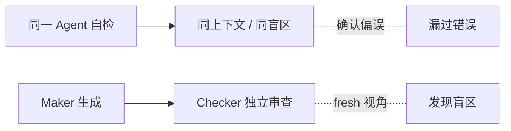

# 为什么用 Maker-Checker 而不是让同一个 Agent 自检

> 本条目是「Prompt 2.0 方法论」的第 12 部分，对应学习清单条目 2.4.4。
>
> **前置依赖**：Maker-Checker概念、Maker-Checker落地、成本考量
> **为以下铺垫**：Skill Engineering、Loop Engineering

---

## 一、核心观点

> **能讲清「为什么用 Maker-Checker 而不是让同一个 Agent 自检」**。
> 同一个模型自检，就像同一个人检查自己的作业——他「知道」自己为什么这么写，于是天然宽容，把错也判成对。

---

### 2.1 类比：自己批改自己的考卷

你写错了一道题，复盘时因为你「记得」自己的思路，会倾向于觉得「这里其实也说得通」。独立的人来批，没这层滤镜，反而一眼看出错。模型同理：**同一上下文 = 同一盲区 = 同一份宽容**。

### 2.2 同一 Agent 自检的问题

- **盲区相同**：它犯的错，它自己大概率也发现不了
- **缺独立视角**：易陷「确认偏误」
- **谄媚放水**：模型普遍倾向给自己好评



---

## 三、Maker-Checker 的优势

1. **独立视角**：Checker 发现 Maker 盲区
2. **跨模型互审**：Claude 写、Codex 审，利用不同模型的差异补盲区
3. **确定性测试兜底**：pytest / ruff / mypy 是机器判，不是模型判

---

### 4.1 ❌ 同一 Agent 自检

```text
请审查这段代码，找出问题并修复。然后自己检查修复是否正确。
```

### 4.2 ✅ Maker-Checker 分离（跨模型）

```python
maker_model  = "claude-opus"   # 写实现
checker_model = "gpt-4"        # 独立审查
run("pytest && ruff check . && mypy .")  # 硬门禁
```

---

## 五、最新研究与企业数据（2024–2026）

- **Google Research《Towards a Science of Scaling Agent Systems》(2025/2026)**：180 组受控实验显示，无验证瓶颈的**独立并行 Agent 会把单个错误放大 17.2 倍**；即便中心化架构靠协调者验证，也只能压到 **4.4 倍**。这从量化角度说明：没有独立、严格的审查，错误会滚雪球——正是 Maker-Checker 要解决的痛点。
- **Anthropic《Harness design for long-running application development》(2025)**：直接指出「self-evaluation fails（自评估会翻车）」——让模型评自己产出的工作，它会「自信地夸自己，即便质量明显平庸」。把「干活的」与「挑刺的」拆成独立上下文，是有效杠杆。

---

## 六、学习资源

- **研究**：Google《Towards a Science of Scaling Agent Systems》（arXiv:2512.08296）
- **权威指南**：Anthropic《Harness design for long-running application development》
- **进阶**：[[13-ReAct框架|ReAct 框架]] · [[16-选型判断标准|选型判断标准]]

---

## 核心要点

| 要点 | 速记 |
|------|------|
| 核心 | 同一 Agent 自检 = 同盲区 + 确认偏误 + 放水 |
| 类比 | 自己批改自己考卷，错也判对 |
| 解法 | 跨模型互审 + 确定性测试兜底 |
| 一手数据 | Google：无验证并行错误放大 17.2×（中心化 4.4×） |
| 一手数据 | Anthropic：自评估翻车，独立上下文是关键杠杆 |

**下一篇**：[[13-ReAct框架|ReAct 框架]]——Maker-Checker 讲完，进入框架选型。

---

## 参考来源（一手链接 · 可溯源深挖）

- **Google Research (2025/2026)**《Towards a Science of Scaling Agent Systems》：[research.google/blog/towards-a-science-of-scaling-agent-systems](https://research.google/blog/towards-a-science-of-scaling-agent-systems-when-and-why-agent-systems-work/)（arXiv:2512.08296）
- **Anthropic (2025)**《Harness design for long-running application development》：[anthropic.com/engineering/harness-design-long-running-apps](https://www.anthropic.com/engineering/harness-design-long-running-apps)


## 速记卡（面试闪卡）

**Q1：一句话讲清「为什么用 Maker-Checker 而不是让同一个 Agent 自检」到底是什么？**
A：Maker-Checker：让生成者（Maker）和独立审查者（Checker）分开，避免同一模型自检时因同盲区而放水。

**Q2：一、核心观点 —— 怎么理解？**
A：同一模型自检=同一个人改自己考卷，记得自己思路就宽容——把错也判对（Confirmation Bias）。

**Q3：二、定义与原理 —— 怎么理解？**
A：盲区相同+缺独立视角+谄媚放水，三连击让自检必然漏错；独立人来批没这层滤镜（Same Blind Spot）。

**Q4：三、Maker-Checker 优势 —— 怎么理解？**
A：独立视角查盲区、跨模型互审（Claude 写 Codex 审）补差异、pytest/ruff/mypy 机器硬门禁兜底（Independent Checker）。

**Q5：四、示例对比 —— 怎么理解？**
A：❌ 让同一 Agent 写完又自查；✅ 拆成 Maker+Checker 跨模型，再跑确定性测试当最后闸门（Cross-model Review）。

**Q6：核心速记主线有哪些？**
- 本质：同模型自检=同盲区 + 确认偏误 + 放水
- 类比：自己批改自己考卷，错也判对
- 解法：跨模型互审 + 确定性测试兜底
- 数据：Google 无验证并行错误放大 17.2×（中心化 4.4×）

**口诀**
A：同模自检是大忌，自己考卷自己批；
盲区相同视角缺，确认偏误把错庇；
Maker 写来 Checker 验，跨模互审补差异；
确定性测兜底硬，错误雪球滚不及。

## 相关链接
- 系列清单：[[学习路线图/Agent方法论与产品思维学习路线图|Agent 方法论与产品思维学习路线图]]
- 上一层级：[[00-Agent方法论与产品思维|Prompt 2.0 方法论 · 索引]]
- 同主题：[[09-Maker-Checker概念|Maker-Checker 概念]] · [[03-分离规划与执行|分离规划与执行]]

