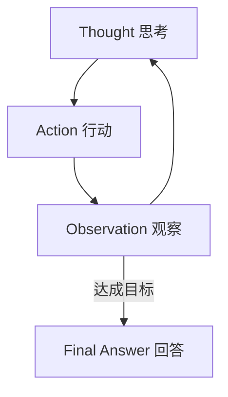

---

title: "ReAct框架"

tags:

  - agent方法论

  - prompt-2.0

  - 框架选型

created: "2026-07-21"

---

# ReAct 框架

> 本条目是「Prompt 2.0 方法论」的第 13 部分，对应学习清单条目 2.5.1。

>

> **前置依赖**：四大黄金法则、Maker-Checker模式

> **为以下铺垫**：Plan-and-Execute、Reflexion、选型判断标准

---

## 一、核心观点

> **ReAct（推理+行动交替）**：适合任务路径不确定的场景。

> 像你边走边看地图导航——走一步、看一眼、再决定下一步，而不是在家把整条路线背下来才出门。

---

## 二、定义与原理（类比先行）
### 2.1 定义

- **全称**：Reasoning + Acting（推理 + 行动）

- **核心**：推理与行动交替进行

- **流程**：思考（Thought）→ 行动（Action）→ 观察（Observation）→ 循环

### 2.2 类比：边走边看地图

路径不确定时，你没法预先规划每一步（你不知道拐角后是什么）。ReAct 就是「走一步看一步」：每步先想「现在该干嘛」，再行动，再看结果，再想下一步。

### 2.3 出处

- **来源**：Google Research, Yao et al., 2022（arXiv:2210.03629）

- 仍是生产中最广泛部署的起步范式之一

---

## 三、为什么有效？

- **灵活**：随时根据工具返回调整

- **可解释**：每步都有思考痕迹，好调试

- **贴合真实任务**：多数现实任务路径本就未知

---

## 四、优缺点

- ✅ 灵活、可解释、好调试

- ❌ 长任务每一步都调 LLM，**效率低、成本高**

- ❌ 缺乏全局规划，可能走弯路

---

## 五、适用场景

- ✅ 路径不确定：搜索、客服、开放问答、工具调用

- ❌ 步骤固定的确定性任务；对成本/延迟极敏感

---

## 六、最新研究与企业数据（2024–2026）

- **ReAct 原始论文 (Yao et al., 2022, Google)**（arXiv:2210.03629）：在问答与决策基准上，推理+行动交替显著优于仅推理或仅行动，奠定 Agent 基础范式。

- **Anthropic《Building Effective Agents》(2024-12)**：将 ReAct 式的「逐步推理 + 工具调用」列为最常用的工作流骨架之一；同时提醒——**若任务路径可预先规划，Plan-and-Execute 更省**。

- **Google《Scaling Agent Systems》(2025/2026)**：在顺序推理任务上，盲目多 Agent 反而下降 39–70%——ReAct 这类单 Agent 逐步循环反而更稳（见 [[16-选型判断标准|选型判断标准]]）。

---

## 七、学习资源

- **论文**：ReAct（arXiv:2210.03629）

- **权威指南**：Anthropic《Building Effective Agents》

- **进阶**：[[14-Plan-and-Execute框架|Plan-and-Execute 框架]] · [[15-Reflexion框架|Reflexion 框架]]

---

## 核心要点

| 要点 | 速记 |

|------|------|

| 核心 | Reasoning + Acting 交替循环 |

| 类比 | 边走边看地图导航 |

| 流程 | Thought → Action → Observation → … |

| 适合 | 路径不确定（搜索/客服/问答） |

| 不适合 | 步骤固定、成本敏感 |

| 一手依据 | ReAct 论文 (arXiv:2210.03629) |

**下一篇**：[[14-Plan-and-Execute框架|Plan-and-Execute 框架]]——路径能预先规划时，换一种打法。

---

## 参考来源（一手链接 · 可溯源深挖）

- **Yao et al. (2022)** ReAct: Synergizing Reasoning and Acting（Google）：[arXiv:2210.03629](https://arxiv.org/abs/2210.03629)

- **Anthropic (2024-12)**《Building Effective Agents》：[anthropic.com/engineering/building-effective-agents](https://www.anthropic.com/engineering/building-effective-agents)

- **Google Research (2025/2026)**《Towards a Science of Scaling Agent Systems》：[research.google/blog/towards-a-science-of-scaling-agent-systems](https://research.google/blog/towards-a-science-of-scaling-agent-systems-when-and-why-agent-systems-work/)

## 速记卡（面试闪卡）

**Q1：一句话讲清「ReAct 框架」到底是什么？**

A：ReAct（推理+行动交替）适合路径不确定的任务：走一步想一步看结果，再决定下一步，而非背完整路线。

**Q2：定义与原理 —— 怎么理解？**

A：全称 Reasoning+Acting，流程是 Thought→Action→Observation 循环，直到得出 Final Answer。出自 Google 2022 论文，仍是生产最广泛部署的起步范式之一。好比边走边看地图导航（Thought-Action-Observation）。

**Q3：为什么有效 —— 怎么理解？**

A：灵活（随时按工具返回调整）、可解释（每步有思考痕迹好调试）、贴合真实（多数任务路径本就未知）。它把"规划"拆进每一步，而不是一次性押注全局计划（flexibility, interpretability）。

**Q4：优缺点与适用场景 —— 怎么理解？**

A：✅灵活可解释好调试；❌长任务每步调 LLM 效率低成本高，且缺全局规划易走弯路。适合搜索/客服/开放问答等路径不定场景；不适合步骤固定、成本敏感的活（pros/cons, applicability）。

**Q5：最新研究与企业印证 —— 怎么理解？**

A：Anthropic 把 ReAct 式逐步推理+工具调用列最常用工作流骨架，但提醒路径可规划时 Plan-and-Execute 更省；Google 发现盲目多 Agent 反而降 39–70%，单 Agent 逐步循环更稳（research backing）。

**Q6：核心速记主线有哪些？**

- 本质：Reasoning+Acting 交替，Thought→Action→Observation 循环

- 有效因：灵活、可解释、贴合路径未知的真实任务

- 缺点：长任务成本高、缺全局规划易绕路

- 适用：搜索/客服/问答；研究提醒可规划时换 Plan-and-Execute

**口诀**

A：ReAct 推理带行动，

走一步来观风向；

想定再干循环往，

路径不定它最畅。

## 相关链接

- 系列清单：[[学习路线图/Agent方法论与产品思维学习路线图|Agent 方法论与产品思维学习路线图]]

- 上一层级：[[00-Agent方法论与产品思维|Prompt 2.0 方法论 · 索引]]

- 同主题：[[14-Plan-and-Execute框架|Plan-and-Execute 框架]] · [[15-Reflexion框架|Reflexion 框架]]

