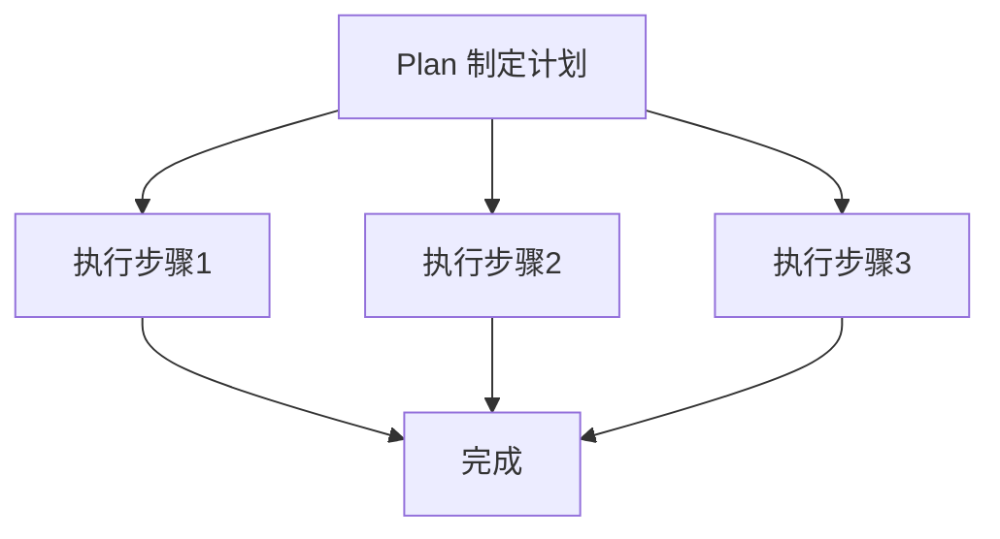

---

title: "Plan-and-Execute框架"

tags:

  - agent方法论

  - prompt-2.0

  - 框架选型

created: "2026-07-21"

---

# Plan-and-Execute 框架

> 本条目是「Prompt 2.0 方法论」的第 14 部分，对应学习清单条目 2.5.2。

>

> **前置依赖**：ReAct框架

> **为以下铺垫**：Reflexion、选型判断标准

---

## 一、核心观点

> **Plan-and-Execute（先计划再执行）**：适合步骤固定的确定性任务。

> 像出差前先列好行程单——哪天飞、住哪、见谁都排好，到了当地照单走，不用每五分钟重新想「下一步干嘛」。

---

## 二、定义与原理（类比先行）
### 2.1 定义

- **Plan**：先制定计划（高层步骤）

- **Execute**：再按计划执行（每步内部可灵活）

- **核心**：先想后做，步骤固定

### 2.2 类比：出差前的行程单

路径能预先规划时，与其每步都现想（ReAct），不如先列总计划。这样不会「走一步偏一步」，还能把子步骤并行、交给更便宜的模型跑。



---

## 三、优缺点

- ✅ 减少中途跑偏；子步骤可并行；成本可控（计划一次，执行多次）

- ❌ 环境变化时计划可能过时；不够灵活；制定计划需额外 LLM 调用

---

## 四、适用场景

- ✅ 步骤清晰、可预先分解的确定性任务：报告生成、数据处理、工作流

- ❌ 路径不确定、需随时调工具返回的任务（用 ReAct）

---

## 五、生产建议：混合使用

**高层用 Plan，低层每步内部用 ReAct**：

```text

Plan（高层）：读取代码 → 跑测试 → 生成报告

Execute（低层）：每步内部用 ReAct 灵活完成

```

- Plan 提供全局视野，不易偏

- ReAct 在每步内提供灵活性

- 成本可控：重规划才调大模型

---

## 六、最新研究与企业数据（2024–2026）

- **LangChain《Plan-and-Execute Agents》(2023)**：正式提出该架构，灵感来自 BabyAGI 与 Plan-and-Solve 论文；指出它「适合复杂长程规划，代价是更多 LLM 调用」，并因「规划与执行分离」可把执行步交给更小模型，从而降本。

- **Google《Towards a Science of Scaling Agent Systems》(2025/2026)**：在**可并行**任务（如金融分析）上，集中式协调比单 Agent **+80.9%**；这正对应「先 Plan 分解、再并行 Execute」的增益区间。但在**顺序推理**任务上多 Agent 反降 39–70%——所以 Plan-and-Execute 仍应以单 Agent 顺序执行为基，慎用多 Agent 并行。

---

## 七、学习资源

- **工程实践**：LangChain《Plan-and-Execute Agents》（blog.langchain.com/plan-and-execute-agents）

- **研究**：Google《Towards a Science of Scaling Agent Systems》

- **进阶**：[[15-Reflexion框架|Reflexion 框架]] · [[16-选型判断标准|选型判断标准]]

---

## 核心要点

| 要点 | 速记 |

|------|------|

| 核心 | 先 Plan 再 Execute，步骤固定 |

| 类比 | 出差前先列行程单 |

| 适合 | 步骤清晰、可分解的确定性任务 |

| 生产套路 | 高层 Plan + 低层 ReAct；执行步可并行/用便宜模型 |

| 一手依据 | LangChain Plan-and-Execute；Google：可并行任务 +80.9% |

**下一篇**：[[15-Reflexion框架|Reflexion 框架]]——质量敏感、需多轮迭代时，再加一层自我反思。

---

## 参考来源（一手链接 · 可溯源深挖）

- **LangChain (2023)**《Plan-and-Execute Agents》：[blog.langchain.com/plan-and-execute-agents](https://blog.langchain.com/plan-and-execute-agents)

- **Google Research (2025/2026)**《Towards a Science of Scaling Agent Systems》：[research.google/blog/towards-a-science-of-scaling-agent-systems](https://research.google/blog/towards-a-science-of-scaling-agent-systems-when-and-why-agent-systems-work/)（arXiv:2512.08296）

- **Anthropic (2024-12)**《Building Effective Agents》：[anthropic.com/engineering/building-effective-agents](https://www.anthropic.com/engineering/building-effective-agents)

## 速记卡（面试闪卡）

**Q1：一句话讲清「Plan-and-Execute 框架」到底是什么？**

A：Plan-and-Execute 是「先计划再执行」的 Agent 框架，适合步骤固定的确定性任务——像出差前列好行程单，到了照单走不用每步现想。

**Q2：核心观点与类比 —— 怎么理解？**

A：核心就一句：先 Plan 再 Execute，步骤固定。类比出差前行程单——哪天飞、住哪、见谁都排好，到了照单走，不像 ReAct 每五分钟重新想「下一步干嘛」。

**Q3：定义与原理 —— 怎么理解？**

A：Plan 制定高层步骤，Execute 按计划执行（每步内部灵活）；路径能预规划时就该先列总计划，避免「走一步偏一步」，还能把子步骤并行、交给更便宜的小模型跑。

**Q4：优缺点与适用场景 —— 怎么理解？**

A：优点：减少跑偏、子步可并行、成本可控（计划一次执行多次）；缺点：环境变了计划过时、不够灵活、多一次 LLM 调用。适合报告/数据处理等确定性任务，路径不确定的用 ReAct。

**Q5：生产建议：高层 Plan + 低层 ReAct —— 怎么理解？**

A：生产套路是高层用 Plan 提供全局视野、低层每步内部用 ReAct 保灵活；Google 研究也印证可并行任务集中协调 +80.9%，但顺序推理任务多 Agent 反降——仍以单 Agent 顺序执行为基。

**Q6：核心速记主线有哪些？**

- 核心：先 Plan 再 Execute，步骤固定

- 类比：出差前先列行程单

- 适合：步骤清晰可分解的确定性任务

- 生产套路：高层 Plan + 低层 ReAct，执行可并行/用便宜模型

- 一手依据：LangChain 提出；Google 可并行任务 +80.9%

**口诀**

A：Plan 再 Execute，步骤固定不乱跑；

出差先列行程单，照单走不步步找；

并行省钱降成本，环境变了计划老；

高层 Plan 低层 React，灵活全局都抓牢。

## 相关链接

- 系列清单：[[学习路线图/Agent方法论与产品思维学习路线图|Agent 方法论与产品思维学习路线图]]

- 上一层级：[[00-Agent方法论与产品思维|Prompt 2.0 方法论 · 索引]]

- 同主题：[[13-ReAct框架|ReAct 框架]] · [[15-Reflexion框架|Reflexion 框架]]

