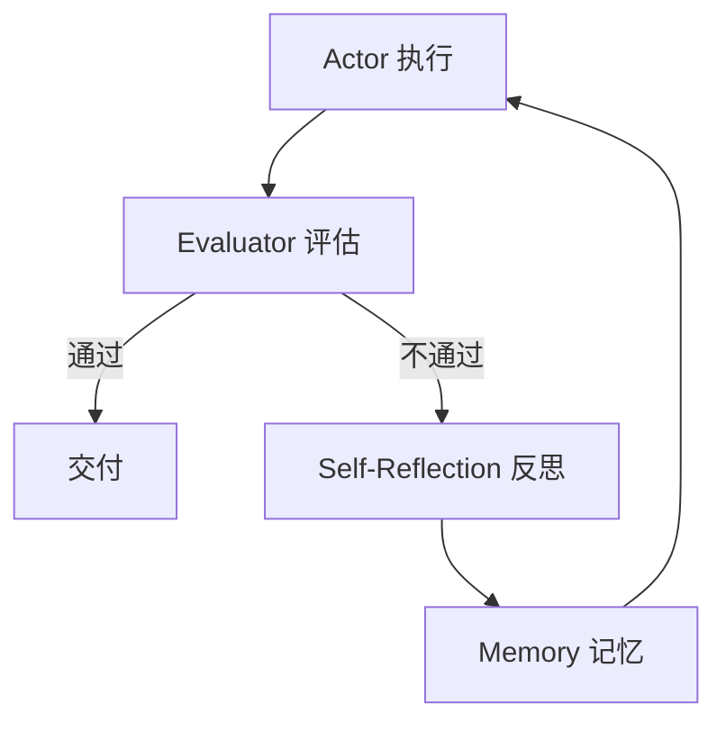

---

title: "Reflexion框架"

tags:

  - agent方法论

  - prompt-2.0

  - 框架选型

created: "2026-07-21"

---

# Reflexion 框架

> 本条目是「Prompt 2.0 方法论」的第 15 部分，对应学习清单条目 2.5.3。

>

> **前置依赖**：ReAct框架、Plan-and-Execute框架

> **为以下铺垫**：选型判断标准、Loop Engineering

---

## 一、核心观点

> **Reflexion（带自我反思）**：适合需要多轮迭代、质量敏感的场景。

> 像写论文被拒稿后写「审稿意见回复信」——不是重写，而是针对具体意见改，改完再投，直到达标。

---

## 二、定义与原理（类比先行）
### 2.1 定义

- **核心**：带自我反思的循环

- **流程**：Actor → Evaluator → Self-Reflection → Memory → 重试

- **机制**：从失败中学习，持续改进

### 2.2 类比：拒稿后的「Response to Reviewers」

第一次投稿被拒，你不傻重写，而是**针对审稿人每条意见逐条回应**、改进，再投。Reflexion 就是这个循环：用评估器指出问题，用反思把问题变成「下次要避免的笔记」，存进记忆，下一轮带着笔记重来。



### 2.3 出处与数据

- **论文**：*Reflexion: Language Agents with Verbal Reinforcement Learning*（Shinn et al., 2023, arXiv:2303.11366）

- **数据**：在 **HumanEval** 编码基准上，Reflexion 把 pass@1 准确率从 **80%**（GPT-4 基线）提升到 **91%**——靠的就是「反思 + 记忆」而非改权重。

---

## 三、优缺点

- ✅ 持续改进；多次迭代后质量高；有反思过程可解释

- ❌ 慢、贵（每轮都调 LLM）；必须有明确评估函数与最大迭代次数

---

## 四、生产化注意事项
### 4.1 必须有独立 verifier

- ❌ 错误做法：执行 → 自己评估 → 自己反思 → 重试（自己审自己，漏盲区）

- ✅ 正确做法：执行 → **独立 verifier** 评估 → 结构化反思 → 重试

> 要求：verifier 独立于 actor；反思有界、结构化；**设最大迭代次数**（如 3 轮），防死循环。这正好衔接 [[09-Maker-Checker概念|Maker-Checker]] 的「独立审查」原则。

### 4.2 最大迭代次数（伪码）

```python

max_iterations = 3

for i in range(max_iterations):

    result = actor.execute(task)

    if verifier.verify(result):

        break

    reflection = reflect(result)   # 反思

    task = update_task(task, reflection)

```

---

## 五、适用场景

- ✅ 质量敏感、可定义成功标准：代码生成、复杂推理、审查

- ❌ 成本/延迟敏感；没有明确成功标准的任务

---

## 六、最新研究与企业数据（2024–2026）

- **Reflexion 论文 (Shinn et al., 2023)**（arXiv:2303.11366）：HumanEval **91% pass@1**，超 GPT-4 基线 80%；在决策、编码、推理多任务上显著优于基线。

- **Anthropic《Building Effective Agents》(2024-12)**：把 **evaluator-optimizer（生成—评估—修订，即 reflection 的工程名）** 列为最实用工作流之一，并提醒——「LLMs 更擅长识别错误而非避免错误」，所以先出草稿、再评估、再修订，优于一次直出；多数生产只用**一轮**修订（收益递减快）。

---

## 七、学习资源

- **论文**：Reflexion（arXiv:2303.11366）

- **权威指南**：Anthropic《Building Effective Agents》（evaluator-optimizer 章节）

- **进阶**：[[16-选型判断标准|选型判断标准]] · [[04-设计反馈闭环|设计反馈闭环]]

---

## 核心要点

| 要点 | 速记 |
|------|------|
| 核心 | Actor→Evaluator→Reflection→Memory→重试 |
| 类比 | 拒稿后写 Response to Reviewers |
| 数据 | HumanEval 80%→91%（arXiv:2303.11366） |
| 铁律 | 必须有独立 verifier + 最大迭代次数 |
| 一手依据 | Anthropic：evaluator-optimizer 最实用，多一轮收益递减快 |

**下一篇**：[[16-选型判断标准|选型判断标准]]——三种框架讲完，怎么选？从最简方案起步。

---

## 参考来源（一手链接 · 可溯源深挖）

- **Shinn et al. (2023)** Reflexion: Language Agents with Verbal Reinforcement Learning：[arXiv:2303.11366](https://arxiv.org/abs/2303.11366)

- **Anthropic (2024-12)**《Building Effective Agents》：[anthropic.com/engineering/building-effective-agents](https://www.anthropic.com/engineering/building-effective-agents)

## 速记卡（面试闪卡）

**Q1：一句话讲清「Reflexion 框架」到底是什么？**

A：Reflexion 是带自我反思的 Agent 循环，失败后把问题变笔记存记忆，带笔记重试直至达标。

**Q2：一、核心观点 —— 怎么理解？**

A：像论文被拒稿后写"审稿意见回复信"：不是重写，而是针对每条意见改，改完再投。评估器(Evaluator)指出问题，反思(Self-Reflection)把问题变成"下次要避免的笔记"存进记忆，下一轮带着笔记重来。

**Q3：二、定义与原理 —— 怎么理解？**

A：像学生错题本：Actor 做题→Evaluator 批改→不过关就反思(Reflection)把错因写进错题本(Memory)→带着本子重做。数据上 HumanEval pass@1 从 80% 提到 91%，靠的是"反思+记忆"而非改权重。

**Q4：三、优缺点 —— 怎么理解？**

A：像反复打磨雕塑：优点是对比迭代质量高、过程可解释；缺点是慢且贵（每轮都调 LLM）。风险是没刹车会空转——必须有明确评估函数和最大迭代次数。

**Q5：四、生产化注意事项 —— 怎么理解？**

A：像考试必须双人阅卷：绝不让"自己写自己改"，要独立 verifier 评估、反思有界结构化；并设最大迭代(如 3 轮)防死循环。这正衔接 Maker-Checker 的"独立审查"原则。

**Q6：核心速记主线有哪些？**

- 核心循环：Actor→Evaluator→Self-Reflection→Memory→重试

- 类比：拒稿回复信 / 错题本，从失败里学

- 数据：HumanEval pass@1 80%→91%（arXiv:2303.11366）

- 铁律：独立 verifier + 最大迭代次数，防自审盲区与死循环

**口诀**

A：反思循环改不写，评估独立莫自审；

错题本里记教训，带记重来更精准。

最大迭代设三圈，收益递减快收心；

质量敏感才上它，慢贵换来高分。

## 相关链接

- 系列清单：[[学习路线图/Agent方法论与产品思维学习路线图|Agent 方法论与产品思维学习路线图]]

- 上一层级：[[00-Agent方法论与产品思维|Prompt 2.0 方法论 · 索引]]

- 同主题：[[13-ReAct框架|ReAct 框架]] · [[14-Plan-and-Execute框架|Plan-and-Execute 框架]]

