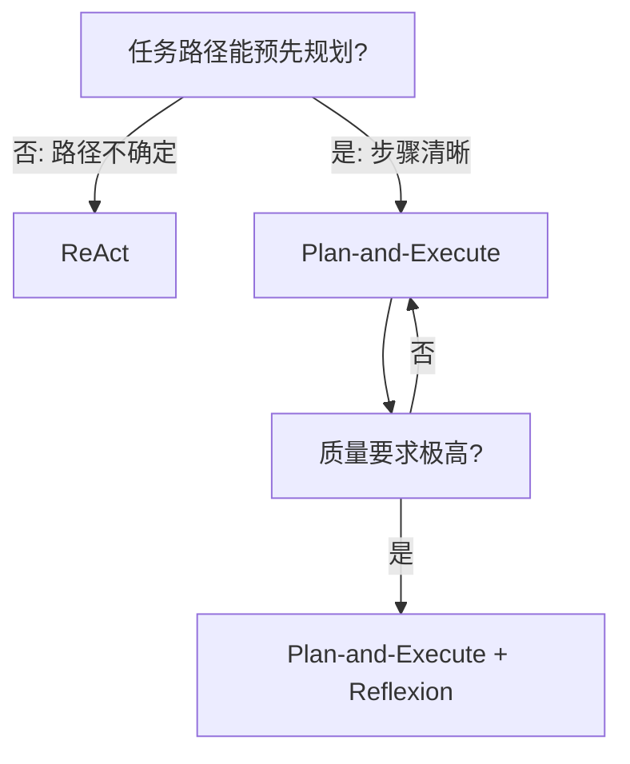

# 选型判断标准：从最简方案起步

> 本条目是「Prompt 2.0 方法论」的第 16 部分，对应学习清单条目 2.5.4。
>
> **前置依赖**：ReAct框架、Plan-and-Execute框架、Reflexion框架
> **为以下铺垫**：Skill Engineering、Loop Engineering

---

## 一、核心观点

> **选型判断标准**：不是所有任务都需复杂框架，从最简方案起步。
> 用大炮打蚊子，蚊子没死，你先破产。能一次 LLM 调用解决的，就别上 Agent——复杂度是负债，不是勋章。

---

## 二、定义与原理（类比先行）

### 2.1 类比：出行选工具

下楼取快递，走路就行；跨城，高铁；出国，飞机。**没人因为「喜欢飞机」就每天开飞机去楼下取快递**。选框架也一样：按任务距离（复杂度）选，不为炫技。

### 2.2 选型决策树

---

## 三、选型原则

### 3.1 从最简方案起步（Anthropic 铁律）

| 方案 | 复杂度 | 适用场景 |
|------|--------|----------|
| **单次 LLM 调用** | 低 | 简单任务（问答、分类、生成） |
| **ReAct** | 中 | 路径不确定 |
| **Plan-and-Execute** | 中 | 步骤固定 |
| **Plan-and-Execute + Reflexion** | 高 | 质量敏感、需多轮迭代 |

### 3.2 不要过度设计

- ❌ 简单任务套复杂 Agent 框架；没需求就上 Reflexion；为用技术而用技术
- ✅ 简单任务用单次调用；路径不确定用 ReAct；步骤固定用 Plan-and-Execute；质量敏感用 Reflexion

### 3.3 架构-任务对齐（警惕多 Agent）

- **顺序推理任务上，盲目上多 Agent 反而降低 39–70% 性能**（PlanCraft 等顺序规划任务上可降 70%）。
- 多 Agent 并非越多越好：当单 Agent 基线准确率已超约 **45%**，再加 Agent 边际收益趋零甚至为负；无验证的并行还会把错误放大 **17.2 倍**。

---

## 四、示例

- **简单任务**（「Python 是什么？」）：`answer = llm.generate(...)`——不需要任何框架
- **中等任务**（查天气）：ReAct 循环即可
- **复杂任务**（完整 API 文档）：Plan-and-Execute + Reflexion

---

## 五、最新研究与企业数据（2024–2026）

- **Anthropic《Building Effective Agents》(2024-12)**：核心方法论即「从最简单的方案起步，只有当简单方案不够时才加复杂性」；许多任务一个带检索的 LLM 调用就够，不必默认上 Agent。
- **Google Research《Towards a Science of Scaling Agent Systems》(2025/2026)**：180 组受控实验给出量化法则——多 Agent 在**顺序推理**任务上性能下降 **39–70%**，但在**可并行**任务（金融分析）上集中式协调 **+80.9%**；并发现单 Agent 基线准确率超 **45%** 后，加 Agent 多无增益。这直接支撑「先简后繁、按任务性质选型」。

---

## 六、学习资源

- **权威指南**：Anthropic《Building Effective Agents》
- **研究**：Google《Towards a Science of Scaling Agent Systems》（arXiv:2512.08296）
- **进阶**：[[../03-Context Engineering/01-Lost in the Middle|Context Engineering]] · [[13-ReAct框架|ReAct 框架]]

---

## 核心要点

| 要点 | 速记 |
|------|------|
| 核心 | 从最简方案起步，不为炫技上框架 |
| 类比 | 取快递走路、出国才飞机 |
| 决策 | 路径不定→ReAct；步骤定→Plan；质量敏→+Reflexion |
| 警惕 | 顺序任务上多 Agent 反降 39–70%；单 Agent>45% 后加 Agent 无益 |
| 一手依据 | Anthropic：先简后繁；Google：顺序任务多 Agent -39~70% |

**下一篇**：[[../03-Context Engineering/01-Lost in the Middle|Context Engineering]]——Prompt 2.0 讲完，进入 Context 层：Prompt 写得再好，上下文被污染也会失效。

---

## 参考来源（一手链接 · 可溯源深挖）

- **Anthropic (2024-12)**《Building Effective Agents》：[anthropic.com/engineering/building-effective-agents](https://www.anthropic.com/engineering/building-effective-agents)
- **Google Research (2025/2026)**《Towards a Science of Scaling Agent Systems》：[research.google/blog/towards-a-science-of-scaling-agent-systems](https://research.google/blog/towards-a-science-of-scaling-agent-systems-when-and-why-agent-systems-work/)（arXiv:2512.08296）

**相关链接**：
- 系列清单：[[学习路线图/Agent 方法论与产品思维学习清单|Agent 方法论与产品思维学习清单]]
- 上一层级：[[00-Agent 方法论与产品思维|Prompt 2.0 方法论 · 索引]]
- 同主题：[[13-ReAct框架|ReAct 框架]] · [[14-Plan-and-Execute框架|Plan-and-Execute 框架]] · [[15-Reflexion框架|Reflexion 框架]]

## 速记卡（面试闪卡）

**Q1：一句话讲清「选型判断标准：从最简方案起步」到底是什么？**
A：**选型判断标准**：不是所有任务都需复杂框架，从最简方案起步。
用大炮打蚊子，蚊子没死，你先破产。能一次 LLM 调用解决的，就别上 Agent——复杂度是负债，不是勋章。
---

**Q2：一、核心观点 —— 怎么理解？**
A：**选型判断标准**：不是所有任务都需复杂框架，从最简方案起步。
用大炮打蚊子，蚊子没死，你先破产。能一次 LLM 调用解决的，就别上 Agent——复杂度是负债，不是勋章。
---

**Q3：二、定义与原理（类比先行） —— 怎么理解？**
A：下楼取快递，走路就行；跨城，高铁；出国，飞机。**没人因为「喜欢飞机」就每天开飞机去楼下取快递**。选框架也一样：按任务距离（复杂度）选，不为炫技。
---

**Q4：三、选型原则 —— 怎么理解？**
A：| 方案 | 复杂度 | 适用场景 |
|------|--------|----------|
| **单次 LLM 调用** | 低 | 简单任务（问答、分类、生成） |
| **ReAct** | 中 | 路径不确定 |
| **Plan-and-Execute** | 中 | 步骤固定 |
| **Plan-and-Execute + Reflexion** | 高 | 质量敏感、需多轮迭代 |

**Q5：四、示例 —— 怎么理解？**
A：**简单任务**（「Python 是什么？」）：——不需要任何框架
**中等任务**（查天气）：ReAct 循环即可
**复杂任务**（完整 API 文档）：Plan-and-Execute + Reflexion
---

**Q6：核心速记主线有哪些？**
A：抓住这几根：一、核心观点、二、定义与原理（类比先行）、三、选型原则、四、示例、五、最新研究与企业数据（2024–2026）、六、学习资源。

