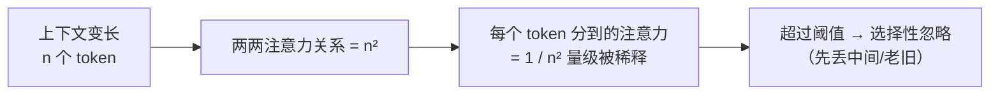

# Attention Budget：模型的「注意力额度」也会透支

> 本条目是「Context Engineering」的第 2 部分，对应学习清单条目 3.1.2。
>
> **前置依赖**：Lost in the Middle
> **为以下铺垫**：150条指令天花板、文件大小与注意力衰减

---

## 核心观点

> **Attention Budget（注意力预算）**：模型单次推理能有效处理的信息量是有限的「额度」。每往上下文里多塞一个 token，就在悄悄扣这笔预算；扣到透支，模型就开始「选择性忽略」。

和人脑的「工作记忆带宽」一模一样：你同时盯的东西越多，每件分到的注意力越少。开会时如果屏幕上同时弹 20 个窗口，你其实一个都没真在看——模型也是。它不会说「我看不过来了」，而是默默把中间、次要、老旧的信息调成「低优先级后台运行」，于是你精心写的规则就被无视了。

### 定义与原理

Attention Budget 指的是 LLM 在单次推理（inference）中能稳定利用的信息量上限。Anthropic 在《Effective context engineering for AI agents》(2025-09) 里把它定性为：**Context（上下文）是有限且边际收益递减的资源**，工程的核心纪律是「找到最小的高信号 token 集合，去最大化目标行为的概率」。

### 为什么是 n²（额度怎么被摊薄）

Transformer 架构让每个 token 都要和所有其他 token 互相注意，于是上下文长度 n 带来 n² 的成对关系。n 越大，每一条关系被「扯得越薄」，模型对长程、中间信息的专注力随之衰减——这就是 attention 稀缺的架构根源。

### 工程实践（怎么省着花）

- **控制上下文长度**：别无脑塞，只留最相关的；用摘要压缩、渐进式加载削减体量。
- **优先级排序**：关键约束优先、冗余删除，必要时用 Rerank（重排序）把高相关片段顶到首尾。
- **首末重注入**：关键信息放首尾，避开中间的「注意力洼地」。
- **隔离上下文**：用 Sub-agent（子智能体）把脏活揽在自己窗口里，只把结论带回主会话。

### 优劣势

- ✅ 把问题从「写更好的 Prompt」升级成「管理有限资源」，思路一下子清晰；可量化、可监控（/context、/usage）。
- ❌ 没有统一「临界值」——不同模型、任务、窗口衰减曲线不同，得自己测（见 [[11-找到临界点|找到临界点]]）。

## 核心要点

| 概念 | 一句话 |
|------|--------|
| Attention Budget | 模型单次能稳定利用的信息量上限 |
| 额度怎么花 | 每多一个 token 就扣一点预算 |
| n² 陷阱 | 上下文越长，注意力被摊得越薄 |
| 对策 | 控长度 + 重排序 + 首末重注入 + 子智能体隔离 |

## 最新研究与企业数据

- **Anthropic（2025-09）**：明确把 context rot 归结为「有限注意力预算 + 边际收益递减」，并指出所有模型都出现该特性，只是衰减平缓程度不同（来源：Anthropic Effective Context Engineering）。
- **Claude Code 实测**：官方最佳实践文档写明「上下文窗口填得越快，性能越差；窗口快满时 Claude 会开始『忘掉』早先指令或犯更多错」，并把上下文称为「最需要管理的资源」（来源：Anthropic Claude Code Best Practices）。
- ** token 预算参考（次级）**：从业者复盘一个中等复杂功能会话约消耗 60K–120K token（Sonnet 200K 窗口），留足 headroom（余量）是保持模型清醒的关键（来源：claudify.tech 2026 博客，次级来源）。

## 学习资源

- **必读**：Anthropic《Effective context engineering for AI agents》(2025-09)
- **官方**：Anthropic《Claude Code Best Practices》
- **进阶**：[[01-LostintheMiddle|Lost in the Middle]] · [[03-150条指令天花板|150 条指令天花板]] · [[09-长任务重注入|长任务重注入]]

## 速记卡（面试闪卡）

**Q1：一句话讲清「Attention Budget：模型的「注意力额度」也会透支」到底是什么？**
A：Attention Budget 是模型单次能稳用的信息额度，超了就选择性忽略。

**Q2：核心类比（工作记忆带宽） —— 怎么理解？ —— 怎么理解？**
A：像开会时屏幕同时弹 20 个窗口——你其实一个都没真看。模型不会喊"我看不过来"，而是默默把中间、老旧信息调成后台低优先级，你精心写的规则就被无视。英语：working memory bandwidth。

**Q3：n² 怎么摊薄额度 —— 怎么理解？ —— 怎么理解？**
A：像宴会桌：每来一个客人（token），就要和全场所有人两两寒暄（n² 关系）。人越多，每场寒暄分得的时间越薄，长程和中间信息最先被冷落。英语：quadratic attention。

**Q4：工程实践（怎么省着花） —— 怎么理解？ —— 怎么理解？**
A：像精打细算过日子：控长度只留高信号、用 Rerank 把重点顶到首尾避开"注意力洼地"、用 Sub-agent 把脏活揽在自己窗口只带结论回来。英语：context compaction / sub-agent。

**Q5：没有统一临界点 —— 怎么理解？ —— 怎么理解？**
A：像每个人的酒精耐受量不同：没有统一"醉值"，不同模型、任务、窗口衰减曲线都不同，得自己测出临界点再留 headroom。Claude Code 实测窗口越满越容易"忘事"。英语：context rot / headroom。

**Q6：核心速记主线有哪些？**
- Attention Budget：模型单次能稳用的信息额度，超了选择性忽略
- n² 摊薄：上下文越长，每条注意力关系越薄
- 省着花：控长度 + Rerank 重排序 + 首末重注入 + 子智能体隔离
- 无统一临界点：不同模型/任务衰减不同，需自测留余量

**口诀**
A：注意力额有上限，
n² 摊薄易丢光；
重排隔离首尾放，
留足余量不强装。

## 相关链接

- 系列清单：[[学习路线图/Agent方法论与产品思维学习路线图|Agent 方法论与产品思维学习路线图]]
- 上一层级：[[00-Agent方法论与产品思维|Context Engineering · 索引]]
- 关联理论：[[../01-认知升级/07-四层嵌套关系|四层嵌套关系]]

**下一篇**：[[03-150条指令天花板|150 条指令天花板]]——注意力预算讲完，下篇讲「规则多到一定程度，模型就开始挑着忽略」。

---

## 参考来源（一手链接 · 可溯源深挖）

- **Anthropic (2025-09)**《Effective context engineering for AI agents》：[anthropic.com/engineering/effective-context-engineering-for-ai-agents](https://www.anthropic.com/engineering/effective-context-engineering-for-ai-agents)
- **Anthropic**《Claude Code Best Practices》：[anthropic.com/engineering/claude-code-best-practices](https://www.anthropic.com/engineering/claude-code-best-practices)
- **claudify.tech (2026)**《Claude Code Context Management》：[claudify.tech/blog/claude-code-context-management](https://claudify.tech/blog/claude-code-context-management) —— 次级从业者博客，token 预算为经验估算。
