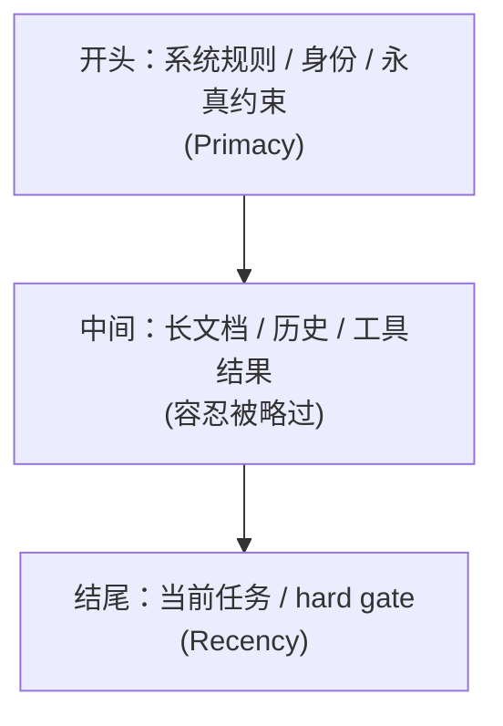

---

title: "首末重注入"

tags:

  - agent方法论

  - context-engineering

  - 实战技术

created: "2026-07-21"

---

# 首末重注入：把「死命令」焊在开头和结尾

> 本条目是「Context Engineering」的第 5 部分，对应学习清单条目 3.2.1。

>

> **前置依赖**：Lost in the Middle、Attention Budget

> **为以下铺垫**：渐进式加载、Recency Effect

---

## 核心观点

> **首末重注入（Bookend Reinforcement）**：把最关键、最不能忘的约束，同时钉在上下文的**开头和结尾**，长文档/历史对话塞中间——顺着模型的 U 型注意力曲线「逆着放」。

就像老师划重点：开课第一句说「期末必考这三条」，下课铃响前又补一句「记住，那三条必考」。你中间走神没关系，开头结尾各挨了一下，总归记住了。Bookend（书挡）就是给上下文加两个「重点书挡」，把长内容夹在中间。

## 定义 / 原理 / 实践 / 示例 / 优劣势
### 定义与原理

首末重注入 = 利用 [[01-LostintheMiddle|Lost in the Middle]] 的 U 型曲线，把高优先级信息放在注意力最高的首尾，把低优先级的「 bulky（笨重）内容」放中间。开头用 Primacy Effect（首因效应），结尾用 Recency Effect（近因效应），两头夹击。

### 一个标准布局

### 工程实践

- **开头放**：身份定义、全局硬规则、项目架构约束。

- **结尾放**：当前这条任务、必须遵循的 hard gate（硬闸门，如「禁止 rm -rf」「必须引用来源」）。

- **中间放**：长代码、检索片段、历史对话——这些即使被略读也不致命。

- **结构化分区优于文字墙**：用 XML / Markdown 分节，比一坨纯文本准确率更高（见 [[13-重注入格式设计|重注入格式设计]]）。

### 优劣势

- ✅ 几乎零成本、立刻见效；和 [[09-长任务重注入|长任务重注入]] 配合可对抗长会话遗忘。

- ❌ 只能缓解、不能消除 context rot；首尾空间本身也有限，别把首尾又塞成新的文字墙。

## 核心要点

| 概念 | 一句话 |

|------|--------|

| 首末重注入 | 关键约束钉在开头+结尾，长内容放中间 |

| 原理 | Primacy（开头）+ Recency（结尾）双高注意力 |

| 开头放 | 身份、全局硬规则 |

| 结尾放 | 当前任务、hard gate |

## 最新研究与企业数据

- **理论根基（一手）**：Liu et al. (2023) 的 U 型曲线证明首尾信息利用率最高（来源：arXiv:2307.03172）。

- **结构化优于文字墙（一手）**：Anthropic（2025-09）建议用清晰结构（XML 标签 / Markdown 分节）组织指令，在「太具体」与「太模糊」间取平衡（来源：Anthropic Effective Context Engineering）。

- **「结构化分区比文字墙高 10–20%」具体增幅（待核实）**：原始文件引用的该增幅来自阿里云 2026 等次级来源，未见一手受控实验，建议自测校准。

## 学习资源

- **必读**：arXiv:2307.03172《Lost in the Middle》

- **延伸**：Anthropic《Effective context engineering for AI agents》(2025-09)

- **进阶**：[[07-RecencyEffect|Recency Effect]] · [[09-长任务重注入|长任务重注入]] · [[13-重注入格式设计|重注入格式设计]]

## 速记卡（面试闪卡）

**Q1：一句话讲清「首末重注入：把「死命令」焊在开头和结尾」到底是什么？**

A：把最关键的约束同时钉在上下文开头和结尾，长内容放中间防遗忘。

**Q2：核心观点 —— 怎么理解？**

A：像老师划重点：开课第一句说"期末必考这三条"，下课铃响前又补一句。你中间走神没关系，开头结尾各挨一下总记住。书挡叫 Bookend。

**Q3：定义 / 原理 / 实践 / 示例 / 优劣势 —— 怎么理解？**

A：像顺着 U 型注意力曲线反着放：开头用首因效应（Primacy）、结尾用近因效应（Recency）两头高注意力，中间放长代码/历史这类可略读内容。首因效应叫 Primacy Effect。

**Q4：核心要点 —— 怎么理解？**

A：速记：开头放身份和全局硬规则、结尾放当前任务和 hard gate（硬闸门，如"禁止 rm -rf"）、中间放检索片段；用 XML/Markdown 分节比文字墙更准。硬闸门叫 Hard Gate。

**Q5：最新研究与企业数据 —— 怎么理解？**

A：像有论文撑腰：Liu et al. 2023 的 U 型曲线证明首尾利用率最高（一手）；Anthropic 2025 建议结构化分节；"结构化比文字墙高 10–20%"来自次级来源待核实。

**Q6：核心速记主线有哪些？**

- 核心：关键约束钉首尾，长内容放中间

- 原理：Primacy（开头）+ Recency（结尾）双高注意力

- 开头放身份/硬规则，结尾放任务/hard gate

- 用 XML/Markdown 分节，优于文字墙

**口诀**

A：重点焊首尾，中间塞冗长；

首因加近因，书挡夹中央；

开头放硬规，结尾锁 gate；

结构化分区，文字墙别扛。

## 相关链接

- 系列清单：[[学习路线图/Agent方法论与产品思维学习路线图|Agent 方法论与产品思维学习路线图]]

- 上一层级：[[00-Agent方法论与产品思维|Context Engineering · 索引]]

- 关联理论：[[../01-认知升级/07-四层嵌套关系|四层嵌套关系]]

**下一篇**：[[06-渐进式加载|渐进式加载]]——首末重注入讲完，下篇讲「长资料别一股脑塞进 System Prompt，按需加载」。

---

## 参考来源（一手链接 · 可溯源深挖）

- **Liu et al. (2023)**《Lost in the Middle: How Language Models Use Long Contexts》：[arXiv:2307.03172](https://arxiv.org/abs/2307.03172)

- **Anthropic (2025-09)**《Effective context engineering for AI agents》：[anthropic.com/engineering/effective-context-engineering-for-ai-agents](https://www.anthropic.com/engineering/effective-context-engineering-for-ai-agents)

- **「结构化分区比文字墙高 10–20%」增幅**：(来源待核实：阿里云 2026 等次级来源引用的数据，未检索到一手受控实验；建议自测校准)

