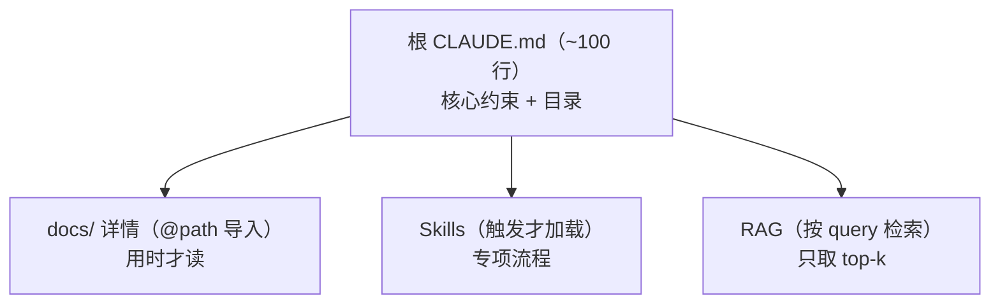

# 渐进式加载：别把整本说明书一次性拍脸上

> 本条目是「Context Engineering」的第 6 部分，对应学习清单条目 3.2.2。
>
> **前置依赖**：首末重注入
> **为以下铺垫**：Recency Effect、摘要压缩

---

## 核心观点

> **渐进式加载（Progressive Disclosure）**：信息只在「用得上」的那一刻才进上下文，而不是一股脑全塞进 System Prompt。根文件当目录，详情按需 `@path` 导入。

就像进餐厅：你先拿到一张菜单（概览），点哪道菜才上哪道菜的详细做法，而不是后厨把 200 道菜的完整菜谱同时砸到你桌上。Agent 也是——常驻上下文越干净，真要用时模型才越清醒。

## 定义 / 原理 / 实践 / 示例 / 优劣势

### 定义与原理

渐进式加载 = 把信息按「需要的概率」分层，高频常驻、低频外置、用时再取。它直接对抗 [[02-Attention Budget|Attention Budget]]：少占常驻额度，把预算留给当下任务。Anthropic（2025-09）把「按需策展 token」列为 context engineering 的核心纪律。

### 三层加载示意

### 工程实践

- **根文件当目录**：CLAUDE.md 只放核心约束 + 指向 `docs/coding-standards.md` 等的 `@path` 导入。
- **Skills 触发加载**：专项流程写进 SKILL.md，匹配到场景才注入，平时不占额度。
- **RAG 检索 top-k**：只把最相关的 k 个片段送进上下文，别全量喂。
- **子智能体隔离**：重型调研交给 Sub-agent，主会话只收结论（见 [[02-Attention Budget|Attention Budget]]）。

### 优劣势

- ✅ 控长度、降 token 成本、提遵循率；详情独立维护、易版本管理。
- ❌ 需要事先把知识「分层归档」，前期有一次性整理成本；加载链路太多也会变复杂。

## 核心要点

| 概念 | 一句话 |
|------|--------|
| 渐进式加载 | 信息用时才进上下文，不一次性全塞 |
| 根文件 | 当目录 + `@path` 导入详情 |
| Skills | 触发才加载的专项流程 |
| RAG | 只取 top-k 最相关片段 |

## 最新研究与企业数据

- **官方原则（一手）**：Anthropic（2025-09）强调 context 是有限资源，应「找到最小的高信号 token 集合」；并点名 Sub-agent 是把工作隔离在各自上下文、只回传结论的有效手段（来源：Anthropic Effective Context Engineering）。
- **Claude Code 实践（一手）**：官方最佳实践鼓励把长文档外置、用 Skills/子代理按需加载，避免上下文窗口被一次性填满（来源：Anthropic Claude Code Best Practices）。
- **`@path` 导入语法**：为 Claude Code / Agent 配置的真实特性（在 CLAUDE.md 中以 `@路径` 引用其他文件），属一手文档能力。

## 学习资源

- **必读**：Anthropic《Effective context engineering for AI agents》(2025-09)
- **官方**：Anthropic《Claude Code Best Practices》
- **进阶**：[[07-Recency Effect|Recency Effect]] · [[08-摘要压缩|摘要压缩]] · [[14-路径作用域|路径作用域]]

## 速记卡（面试闪卡）

**Q1：一句话讲清「渐进式加载：别把整本说明书一次性拍脸上」到底是什么？**
A：**渐进式加载（Progressive Disclosure）**：信息只在「用得上」的那一刻才进上下文，而不是一股脑全塞进 System Prompt。根文件当目录，详情按需  导入。
就像进餐厅：你先拿到一张菜单（概览），点哪道菜才上哪道菜的详细做法，而不是后厨把 200 道菜的完整菜谱同时砸到你桌上。Agent 也是——常驻上下文越干净，真要用时模型才越清醒。

**Q2：核心观点 —— 怎么理解？**
A：**渐进式加载（Progressive Disclosure）**：信息只在「用得上」的那一刻才进上下文，而不是一股脑全塞进 System Prompt。根文件当目录，详情按需  导入。
就像进餐厅：你先拿到一张菜单（概览），点哪道菜才上哪道菜的详细做法，而不是后厨把 200 道菜的完整菜谱同时砸到你桌上。Agent 也是——常驻上下文越干净，真要用时模型才越清醒。

**Q3：定义 / 原理 / 实践 / 示例 / 优劣势 —— 怎么理解？**
A：渐进式加载 = 把信息按「需要的概率」分层，高频常驻、低频外置、用时再取。它直接对抗 ：少占常驻额度，把预算留给当下任务。Anthropic（2025-09）把「按需策展 token」列为 context engineering 的核心纪律。
**根文件当目录**：CLAUDE.md 只放核心约束 + 指向  等的  导入。
**Skills 触发加载**：专项流程写进 SKILL.md，匹配到场景才注入，平时不占额度。

**Q4：核心要点 —— 怎么理解？**
A：| 概念 | 一句话 |
|------|--------|
| 渐进式加载 | 信息用时才进上下文，不一次性全塞 |
| 根文件 | 当目录 +  导入详情 |
| Skills | 触发才加载的专项流程 |
| RAG | 只取 top-k 最相关片段 |

**Q5：最新研究与企业数据 —— 怎么理解？**
A：**官方原则（一手）**：Anthropic（2025-09）强调 context 是有限资源，应「找到最小的高信号 token 集合」；并点名 Sub-agent 是把工作隔离在各自上下文、只回传结论的有效手段（来源：Anthropic Effective Context Engineering）。

**Q6：核心速记主线有哪些？**
A：抓住这几根：核心观点、定义 / 原理 / 实践 / 示例 / 优劣势、核心要点、最新研究与企业数据、学习资源、参考来源（一手链接 · 可溯源深挖）。

## 相关链接

- 系列清单：[[学习路线图/Agent 方法论与产品思维学习清单|Agent 方法论与产品思维学习清单]]
- 上一层级：[[00-Agent 方法论与产品思维|Context Engineering · 索引]]
- 关联理论：[[../01-认知升级/07-四层嵌套关系|四层嵌套关系]]

**下一篇**：[[07-Recency Effect|Recency Effect]]——渐进式加载讲完，下篇讲「模型对末尾指令更买账，hard gate 放最后」。

---

## 参考来源（一手链接 · 可溯源深挖）

- **Anthropic (2025-09)**《Effective context engineering for AI agents》：[anthropic.com/engineering/effective-context-engineering-for-ai-agents](https://www.anthropic.com/engineering/effective-context-engineering-for-ai-agents)
- **Anthropic**《Claude Code Best Practices》：[anthropic.com/engineering/claude-code-best-practices](https://www.anthropic.com/engineering/claude-code-best-practices)
