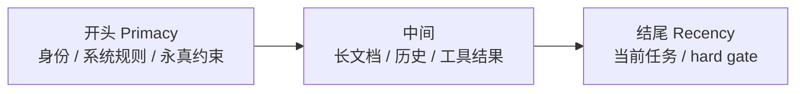

# Recency Effect：模型对「最后说的话」最上心

> 本条目是「Context Engineering」的第 7 部分，对应学习清单条目 3.2.3。
>
> **前置依赖**：首末重注入、渐进式加载
> **为以下铺垫**：摘要压缩、长任务重注入

---

## 核心观点

> **Recency Effect（近因效应）**：模型对**末尾**的信息权重更高、遵循率更好。所以「绝不可违反的 hard gate（硬闸门）」和「当前任务」要焊在结尾。

和老师布置作业一样：开头说「这学期要好好学」，你左耳进右耳出；下课铃响前说「今晚作业不交扣十分」，你立刻掏本子。模型也是——末尾那句，它记得最牢。Primacy（开头）管「你是谁、规矩是什么」，Recency（结尾）管「现在立刻干啥、红线在哪」。

### 定义与原理

Recency Effect 指模型对靠近生成位置（即上下文末尾）的 token 赋予更高权重。它和 Primacy Effect（首因效应）共同构成 U 型曲线的两端——[[01-LostintheMiddle|Lost in the Middle]] 论文已证实首尾信息利用率最高。

### Primacy vs Recency（怎么分工）

| 效应 | 位置 | 适合放什么 |
|------|------|------------|
| Primacy（首因） | 开头 | 身份定义、全局系统规则 |
| Recency（近因） | 结尾 | hard gate、当前任务 |

### 工程实践

- **hard gate 放结尾**：`不执行破坏性命令` / `必须引用来源` / `输出 Markdown` 这类「违反了就出事」的规则，钉在 System Prompt 末尾。
- **当前任务放结尾**：把「现在要做什么」写在最后一句，模型目标最清晰。
- **首尾呼应**：关键约束开头讲一遍、结尾再重申（见 [[13-重注入格式设计|重注入格式设计]]）。

### 优劣势

- ✅ 零成本提升关键约束遵循率；和 [[05-首末重注入|首末重注入]] 天然互补。
- ❌ 末尾空间也有限，别把结尾又堆成规则墙；长会话里「末尾」会随轮次滚动，需配合 [[09-长任务重注入|长任务重注入]]。

## 核心要点

| 概念 | 一句话 |
|------|--------|
| Recency Effect | 模型对末尾信息权重更高 |
| 放结尾的 | hard gate + 当前任务 |
| 放开头的 | 身份 + 全局系统规则 |
| 配合 | 首末重注入 + 长任务重注入 |

## 最新研究与企业数据

- **理论根基（一手）**：Liu et al. (2023) 证实相关信息在结尾时模型表现最好（来源：arXiv:2307.03172）。
- **官方建议（一手）**：Anthropic 的长上下文使用文档明确建议把关键信息放在结尾；其 1M 上下文管理博客也把「末尾指令遵循」作为设计考量（来源：Anthropic Effective Context Engineering / Claude 1M 上下文博客）。
- **「Claude 对末尾遵循率更高」的具体量化（待核实）**：原始文件引用自 Claude Code 用户观察，未见一手受控实验，建议自测校准。

## 学习资源

- **必读**：arXiv:2307.03172《Lost in the Middle》
- **延伸**：Anthropic《Effective context engineering for AI agents》(2025-09)
- **进阶**：[[05-首末重注入|首末重注入]] · [[09-长任务重注入|长任务重注入]] · [[13-重注入格式设计|重注入格式设计]]

## 速记卡（面试闪卡）

**Q1：一句话讲清「Recency Effect：模型对「最后说的话」最上心」到底是什么？**
A：Recency Effect 是近因效应：模型对上下文末尾的信息权重更高、遵循率更好。

**Q2：核心观点 —— 怎么理解？**
A：像老师布置作业：开头说"这学期好好学"你左耳进右耳出，下课铃前说"作业不交扣十分"你立刻掏本子。模型也是——末尾那句记得最牢，所以 hard gate 和当前任务要焊在结尾。

**Q3：定义 / 原理 / 实践 / 示例 / 优劣势 —— 怎么理解？**
A：像 U 型记忆曲线两端：Recency（近因）管结尾、Primacy（首因）管开头，Lost in the Middle 论文证实首尾利用率最高。实践上 hard gate、当前任务钉末尾；开头讲身份和全局规则，首尾呼应。

**Q4：核心要点 —— 怎么理解？**
A：像一张速查卡：放结尾的是 hard gate + 当前任务；放开头的是身份 + 全局系统规则；配合首末重注入与长任务重注入。零成本提升关键约束遵循率，但末尾空间有限别堆成规则墙。

**Q5：最新研究与企业数据 —— 怎么理解？**
A：像权威背书：Liu et al. (2023) 证实相关信息在结尾时模型表现最好（arXiv:2307.03172）；Anthropic 长上下文文档明确建议把关键信息放结尾。Claude 对末尾遵循率更高属用户观察，建议自测校准。

**Q6：核心速记主线有哪些？**
- 本质：模型对末尾 token 权重更高，遵循率更好
- 分工：Recency 管结尾（hard gate/当前任务），Primacy 管开头
- 实践：hard gate 钉末尾、当前任务写最后、首尾呼应
- 依据：Lost in the Middle 论文 + Anthropic 官方建议

**口诀**
A：近因管结尾，末尾最上心；
hard gate 焊尾，任务写最后；
首因管开头，规矩定身份；
首尾相呼应，遵循率提升。

## 相关链接

- 系列清单：[[学习路线图/Agent方法论与产品思维学习路线图|Agent 方法论与产品思维学习路线图]]
- 上一层级：[[00-Agent方法论与产品思维|Context Engineering · 索引]]
- 关联理论：[[../01-认知升级/07-四层嵌套关系|四层嵌套关系]]

**下一篇**：[[08-摘要压缩|摘要压缩]]——实战技术讲完，下篇讲「工具返回结果先做摘要，别堆原始输出」。

---

## 参考来源（一手链接 · 可溯源深挖）

- **Liu et al. (2023)**《Lost in the Middle: How Language Models Use Long Contexts》：[arXiv:2307.03172](https://arxiv.org/abs/2307.03172)
- **Anthropic (2025-09)**《Effective context engineering for AI agents》：[anthropic.com/engineering/effective-context-engineering-for-ai-agents](https://www.anthropic.com/engineering/effective-context-engineering-for-ai-agents)
- **Anthropic**《Using Claude Code session management and 1M context》：[claude.com/blog/using-claude-code-session-management-and-1m-context](https://claude.com/blog/using-claude-code-session-management-and-1m-context)
- **「Claude 对末尾遵循率更高」量化**：(来源待核实：Claude Code 用户观察，未检索到一手受控实验；建议自测校准)
