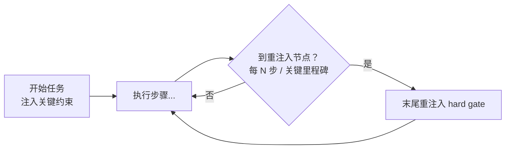

---

title: "长任务重注入"

tags:

  - agent方法论

  - context-engineering

  - 实战技术

created: "2026-07-21"

---

# 长任务重注入：跑到第 50 步，把「铁律」再念一遍

> 本条目是「Context Engineering」的第 9 部分，对应学习清单条目 3.2.5。

>

> **前置依赖**：摘要压缩、Recency Effect

> **为以下铺垫**：Context Rot、诊断与修复

---

## 核心观点

> **长任务重注入（Mid-task Re-injection）**：在长任务执行过程中，隔若干步把关键约束重新注入到上下文末尾——防止它一路滚到「中间」被遗忘。

就像长跑中途补给站：出发前说了「别抄近道」，跑 40 公里时你早忘了，得有人在补给站举牌再提醒一次。Agent 跑长循环也是，开头定的 hard gate 跑到第 50 步早就滚进「注意力洼地」了，不重念就会悄悄违反。

## 定义 / 原理 / 实践 / 示例 / 优劣势
### 定义与原理

长任务重注入 = 在长程 Agent 循环里，周期性地把「关键约束 / 当前目标 / 安全红线」重新贴到上下文末尾。原理复用 [[07-RecencyEffect|Recency Effect]]（末尾权重高）+ 对抗 [[01-LostintheMiddle|Lost in the Middle]]（中间易失）——本质是把 [[05-首末重注入|首末重注入]] 做成「滚动版」。

### 触发逻辑

### 工程实践

- **重注入内容**：关键约束（必须遵循）、当前目标（怎样算完成）、安全规则（不能做什么）。

- **重注入时机**：每隔 N 步，或在关键里程碑（切子任务、调用危险工具前）注入。

- **配合 compact**：重注入和 [[12-compact总结|compact]] 一起用——压缩后关键约束若被丢掉，立刻补一刀（见 [[13-重注入格式设计|重注入格式设计]]）。

### 优劣势

- ✅ 显著缓解长会话遗忘/漂移；实现简单，几行钩子即可。

- ❌ 注入太频繁会重新污染上下文；要和「临界点」配合，别无脑每步都念（见 [[11-找到临界点|找到临界点]]）。

## 核心要点

| 概念 | 一句话 |

|------|--------|

| 长任务重注入 | 长循环里周期性把关键约束贴回末尾 |

| 原理 | Recency + 对抗 Lost in the Middle |

| 注入啥 | 关键约束 / 目标 / 安全红线 |

| 时机 | 每 N 步 或 关键里程碑 |

## 最新研究与企业数据

- **长程 Agent 需求（一手）**：Anthropic（2025-09）指出 Agent 在 loop（循环）里不断产生新数据，必须「周期性地精炼」上下文；长会话靠 compaction 续命（来源：Anthropic Effective Context Engineering）。

- **官方杠杆（一手）**：Anthropic Cookbook 把 compaction / tool-result clearing / memory 列为长程 Agent 的三大上下文管理杠杆，并强调「在硬限制到达前就该干预」（来源：Anthropic Cookbook）。

- **具体「每隔几步」经验值**：属实现细节，按任务复杂度自定，无统一一手结论。

## 学习资源

- **必读**：Anthropic《Effective context engineering for AI agents》(2025-09)

- **官方**：Anthropic Cookbook《memory, compaction, and tool clearing》

- **进阶**：[[11-找到临界点|找到临界点]] · [[12-compact总结|compact 总结]] · [[13-重注入格式设计|重注入格式设计]]

## 速记卡（面试闪卡）

**Q1：一句话讲清「长任务重注入：跑到第 50 步，把「铁律」再念一遍」到底是什么？**

A：长任务重注入是在长 Agent 循环里隔若干步把关键约束重新贴到上下文末尾，对抗 Lost in the Middle，防开头定的 hard gate 跑到中途被遗忘。

**Q2：核心观点（类比） —— 怎么理解？**

A：像长跑中途补给站：出发前说"别抄近道"，跑 40 公里早忘了，得有人举牌再提醒一次。Agent 跑长循环，开头定的 hard gate 到第 50 步早已滚进注意力洼地，不重念就悄悄违反。本质是首末重注入的"滚动版"。

**Q3：定义 / 原理 / 实践 —— 怎么理解？**

A：原理复用 Recency Effect（末尾权重高）+ 对抗 Lost in the Middle（中间易失）。实践：重注入内容是关键约束（必须遵循）、当前目标（怎样算完成）、安全红线（不能做）；时机是每 N 步或关键里程碑（切子任务、调危险工具前）；还要和 compact 配合——压缩后约束丢了立刻补。

**Q4：优劣势与临界点 —— 怎么理解？**

A：✅显著缓解长会话遗忘/漂移，实现简单几行钩子。❌注入太频繁反而重新污染上下文，要配合"临界点"——别无脑每步都念。具体"每隔几步"按任务复杂度自定，无统一值，找到临界点再注入最省。

**Q5：最新研究与企业数据 —— 怎么理解？**

A：一手：Anthropic 2025-09 指出 Agent 在 loop 里不断产生新数据，必须"周期性精炼"上下文，长会话靠 compaction 续命。Anthropic Cookbook 把 compaction / tool-result clearing / memory 列为长程 Agent 三大上下文杠杆，强调"硬限制到达前就该干预"。

**Q6：核心速记主线有哪些？**

- 核心：长循环周期性把关键约束贴回末尾

- 原理：Recency Effect + 对抗 Lost in the Middle

- 注入啥：关键约束 / 目标 / 安全红线

- 时机：每 N 步或关键里程碑，配 compact

- 研究：Anthropic 周期性精炼 + 三大杠杆

**口诀**

A：长跑补给站，中途再提醒；

关键约束贴末尾，Recency 抗丢失；

频繁反污要临界点，配 compact 补一刀；

Anthropic 周期炼，三大杠杆限前调。

## 相关链接

- 系列清单：[[学习路线图/Agent方法论与产品思维学习路线图|Agent 方法论与产品思维学习路线图]]

- 上一层级：[[00-Agent方法论与产品思维|Context Engineering · 索引]]

- 关联理论：[[../01-认知升级/07-四层嵌套关系|四层嵌套关系]]

**下一篇**：[[10-污染征兆识别|污染征兆识别]]——实战技术讲完，下篇进入诊断与修复：怎么看出上下文已经「脏了」。

---

## 参考来源（一手链接 · 可溯源深挖）

- **Anthropic (2025-09)**《Effective context engineering for AI agents》：[anthropic.com/engineering/effective-context-engineering-for-ai-agents](https://www.anthropic.com/engineering/effective-context-engineering-for-ai-agents)

- **Anthropic Cookbook**《Context engineering: memory, compaction, and tool clearing》：[platform.claude.com/cookbook/tool-use-context-engineering-context-engineering-tools](https://platform.claude.com/cookbook/tool-use-context-engineering-context-engineering-tools)

