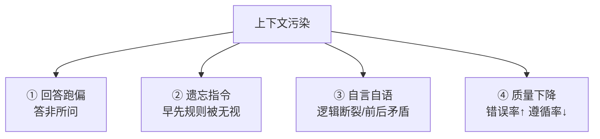

# 污染征兆识别：上下文「发霉」的四种味道

> 本条目是「Context Engineering」的第 10 部分，对应学习清单条目 3.3.1。
>
> **前置依赖**：Lost in the Middle、Attention Budget、Context Rot
> **为以下铺垫**：找到临界点、compact总结、重注入格式设计

---

## 核心观点

> **上下文污染（Context Pollution）**：当上下文里混进噪声、矛盾、过时信息时，模型的决策会被带偏。识别征兆 = 回答跑偏、遗忘早先指令、开始自言自语、质量莫名下降。

就像你桌上堆了三天没扔的草稿、过期的便签、别人塞错的纸条——你基于这些「脏信息」做决定，结果自然歪。Context Pollution 不是模型变笨，是它「看到的」已经被污染了。早识别、早清场，比事后补救便宜得多。

## 定义 / 原理 / 实践 / 示例 / 优劣势

### 定义与原理

Context Pollution = 上下文中存在不准确 / 不完整 / 不相关信号，稀释了高信号 token 的权重。它和 [[02-Attention Budget|Attention Budget]] 同源：噪声每多一个，真信号就被分走一份注意力。Anthropic 称之为 context rot（上下文衰减）的表现之一。

### 四种征兆

### 污染来源

- **历史对话污染**：早期规则滚到中间被忽略（见 [[01-Lost in the Middle|Lost in the Middle]]）。
- **检索结果污染**：RAG 召回不相关/矛盾文档（distractor pollution）。
- **工具结果污染**：原始输出太长，关键信息被淹（见 [[08-摘要压缩|摘要压缩]]）。
- **过时信息污染**：旧版代码/文档没清，模型基于过期事实决策。

### 诊断方法

- **看最终上下文**：打印真正送模型的 context，检查是否历史污染 / 检索重复 / chunk 过碎。
- **看日志**：抓「遗忘」「跑偏」类信号。
- **看用户反馈**：用户抱怨「不按我说的做」往往就是污染征兆。

### 优劣势

- ✅ 征兆可观察、可量化，是后续所有修复（compact / 重注入 / 路径作用域）的抓手。
- ❌ 征兆和「模型本身能力不足」容易混淆，需要对照「干净上下文下的表现」来确诊。

## 核心要点

| 概念 | 一句话 |
|------|--------|
| Context Pollution | 上下文混入噪声/矛盾/过时信息，带偏决策 |
| 四征兆 | 跑偏 / 遗忘指令 / 自言自语 / 质量降 |
| 四来源 | 历史 / 检索 / 工具 / 过时 |
| 诊断 | 看 context + 看日志 + 看反馈 |

## 最新研究与企业数据

- **官方定义（一手）**：Anthropic 把 context rot 描述为「上下文越长，模型准确回忆信息的能力越差」，在硬限制到达前就开始；并列出历史、工具结果、外部数据都是污染来源（来源：Anthropic Effective Context Engineering / Cookbook）。
- **实践信号（一手）**：Claude Code 官方指出窗口快满时「会开始忘掉早先指令或犯更多错」，并给出 /rewind、/compact、Sub-agent 等干预手段（来源：Anthropic 1M 上下文博客 / Best Practices）。
- **distractor pollution（待核实细节）**：「更多干扰文档→幻觉率上升」有后续研究（如 Found in the Middle, He et al.）支撑，但本笔记引用的具体百分比未见一手实验，建议引用原论文而非二手。

## 学习资源

- **必读**：Anthropic《Effective context engineering for AI agents》(2025-09)
- **官方**：Anthropic《Using Claude Code session management and 1M context》
- **进阶**：[[11-找到临界点|找到临界点]] · [[12-compact总结|compact 总结]] · [[08-摘要压缩|摘要压缩]]

## 速记卡（面试闪卡）

**Q1：一句话讲清「污染征兆识别：上下文「发霉」的四种味道」到底是什么？**
A：**上下文污染（Context Pollution）**：当上下文里混进噪声、矛盾、过时信息时，模型的决策会被带偏。识别征兆 = 回答跑偏、遗忘早先指令、开始自言自语、质量莫名下降。
就像你桌上堆了三天没扔的草稿、过期的便签、别人塞错的纸条——你基于这些「脏信息」做决定，结果自然歪。Context Pollution 不是模型变笨，是它「看到的」已经被污染了。早识别、早清场，比事后补救便宜得多。

**Q2：核心观点 —— 怎么理解？**
A：**上下文污染（Context Pollution）**：当上下文里混进噪声、矛盾、过时信息时，模型的决策会被带偏。识别征兆 = 回答跑偏、遗忘早先指令、开始自言自语、质量莫名下降。
就像你桌上堆了三天没扔的草稿、过期的便签、别人塞错的纸条——你基于这些「脏信息」做决定，结果自然歪。Context Pollution 不是模型变笨，是它「看到的」已经被污染了。早识别、早清场，比事后补救便宜得多。

**Q3：定义 / 原理 / 实践 / 示例 / 优劣势 —— 怎么理解？**
A：Context Pollution = 上下文中存在不准确 / 不完整 / 不相关信号，稀释了高信号 token 的权重。它和  同源：噪声每多一个，真信号就被分走一份注意力。Anthropic 称之为 context rot（上下文衰减）的表现之一。
**历史对话污染**：早期规则滚到中间被忽略（见 ）。
**检索结果污染**：RAG 召回不相关/矛盾文档（distractor pollution）。

**Q4：核心要点 —— 怎么理解？**
A：| 概念 | 一句话 |
|------|--------|
| Context Pollution | 上下文混入噪声/矛盾/过时信息，带偏决策 |
| 四征兆 | 跑偏 / 遗忘指令 / 自言自语 / 质量降 |
| 四来源 | 历史 / 检索 / 工具 / 过时 |
| 诊断 | 看 context + 看日志 + 看反馈 |

**Q5：最新研究与企业数据 —— 怎么理解？**
A：**官方定义（一手）**：Anthropic 把 context rot 描述为「上下文越长，模型准确回忆信息的能力越差」，在硬限制到达前就开始；并列出历史、工具结果、外部数据都是污染来源（来源：Anthropic Effective Context Engineering / Cookbook）。

**Q6：核心速记主线有哪些？**
A：抓住这几根：核心观点、定义 / 原理 / 实践 / 示例 / 优劣势、核心要点、最新研究与企业数据、学习资源、参考来源（一手链接 · 可溯源深挖）。

## 相关链接

- 系列清单：[[学习路线图/Agent 方法论与产品思维学习清单|Agent 方法论与产品思维学习清单]]
- 上一层级：[[00-Agent 方法论与产品思维|Context Engineering · 索引]]
- 关联理论：[[../01-认知升级/07-四层嵌套关系|四层嵌套关系]]

**下一篇**：[[11-找到临界点|找到临界点]]——征兆识别讲完，下篇讲「你的场景，对话多长开始跑偏？自己测」。

---

## 参考来源（一手链接 · 可溯源深挖）

- **Anthropic (2025-09)**《Effective context engineering for AI agents》：[anthropic.com/engineering/effective-context-engineering-for-ai-agents](https://www.anthropic.com/engineering/effective-context-engineering-for-ai-agents)
- **Anthropic**《Using Claude Code session management and 1M context》：[claude.com/blog/using-claude-code-session-management-and-1m-context](https://claude.com/blog/using-claude-code-session-management-and-1m-context)
- **Anthropic Cookbook**《Context engineering: memory, compaction, and tool clearing》：[platform.claude.com/cookbook/tool-use-context-engineering-context-engineering-tools](https://platform.claude.com/cookbook/tool-use-context-engineering-context-engineering-tools)
- **distractor pollution 具体百分比**：(来源待核实：引自 Found in the Middle 等后续研究，建议直接引用一手论文而非本笔记的二手数字)
