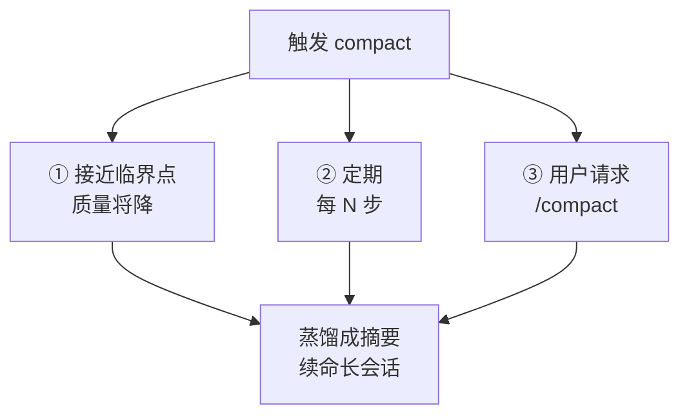

---

title: "compact总结"

tags:

  - agent方法论

  - context-engineering

  - 诊断与修复

created: "2026-07-21"

---

# compact 总结：把「聊累了」的会话榨成一份纪要

> 本条目是「Context Engineering」的第 12 部分，对应学习清单条目 3.3.3。

>

> **前置依赖**：找到临界点

> **为以下铺垫**：重注入格式设计

---

## 核心观点

> **compact（压缩总结）**：把已经很长的对话蒸馏成高保真摘要，腾出上下文空间继续跑——相当于给 Agent 做「阶段性笔记」，而不是从头背到尾。

就像写论文：你不会把读过的 200 篇文献全文记在脑子里，而是写成文献综述，需要细节再回去翻。compact 就是让模型在会话中途写「阶段性综述」，丢掉流水账、留住决策与结论。

## 定义 / 原理 / 实践 / 示例 / 优劣势
### 定义与原理

compact = 把上下文窗口蒸馏成摘要，保留关键决策/结果、丢弃无关细节。Anthropic Cookbook 把它列为长程 Agent 三大上下文杠杆之一，并说明 Claude Code 在生产中对长会话使用 compaction（压缩）。

### 三种触发方式

### 工程实践

- **主动 compact**：在 ~40–50% 处手动 `/compact` 并附引导（「聚焦认证重构，删掉测试调试」），比等系统自动压缩更可靠。

- **可恢复压缩**：完整对话 dump 到本地 JSONL「黑匣子」，要精确细节时 Agent 主动读回——有损压缩变可恢复。

- **配合重注入**：compact 后若把关键约束压丢了，立刻补一刀 [[09-长任务重注入|长任务重注入]]。

### 优劣势

- ✅ 让长会话以最小性能损失续命；省 token；Claude Code 有一手 API 支持（server-side compaction）。

- ❌ 有损——自动压缩发生在「上下文最长、模型最糊涂」时，最容易丢关键信息；要附引导、别盲信。

## 核心要点

| 概念 | 一句话 |
|------|--------|
| compact | 长对话蒸馏成摘要，腾空间续命 |
| 触发 | 临界点前 / 定期 / 用户请求 |
| 关键 | 主动 + 附引导，别等自动 |
| 兜底 | 原始对话落黑匣子可恢复 |

## 最新研究与企业数据

- **官方定义（一手）**：Anthropic Cookbook 把 compaction 定义为「将上下文窗口蒸馏成高保真摘要，让长对话以最小性能下降继续」，并指出 Claude Code 在生产中用它处理长会话（来源：Anthropic Cookbook）。

- **一手 API 支持（一手）**：Anthropic 提供 server-side compaction、context editing（含 tool-result clearing）、memory 三类一手实现（来源：Anthropic Cookbook / Effective Context Engineering）。

- **自动压缩翻车（一手）**：Anthropic 1M 上下文博客坦承，自动压缩触发那一刻「恰恰是上下文最长、模型表现最打折的时候」，建议提前主动 `/compact` 并附说明（来源：Anthropic 1M 上下文博客）。

## 学习资源

- **必读**：Anthropic Cookbook《Context engineering: memory, compaction, and tool clearing》

- **官方**：Anthropic《Using Claude Code session management and 1M context》

- **进阶**：[[13-重注入格式设计|重注入格式设计]] · [[09-长任务重注入|长任务重注入]] · [[08-摘要压缩|摘要压缩]]

## 速记卡（面试闪卡）

**Q1：一句话讲清「compact 总结：把「聊累了」的会话榨成一份纪要」到底是什么？**

A：compact 把很长的对话蒸馏成高保真摘要，腾出上下文空间续跑——像给 Agent 写阶段性综述而非从头背到尾。

**Q2：核心观点：阶段性综述 —— 怎么理解？**

A：像写论文：你不会把 200 篇文献全文记脑子里，而是写文献综述，要细节再翻。compact 让模型中途写「阶段性综述」，丢流水账、留决策。

**Q3：三种触发方式 —— 怎么理解？**

A：接近临界点（质量将降）、定期每 N 步、用户请求 /compact——三条路都汇到「蒸馏成摘要续命长会话」，像定时存盘防崩。

**Q4：工程实践：主动+可恢复 —— 怎么理解？**

A：在 40~50% 处主动 /compact 并附引导比等系统自动更稳；完整对话落 JSONL 黑匣子，要细节 Agent 主动读回——有损压缩变可恢复。

**Q5：优劣势与企业数据 —— 怎么理解？**

A：优在让长会话最小损失续命、省 token、有 server-side compaction；坑是「自动压缩」偏在上下文最长最糊涂时丢关键信息，要附引导。

**Q6：核心速记主线有哪些？**

- compact：长对话蒸馏成摘要腾空间

- 触发：临界点前 / 定期 / 用户请求

- 关键：主动 + 附引导，别等自动

- 兜底：原始对话落黑匣子可恢复

**口诀**

A：聊累榨成阶段性，

三种触发莫等自动；

黑匣子留可恢复，

丢了约束补重注。

## 相关链接

- 系列清单：[[学习路线图/Agent方法论与产品思维学习路线图|Agent 方法论与产品思维学习路线图]]

- 上一层级：[[00-Agent方法论与产品思维|Context Engineering · 索引]]

- 关联理论：[[../01-认知升级/07-四层嵌套关系|四层嵌套关系]]

**下一篇**：[[13-重注入格式设计|重注入格式设计]]——compact 讲完，下篇讲「重注入的关键约束，格式怎么设计才不被忽略」。

---

## 参考来源（一手链接 · 可溯源深挖）

- **Anthropic Cookbook**《Context engineering: memory, compaction, and tool clearing》：[platform.claude.com/cookbook/tool-use-context-engineering-context-engineering-tools](https://platform.claude.com/cookbook/tool-use-context-engineering-context-engineering-tools)

- **Anthropic**《Using Claude Code session management and 1M context》：[claude.com/blog/using-claude-code-session-management-and-1m-context](https://claude.com/blog/using-claude-code-session-management-and-1m-context)

- **Anthropic (2025-09)**《Effective context engineering for AI agents》：[anthropic.com/engineering/effective-context-engineering-for-ai-agents](https://www.anthropic.com/engineering/effective-context-engineering-for-ai-agents)

