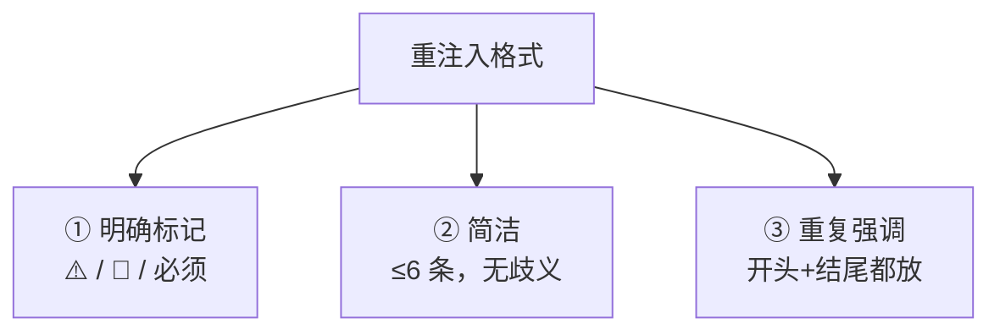

---

title: "重注入格式设计"

tags:

  - agent方法论

  - context-engineering

  - 诊断与修复

created: "2026-07-21"

---

# 重注入格式设计：把「死命令」写成模型不敢忽略的样子

> 本条目是「Context Engineering」的第 13 部分，对应学习清单条目 3.3.4。

>

> **前置依赖**：compact总结

> **为以下铺垫**：路径作用域

---

## 核心观点

> **重注入格式设计**：关键约束重注入时，要让模型「一眼看到、一眼记住」——用明确标记、控制在 6 条内、开头结尾双钉。格式越清晰，遵循率越高。

就像公司发全员通知：黑底红字「⚠️ 必须」永远比一段灰色小字「请注意……」被执行得到位。模型读重注入的约束也一样——你写得含糊，它就当没看见；你写得像路障，它绕不过去。

## 定义 / 原理 / 实践 / 示例 / 优劣势
### 定义与原理

重注入格式 = 在重注入关键约束时采用的呈现方式。它复用 [[07-RecencyEffect|Recency Effect]]（末尾高权重）+ [[05-首末重注入|首末重注入]]（首尾双钉），目标是最大化约束的「视觉—语义显著性」。Anthropic（2025-09）建议用清晰结构（XML 标签 / Markdown 分节）组织指令。

### 三条设计原则



### 工程实践（✅ 示例）

```markdown

## ⚠️ 必须遵循（Hard Gate）

1. 不执行破坏性命令（rm -rf、DROP TABLE）

2. 必须引用来源

3. 输出格式为 Markdown

```

- **明确标记**：用 ⚠️ / 🔴 / 「必须」让模型知道这是硬约束。

- **简洁**：不超过 6 条，每条无歧义。

- **重复强调**：开头放一遍、结尾重申一遍（Primacy + Recency 双保险）。

### 优劣势

- ✅ 低成本高回报；和 [[09-长任务重注入|长任务重注入]]、[[12-compact总结|compact]] 天然配合。

- ❌ 标记太多会「狼来了」——满屏 ⚠️ 反而弱化真正的红线；要克制。

## 核心要点

| 概念 | 一句话 |

|------|--------|

| 重注入格式 | 让关键约束一眼看到、一眼记住 |

| 三原则 | 明确标记 / 简洁≤6条 / 首尾双钉 |

| 标记 | ⚠️ 🔴 「必须」 |

| 雷区 | 满屏警告 = 没有警告 |

## 最新研究与企业数据

- **结构化指令（一手）**：Anthropic（2025-09）建议用 XML 标签 / Markdown 分节组织指令，在「太具体」与「太模糊」间取 Goldilocks 平衡（来源：Anthropic Effective Context Engineering）。

- **hard gate 实践（一手）**：Anthropic 1M 上下文博客将「末尾放不可违反的规则」作为上下文管理动作之一（来源：Anthropic 1M 上下文博客）。

- **「≤6 条 / 明确标记提升遵循率」的量化（待核实）**：具体增幅来自社区实践，未见一手受控实验，建议以自家任务实测校准。

## 学习资源

- **必读**：Anthropic《Effective context engineering for AI agents》(2025-09)

- **官方**：Anthropic《Using Claude Code session management and 1M context》

- **进阶**：[[14-路径作用域|路径作用域]] · [[09-长任务重注入|长任务重注入]] · [[07-RecencyEffect|Recency Effect]]

## 速记卡（面试闪卡）

**Q1：一句话讲清「重注入格式设计：把「死命令」写成模型不敢忽略的样子」到底是什么？**

A：重注入格式设计：把关键约束写成模型不敢忽略的样子——明确标记、≤6 条、首尾双钉。

**Q2：一、核心观点 —— 怎么理解？**

A：重注入关键约束要让模型“一眼看到、一眼记住”。像公司通知：黑底红字“⚠️ 必须”永远比灰色小字“请注意”执行得到位。你写得像路障，它绕不过去（visual salience）。

**Q3：二、三条设计原则 —— 怎么理解？**

A：① 明确标记用 ⚠️/🔴/“必须” ② 简洁≤6 条无歧义 ③ 重复强调开头结尾都放（Primacy+Recency）。复用 Recency Effect 与首末重钉，最大化语义显著性（hard gate）。

**Q4：三、工程实践示例 —— 怎么理解？**

A：用 `## ⚠️ 必须遵循` 列 1.不执行破坏性命令 2.必须引用来源 3.输出 Markdown。开头放一遍、结尾重申一遍。Anthropic 建议 XML/Markdown 分节取 Goldilocks 平衡（structured instructions）。

**Q5：四、雷区 —— 怎么理解？**

A：标记太多会“狼来了”——满屏 ⚠️ 反而弱化真正红线，要克制。低成本高回报，和 compact、长任务重注入天然配合。少而狠，多而废（signal dilution）。

**Q6：核心速记主线有哪些？**

- 目标：让关键约束一眼看到、一眼记住

- 三原则：明确标记 / 简洁≤6条 / 首尾双钉

- 标记：⚠️ 🔴 「必须」做硬约束

- 依据：Anthropic 建议 XML/Markdown 分节

- 雷区：满屏警告=没有警告，要克制

**口诀**

A：死命令要钉得醒

明确标记亮红灯

六条以内说得清

首尾双钉最稳成

## 相关链接

- 系列清单：[[学习路线图/Agent方法论与产品思维学习路线图|Agent 方法论与产品思维学习路线图]]

- 上一层级：[[00-Agent方法论与产品思维|Context Engineering · 索引]]

- 关联理论：[[../01-认知升级/07-四层嵌套关系|四层嵌套关系]]

**下一篇**：[[14-路径作用域|路径作用域]]——诊断与修复讲完，进入记忆与状态外部化：CLAUDE.md 放子目录，减少全局上下文。

---

## 参考来源（一手链接 · 可溯源深挖）

- **Anthropic (2025-09)**《Effective context engineering for AI agents》：[anthropic.com/engineering/effective-context-engineering-for-ai-agents](https://www.anthropic.com/engineering/effective-context-engineering-for-ai-agents)

- **Anthropic**《Using Claude Code session management and 1M context》：[claude.com/blog/using-claude-code-session-management-and-1m-context](https://claude.com/blog/using-claude-code-session-management-and-1m-context)

- **「≤6 条 / 明确标记提升遵循率」量化**：(来源待核实：社区实践共识，未检索到一手受控实验；建议自测校准)

