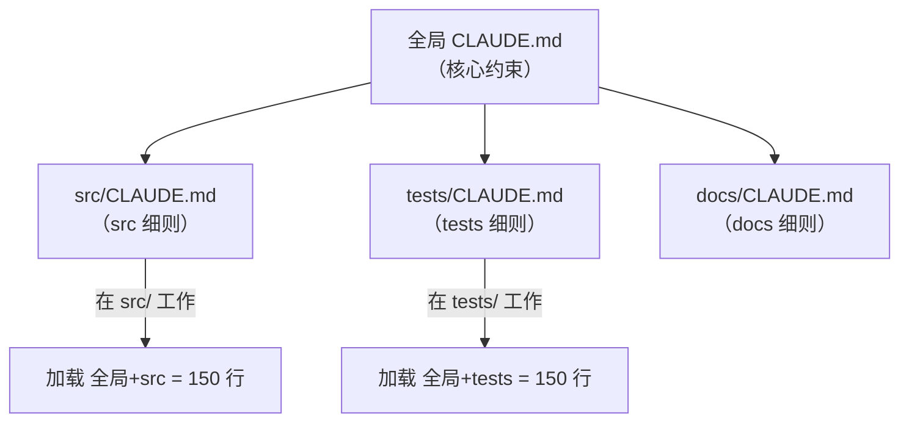

---

title: "路径作用域"

tags:

  - agent方法论

  - context-engineering

  - 记忆与状态外部化

created: "2026-07-21"

---

# 路径作用域：规则别都堆全局，按目录「分田到户」

> 本条目是「Context Engineering」的第 14 部分，对应学习清单条目 3.2.6。

>

> **前置依赖**：渐进式加载、摘要压缩

> **为以下铺垫**：Skill Engineering、Loop Engineering

---

## 核心观点

> **路径作用域（Path-scoping）**：子目录的 CLAUDE.md 只在该目录下生效，按文件路径加载对应规则——把全局上下文「分田到户」，谁的地盘谁的规则，互不污染。

就像公司制度：总部发一本《员工手册》管全员，但研发部、财务部、客服部各自还有部门细则，你进哪个部门就只看哪个部门的规定，不用把全公司制度都背身上。Agent 也是——在 `src/` 里就加载 `src/CLAUDE.md`，在 `tests/` 里就加载 `tests/CLAUDE.md`，全局只留最核心的。

## 定义 / 原理 / 实践 / 示例 / 优劣势
### 定义与原理

路径作用域 = 根据当前文件路径，只加载该路径及其祖先目录下的规则文件。它是 [[06-渐进式加载|渐进式加载]] 的「空间版」：不在当前工作目录的规则，根本不进上下文，从根上省下 [[02-AttentionBudget|Attention Budget]]。Claude Code 原生支持目录级 CLAUDE.md。

### 加载逻辑

工具实现上，从文件路径向上逐级查找 CLAUDE.md，从全局到局部拼接——`src/` 目录最终加载「全局 100 行 + src 50 行」，而非全部 500 行。

### 工程实践

- **根文件只放永真约束**：跨目录都适用的架构红线、硬性禁止项。

- **子目录放专属规范**：`src/` 放编码约定，`tests/` 放测试约定，`docs/` 放文档约定。

- **配合 Skills / Sub-agent**：重活交给子智能体，主会话只收结论（见 [[02-AttentionBudget|Attention Budget]]）。

### 优劣势

- ✅ 减少全局上下文、提精度、降噪声；规则「分田到户」更好维护。

- ❌ 目录层级多了要规划清楚，避免规则冲突/重复；跨目录任务要显式加载相关子目录规则。

## 核心要点

| 概念 | 一句话 |

|------|--------|

| 路径作用域 | 子目录 CLAUDE.md 仅在该目录生效 |

| 本质 | 渐进式加载的「空间版」 |

| 根文件 | 只放永真约束 |

| 收益 | 省全局上下文 + 提精度 |

## 最新研究与企业数据

- **原生能力（一手）**：Claude Code 支持在子目录放置 CLAUDE.md，按当前路径加载对应规则；官方建议保持文件精简、长文档外置（来源：Anthropic Claude Code Best Practices / CLAUDE.md 文档）。

- **Sub-agent 隔离（一手）**：Anthropic 多 Agent 研究中，把工作分给独立上下文的子智能体是控制主会话上下文污染的核心手段——路径作用域是单智能体版的「上下文隔离」（来源：Anthropic Built Multi-Agent Research System）。

- **具体行数节省（待核实）**：原始笔记的「500 行→150 行」为示意性测算，按真实目录结构而异，非一手实验数字。

## 学习资源

- **必读**：Anthropic《Claude Code Best Practices》

- **官方**：Anthropic《Building Multi-Agent Research System》(2025)

- **进阶**：[[06-渐进式加载|渐进式加载]] · [[13-重注入格式设计|重注入格式设计]] · [[../04-Skill Engineering/01-读外部Skills|Skill Engineering]]

## 速记卡（面试闪卡）

**Q1：一句话讲清「路径作用域：规则别都堆全局，按目录「分田到户」」到底是什么？**

A：路径作用域（Path-scoping）是子目录的 CLAUDE.md 只在该目录下生效，按文件路径加载对应规则——把全局上下文"分田到户"，谁的地盘谁的规则，互不污染。

**Q2：核心观点 —— 怎么理解？**

A：类比公司制度：总部发《员工手册》管全员，但研发、财务、客服各部还有部门细则，你进哪个部门就只看哪部规定，不用把全公司制度背身上。Agent 也一样——在 src/ 就加载 src/CLAUDE.md，在 tests/ 就加载 tests/CLAUDE.md，全局只留最核心的。

**Q3：定义 / 原理 / 实践 / 示例 / 优劣势 —— 怎么理解？**

A：原理是根据当前文件路径只加载该路径及祖先目录的规则文件，是渐进式加载的"空间版"——不在当前工作目录的规则根本不进上下文，从根上省 Attention Budget。Claude Code 原生支持目录级 CLAUDE.md：从文件路径向上逐级查找，从全局到局部拼接，比如 src/ 最终加载"全局 100 行 + src 50 行"而非全部 500 行。实践：根文件只放永真约束（架构红线、硬性禁止项），子目录放专属规范（src/ 编码约定、tests/ 测试约定），重活交 Sub-agent。优点是减少全局上下文、提精度、降噪声；缺点是目录层级多了要规划清，避免规则冲突，跨目录任务要显式加载相关子目录规则。

**Q4：核心要点 —— 怎么理解？**

A：速记：路径作用域 = 子目录 CLAUDE.md 仅在该目录生效；本质 = 渐进式加载的空间版；根文件只放永真约束；收益 = 省全局上下文 + 提精度。

**Q5：最新研究与企业数据 —— 怎么理解？**

A：一手：Claude Code 支持在子目录放 CLAUDE.md 按当前路径加载，官方建议保持文件精简、长文档外置。Sub-agent 隔离一手：Anthropic 多 Agent 研究把工作分给独立上下文的子智能体，是控制主会话污染的核心手段——路径作用域是单智能体版的"上下文隔离"。具体"500 行→150 行"是示意性测算，按真实目录结构而异。

**Q6：核心速记主线有哪些？**

A：抓住这几根：核心观点（分田到户）、定义/原理（空间版渐进式加载 + 向上逐级查找）、工程实践（根放永真/子放专属）、核心要点、最新研究（Claude Code 原生 + Sub-agent 隔离一手）。

**口诀**

A：规则莫堆全局里，按目录来分田到户；

根放永真子放专，空间版渐进加载。

## 相关链接

- 系列清单：[[学习路线图/Agent方法论与产品思维学习路线图|Agent 方法论与产品思维学习路线图]]

- 上一层级：[[00-Agent方法论与产品思维|Context Engineering · 索引]]

- 关联理论：[[../01-认知升级/07-四层嵌套关系|四层嵌套关系]]

**下一篇**：[[../04-Skill Engineering/01-读外部Skills|Skill Engineering]]——Context Engineering 讲完，下篇进入 Skill 层：把可复用经验沉淀成模块。

---

## 参考来源（一手链接 · 可溯源深挖）

- **Anthropic**《Claude Code Best Practices》：[anthropic.com/engineering/claude-code-best-practices](https://www.anthropic.com/engineering/claude-code-best-practices)

- **Anthropic (2025)**《Building a multi-agent research system》：[anthropic.com/engineering/built-multi-agent-research-system](https://www.anthropic.com/engineering/built-multi-agent-research-system)

- **「500 行→150 行」具体节省**：(来源待核实：示意性测算，按真实目录结构而异，非一手实验数字；建议以自家仓库实测)

