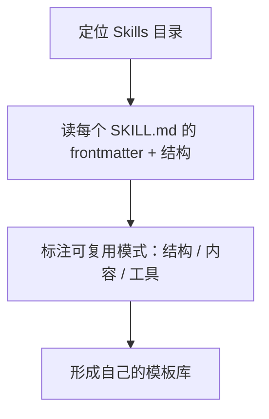

---

title: "读外部 Skills 建立认知"

tags:

  - agent方法论

  - skill-engineering

  - 建立认知

created: "2026-07-21"

---

# 读外部 Skills 建立认知

> 本条目是「Skill Engineering」的第 1 部分，对应学习清单条目 4.1.1。

>

> **前置依赖**：认知升级：四层模型、Context Engineering

> **为以下铺垫**：[[02-分析优秀skill|分析优秀skill]]、[[03-对比工具Skill系统|对比工具Skill系统]]、[[04-九要素结构|九要素结构]]

---

## 一、核心观点

> **想写好自己的 Skill（技能），先去拆别人的 Skill。** 打开 `.claude/skills/`，把已安装技能的 structure（结构）读一遍，标注可复用模式（pattern）。

学游泳最快的方式不是背教材，是跳进泳池看别人怎么划水。Skill 也是一样——在你动手写第一行 `SKILL.md` 之前，先把社区里成熟的 Skill 当「活体标本」拆一遍：它的 frontmatter（前置元数据）怎么写、操作步骤怎么排、Gotchas（避坑点）怎么列。Anthropic 自己就把「写一个 Skill」类比成「给新同事写一份入职手册（onboarding guide）」——那你当然得先看看别人家手册长什么样，才知道好手册的样板是什么。

---

## 二、定义 / 原理 / 实践 / 示例 / 优劣势
### 2.1 定义：什么是「读外部 Skills」

外部 Skills 指你已经安装、由别人或官方写好的 Skill 文件夹。读它们，目的是**建立对 Skill 结构的肌肉记忆**，而不是抄代码。

### 2.2 原理：为什么「读」比「写」先发生

你的大脑需要一个「模板库」。读得够多，后面写的时候才不会对着空白 `SKILL.md` 发呆——你知道好 Skill 长什么样，烂 Skill 的坑长什么样。

### 2.3 实践：三步走

- **第一步：定位目录**

  - 用户级：`~/.claude/skills/`（所有项目共享）

  - 项目级：`.claude/skills/`（仅当前仓库，建议 commit 进 git）

- **第二步：读 `SKILL.md` 本体** —— 重点看四类信息：元数据（name、description）、操作步骤、工具使用、错误处理。

- **第三步：标注模式** —— 把「通用结构 / 高效写法 / 可借鉴模式」记下来（见 2.4）。

### 2.4 示例：可复用模式标注表

| 维度 | 看什么 | 标注成一句 |

|------|--------|------------|

| **结构模式** | 元数据的格式、章节顺序 | "都用 适用场景 → 操作步骤 → 工具 → 输出" |

| **内容模式** | 触发条件怎么描述 | "description 写清『什么时候用 / 什么时候不用』" |

| **工具模式** | 命令怎么写 | "写具体命令 + 参数，不写含糊的『运行测试』" |

### 2.5 优劣势

- ✅ 零成本建立认知；避免重复造轮子；直接学到经过验证的写法

- ❌ 烂 Skill 也不少，需要批判性筛选；只读不写容易「眼会手不会」

---

## 三、最新研究与企业数据（2025–2026）

- **Skill 已是官方一级概念**：Anthropic 在 2025-12-18 将 Agent Skills 发布为开放标准，明确「一个 Skill 就是一个包含 `SKILL.md` 的目录」，并鼓励社区共享、跨工具分发（[anthropic.com/engineering/equipping-agents-for-the-real-world-with-agent-skills](https://www.anthropic.com/engineering/equipping-agents-for-the-real-world-with-agent-skills)）。

- **开放生态已成形**：Agent Skills 格式由 Anthropic 提出并开源，已被大量 agent 客户端采纳（[skill.md 开放标准](http://skill.md/)）。这意味着「读外部 Skills」的可读素材极其丰富。

- 注：本条为方法论认知，无具体定量指标；凡涉及 token 成本 / 遵循率的数字，见 [[07-压缩到500行|压缩到 500 行]] 与 [[11-延迟加载机制|延迟加载机制]]。

---

## 四、学习资源

- **一手文档**：Anthropic《Equipping agents for the real world with Agent Skills》(2025-12-18)

- **规范**：[Agent Skills 开放标准 skill.md](http://skill.md/)

- **进阶**：[[02-分析优秀skill|分析优秀skill]] —— 下一章教你怎么逐行评判别人的 Skill 好不好

---

## 五、相关链接

- 系列内：[[02-分析优秀skill|分析优秀skill]] · [[03-对比工具Skill系统|对比工具Skill系统]] · [[04-九要素结构|九要素结构]]

- 跨系列：[[../01-认知升级/03-2026初HarnessEngineering|Harness Engineering]]（Skill 是 Harness 层的可复用组件）· [[../01-认知升级/07-四层嵌套关系|四层嵌套关系]]

- 系列清单：[[学习路线图/Agent方法论与产品思维学习路线图|Agent 方法论与产品思维学习路线图]]

---

## 六、核心要点

- 🎯 写 Skill 前先「拆」Skill：把外部 `SKILL.md` 当活体标本，建立结构肌肉记忆。

- 💡 三步走：定位目录 → 读 frontmatter+结构 → 标注「结构 / 内容 / 工具」三类可复用模式。

- ⚠️ 只读不写会「眼会手不会」，标注完立刻去 [[06-写第一个SKILL|写第一个 SKILL]] 实践。

---

## 参考来源（一手链接 · 可溯源深挖）

- **Anthropic (2025-12-18)**《Equipping agents for the real world with Agent Skills》：[anthropic.com/engineering/equipping-agents-for-the-real-world-with-agent-skills](https://www.anthropic.com/engineering/equipping-agents-for-the-real-world-with-agent-skills)

- **Agent Skills 开放标准**（Anthropic 提出并开源）：[skill.md](http://skill.md/)

- **Anthropic Agent Skills 文档**：[docs.anthropic.com/en/docs/agents-and-tools/agent-skills](https://docs.anthropic.com/en/docs/agents-and-tools/agent-skills)

## 速记卡（面试闪卡）

**Q1：一句话讲清「读外部 Skills 建立认知」到底是什么？**

A：写自己的 Skill 前，先把别人的 SKILL.md 当活体标本拆一遍，建结构肌肉记忆。

**Q2：一、核心观点 —— 怎么理解？**

A：类比学游泳：先跳泳池看别人划水，比背教材快。拆社区成熟 Skill 的 frontmatter、操作步骤、避坑点，建立模板库。Anthropic 把写 Skill 比作写新人入职手册（onboarding guide）。

**Q3：二、三步走实践 —— 怎么理解？**

A：定位目录（用户级 ~/.claude/skills、项目级 .claude/skills）→ 读 SKILL.md 看元数据与操作 → 标注结构/内容/工具三类可复用模式。像收集菜谱：看配料表、步骤、火候，攒成自己的拿手谱。

**Q4：三、原理：为什么先读后写 —— 怎么理解？**

A：大脑需要"模板库"，读得够多写时才不对着空白 SKILL.md 发呆。像练字先临摹字帖，肌肉记忆（muscle memory）来自大量观察，不是空想。

**Q5：四、最新研究与企业数据 —— 怎么理解？**

A：Anthropic 2025-12 将 Agent Skills 发布为开放标准，"一个 Skill = 含 SKILL.md 的目录"，已被大量 agent 客户端采纳（skill.md 标准）。可读素材极丰富，但烂 Skill 也不少需批判筛选。

**Q6：核心速记主线有哪些？**

- 先拆后写：外部 SKILL.md 当活体标本

- 三步走：定位 → 读本体 → 标模式

- 标注三类：结构 / 内容 / 工具

- 只读不写会"眼会手不会"，立刻实践

**口诀**

A：写 Skill 前先拆 Skill，活体标本建认知；

定位目录找模板，读罢结构记心池。

标注三类模式稳，眼会手会莫迟疑；

只读不写终是浅，动手方知深与实。

## 相关链接

- [[笔记/AI与Agent/方法论/04-Skill Engineering/02-分析优秀skill|分析优秀 skill]]

- [[笔记/AI与Agent/方法论/04-Skill Engineering/03-对比工具Skill系统|对比工具 Skill 系统]]

- [[笔记/AI与Agent/方法论/04-Skill Engineering/13-Skill版本管理|Skill版本管理]]

- [[笔记/AI与Agent/方法论/04-Skill Engineering/10-Gotchas章节优先|Gotchas章节优先]]

- [[笔记/AI与Agent/方法论/04-Skill Engineering/05-Gotchas优先|Gotchas优先]]

