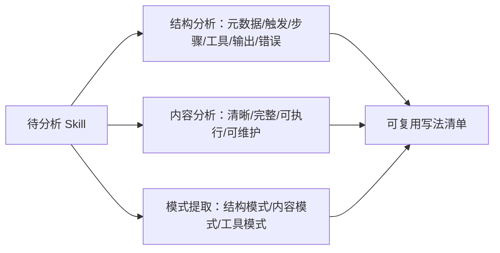

---

title: "分析优秀 skill"

tags:

  - agent方法论

  - skill-engineering

  - 建立认知

created: "2026-07-21"

---

# 分析优秀 Skill：当美食评委，拆出「为什么好」

> 本条目是「Skill Engineering」的第 2 部分，对应学习清单条目 4.1.2。

>

> **前置依赖**：[[01-读外部Skills|读外部Skills]]

> **为以下铺垫**：[[03-对比工具Skill系统|对比工具Skill系统]]、[[04-九要素结构|九要素结构]]

---

## 一、核心观点

> **挑 3 个写得好的外部 Skill，逐行分析「为什么好」，而不是只说「写得好」。** 像美食评委拆出火候、刀工、摆盘，而不是吃一口喊「好吃」。

读了一堆 Skill 之后，下一步是「批判性拆解」。好 Skill 不是玄学——它的好是可枚举的：元数据是否自解释、触发条件是否明确、操作步骤是否可执行。把这三处拆透，你脑子里的「好 Skill 模板」就从模糊印象变成精确清单。

---

## 二、定义 / 原理 / 实践 / 示例 / 优劣势
### 2.1 定义

分析优秀 Skill = 用一套固定框架，对外部 Skill 做「结构 + 内容 + 模式」三维体检，产出可复用的写法清单。

### 2.2 原理：为什么是「3 个」而不是「1 个」

看 1 个容易以偏概全，看 10 个又太累。3 个刚好够你交叉验证「哪些是通用的好」，过滤掉「只是这个 Skill 碰巧需要的」噪音。

### 2.3 实践：分析框架（三维度）

| 维度 | 分析点 | 好 Skill 长什么样 |

|------|--------|-------------------|

| **结构** | 元数据、触发条件、操作步骤、工具、输出、错误处理 | name+description 自解释；步骤编号且每步一个动作 |

| **内容** | 清晰度、完整性、可执行性、可维护性 | 能直接照做，不用猜；覆盖异常分支 |

| **模式** | 结构/内容/工具三类可复用点 | "description 写『什么时候不用』减少误触发" |

### 2.4 示例：逐行点评一个 code-review Skill

> **优点拆解**

> 1. **元数据清晰**：`name: code-review` + `description` 直接说清用途与触发时机。

> 2. **触发条件明确**：适用场景列了「用户要求 review diff / 改了 src 下 .py」。

> 3. **操作步骤清晰**：`1. 解析 diff → 2. 按风险分级 → 3. 给行级评论 → 4. 出报告`。

> 4. **工具使用规范**：`git diff / mypy / ruff` 都是具体命令。

> 5. **输出格式明确**：Markdown 报告，结构固定。

### 2.5 优劣势

- ✅ 把「感觉好」变成「可复用的写法清单」；跨 Skill 对比能发现行业共识

- ❌ 容易陷入细节；需要克制，只提取「通用且可迁移」的模式

---

## 三、最新研究与企业数据（2025–2026）

- **官方给的「好 Skill」标准**：Anthropic 在《How to create custom skills》中明确，最好的 Skill 具备五条特征——解决一个**具体、可重复**的任务、有清晰的指令、在有帮助时给示例、明确**何时**应使用、且**聚焦于单一工作流**而非什么都做（[support.anthropic.com](https://support.anthropic.com/en/articles/12512198-creating-custom-skills)）。

- 这五条正好对应上面「结构 + 内容」框架的评判点，可作你的分析 Checklist 的一手依据。

---

## 四、学习资源

- **一手文档**：Anthropic《How to create custom skills》（含 best skills 五特征）

- **规范**：[Agent Skills 开放标准 skill.md](http://skill.md/)

- **进阶**：[[04-九要素结构|九要素结构]] —— 把「好」落成一套完整结构

---

## 五、相关链接

- 系列内：[[01-读外部Skills|读外部Skills]] · [[03-对比工具Skill系统|对比工具Skill系统]] · [[04-九要素结构|九要素结构]]

- 跨系列：[[../01-认知升级/03-2026初HarnessEngineering|Harness Engineering]]

- 系列清单：[[学习路线图/Agent方法论与产品思维学习路线图|Agent 方法论与产品思维学习路线图]]

---

## 六、核心要点

- 🎯 挑 3 个好 Skill 逐行拆「为什么好」，比看 10 个只说「好」更有用。

- 💡 三维度框架：结构分析（元数据/步骤/工具/输出）+ 内容分析（清晰/可执行）+ 模式提取。

- ⚠️ 只提取「通用且可迁移」的写法，别把某个 Skill 的特例当真理。

---

## 参考来源（一手链接 · 可溯源深挖）

- **Anthropic**《How to create custom skills》（best skills 五特征：具体可重复 / 清晰指令 / 有示例 / 明确何时用 / 聚焦单一工作流）：[support.anthropic.com/en/articles/12512198-creating-custom-skills](https://support.anthropic.com/en/articles/12512198-creating-custom-skills)

- **Agent Skills 开放标准**：[skill.md](http://skill.md/)

- **Anthropic Agent Skills 文档**：[docs.anthropic.com/en/docs/agents-and-tools/agent-skills](https://docs.anthropic.com/en/docs/agents-and-tools/agent-skills)

## 速记卡（面试闪卡）

**Q1：一句话讲清「分析优秀 Skill：当美食评委，拆出「为什么好」」到底是什么？**

A：分析优秀 Skill 是挑 3 个写得好的外部 Skill 逐行拆解「为什么好」，用结构/内容/模式三维体检，把模糊的「写得好」变成可复用的写法清单。

**Q2：核心观点：当美食评委 —— 怎么理解？**

A：读了一堆 Skill 后要做批判性拆解——像美食评委拆出火候、刀工、摆盘，而不是吃一口喊「好吃」。好 Skill 不玄学，它的好是可枚举的（元数据自解释、触发明确、步骤可执行）。

**Q3：原理：为何是 3 个而非 1 个 —— 怎么理解？**

A：看 1 个易以偏概全，看 10 个又太累；3 个刚好交叉验证「哪些是通用好」，过滤掉「只是这个 Skill 碰巧需要」的噪音——样本量是用边际成本换信噪比。

**Q4：实践：三维度分析框架 —— 怎么理解？**

A：结构看元数据/触发/步骤/工具/输出/错误；内容看清晰/完整/可执行/可维护；模式提取可复用写法（如「description 写何时不用」减少误触发）——三者汇成可复用写法清单。

**Q5：官方标准：Anthropic 五特征 —— 怎么理解？**

A：Anthropic 给「好 Skill」五条标准：解决具体可重复任务、有清晰指令、有帮助时给示例、明确何时使用、聚焦单一工作流——正好对应结构+内容框架，作你的一手 Checklist。

**Q6：核心速记主线有哪些？**

- 核心：挑 3 个好 Skill 逐行拆「为什么好」

- 原理：3 个交叉验证，过滤个例噪音

- 框架：结构 + 内容 + 模式 三维体检

- 官方标准：Anthropic 五特征（具体/清晰/示例/何时/聚焦）

- 取舍：只提取通用可迁移写法，别把特例当真理

**口诀**

A：分析 Skill 当评委，拆出为什么好；

三个样本交叉验，个例噪音跑得掉；

结构内容加模式，三维体检清单造；

Anthropic 五特征，通用写法才可靠。

## 相关链接

- [[笔记/AI与Agent/方法论/04-Skill Engineering/03-对比工具Skill系统|对比工具 Skill 系统]]

- [[笔记/AI与Agent/方法论/04-Skill Engineering/01-读外部Skills|读外部 Skills 建立认知]]

- [[笔记/AI与Agent/方法论/04-Skill Engineering/13-Skill版本管理|Skill版本管理]]

- [[笔记/AI与Agent/方法论/04-Skill Engineering/06-写第一个SKILL|写第一个SKILL.md]]

- [[笔记/AI与Agent/方法论/04-Skill Engineering/05-Gotchas优先|Gotchas优先]]

